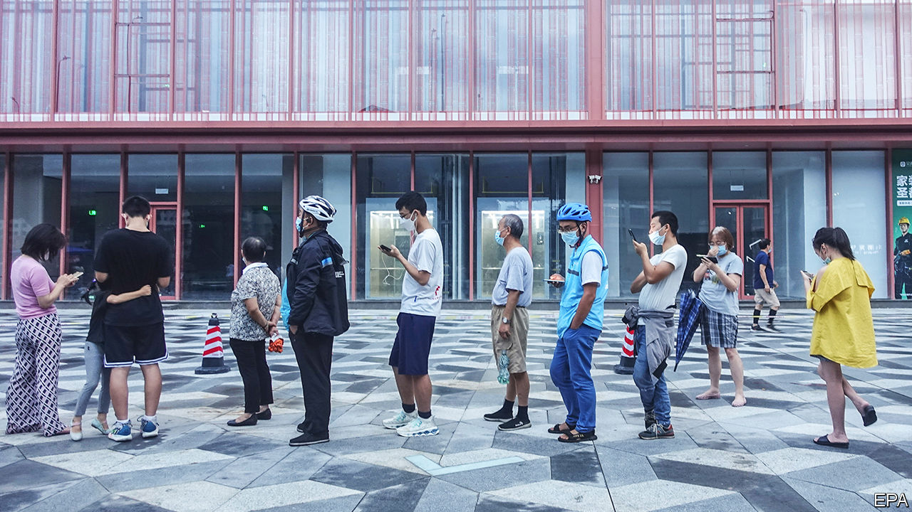

###### Shaking with frustration

# Public patience with zero-covid is wearing thin in China 

##### An earthquake in locked-down Chengdu renews doubts about the policy 

 

> Sep 8th 2022 

The 21m residents of Chengdu faced a tricky decision on September 5th: adhere to the covid-19 lockdown declared by authorities days earlier, or evacuate their homes as a 6.8-magnitude earthquake shook the ground (it killed more than 70 people). In some cases local lockdown enforcers made the choice for them, barring people from leaving even high-rise buildings. Videos of such incidents have circulated online. “I would absolutely trample over anyone blocking me!” wrote one commenter, capturing the public’s mood.

Dozens of Chinese cities, home to tens of millions of people, are in partial or full lockdowns. Across China, new covid cases have topped 1,000 per day for the past month. That would be a trivial number in most countries. But China fears that if the virus spreads, it could devastate its under-vaccinated elderly population. So it continues to use mass testing, lockdowns and other restrictions to contain covid. The result is an increasingly frustrated public.

The government’s “zero-covid” policy asks a lot even of citizens who are not locked down. Beijing is open, but its residents must get tested every 72 hours in order to use public transport or enter buildings. Some universities bar students from leaving campus, while secondary schools have told parents and pupils not to travel outside their home cities. They enforce the policy by making parents submit data from apps that track the user’s movements. 

Some people bristle at the way enforcement of covid controls has fallen to relatively low-level functionaries, such as school administrators and building managers. Chinese netizens mocked a building manager in Chengdu who set a 7.0-magnitude earthquake as the threshold for allowing a breach of lockdown. The quake also led to renewed scrutiny of a common practice: officials locking, or even welding shut, fire exits to enforce lockdowns.

The struggling economy has contributed to the sour mood. It expanded by just 0.4% in the second quarter compared with a year earlier. On September 6th Nomura, a Japanese bank, said covid controls were affecting places responsible for 12% of China’s gdp, up from 5.3% the week before. Recent restrictions imposed on the southern city of Shenzhen, a manufacturing and technology hub, have added to the anxiety. Nomura revised down its Chinese growth forecast for the year, to 2.7%.

China’s leader, Xi Jinping, says “unimaginable consequences” would follow if he were to lift the zero-covid policy. But whose fault is that? The health system is too weak to handle a wave of cases. And the state refuses to compel old people to get vaccinated. Still, some hope that Mr Xi will loosen up after the Communist Party congress in October. With a new term in hand, perhaps he will see things differently. ■

