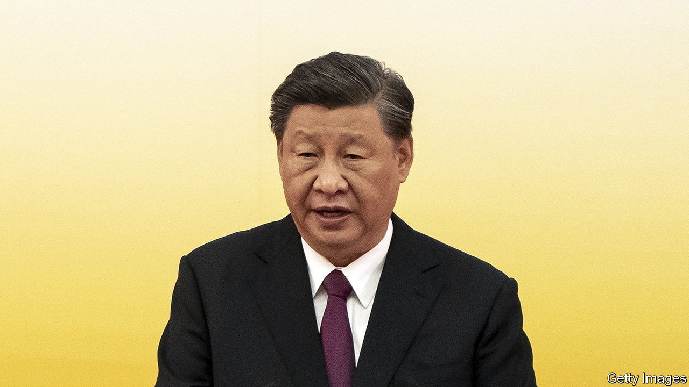

###### Travelin’ man

# Xi Jinping will at last venture abroad again 

##### Why is Central Asia his destination? 

 

> Sep 8th 2022 

By the time President Xi Jinping arrives in Central Asia this month, it will have been nearly a thousand days since he last left China. In the interim, much has changed—just look at his previous destination. In January 2020 Mr Xi visited Myanmar, where he signed some deals and shook hands with Aung San Suu Kyi, then Myanmar’s de facto leader. Today Ms Suu Kyi sits in jail, the victim of a coup carried out by the country’s generals.

Mr Xi stopped travelling abroad when China closed its borders in order to keep covid-19 out. The government still tries to contain the virus through strict controls at home. But Mr Xi has decided that diplomacy, at least, must start returning to normal. He plans to visit Kazakhstan and Uzbekistan, where he will attend a summit of the Shanghai Co-operation Organisation (sco) on September 15th and 16th, and probably meet his friend Vladimir Putin.

There had been much speculation about where Mr Xi would go. Kazakhstan makes sense. It is where Mr Xi, in 2013, launched the Belt and Road Initiative, a global infrastructure-building scheme. China has invested tens of billions of dollars in Kazakhstan, which sends back oil and gas through pipelines co-owned by the two countries’ biggest state oil companies. 

Kazakhstan is important to China for another reason: it borders the Chinese region of Xinjiang, where more than a million Uyghurs, as well as ethnic Kazakhs, have been thrown into camps for “re-education”. Much of the early evidence of those camps came from victims who escaped to Kazakhstan, where they were interviewed by activists—until the Kazakh government pressed the activists to stop. In public it has remained mostly quiet on the matter. China wants it to stay that way. But Chinese officials have struggled to read Kazakhstan. They were surprised by the protests, over high prices and dirty politics, that rocked the country in January, as well as by Russia’s decision to send troops.

China has ambitions across Central Asia, where it has tried to build land-based trade and energy links as an alternative to sea-based routes dominated by Western powers. It long deferred to Russia on political and security matters in the region, but that is changing, says Niva Yau of the osce Academy, a research centre in Kyrgyzstan. “Everything that Russia does in Central Asia, China does too, just on a smaller scale,” she says. For example, thousands of Kyrgyz military officers train in Russia. A few hundred do so in China. Look around the region and there are other signs of its influence, such as a Chinese police base in Tajikistan and classrooms where Uzbek national guardsmen learn Chinese.

Russia&#39;s invasion of Ukraine will be the elephant in the room at the sco summit. Kazakhstan’s president, Kassym-Jomart Tokayev, has not endorsed Mr Putin’s war. Mr Tokayev and other Central Asian leaders worry about Russian encroachment on their own territory, which is one reason why they seek closer ties to China. But they will probably skirt the issue at the summit and focus instead on new railways and pipelines, as well as security. China wants regional powers to take the lead in cleaning up after America in Afghanistan.

For Mr Xi the summit is a chance to reaffirm his support for Mr Putin, and thumb his nose at the West, while avoiding the tricky optics of a state visit to Moscow. He will also have the chance to mingle with other leaders who, to varying degrees, share China’s world-view. Some analysts see Mr Xi’s decision to travel in the run-up to the Communist Party congress in October as a sign of confidence in his position, though there has never been much doubt that he will be handed a third term as party chief at the event. More trips abroad are expected in the coming months. ■

