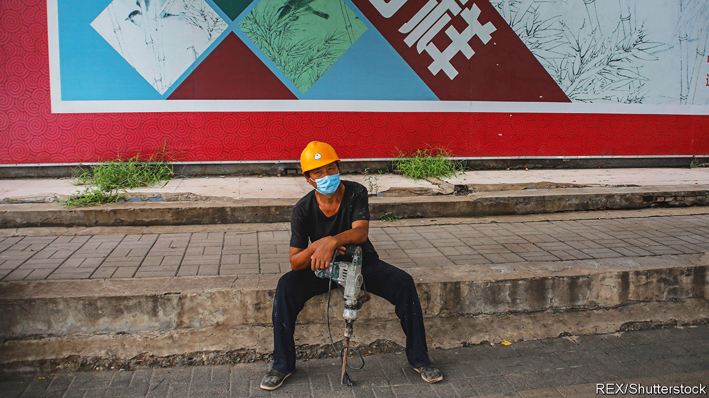
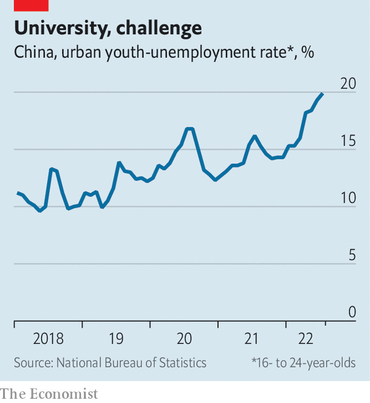

###### Greasing the ladders

# Zero-covid is making it tougher for Chinese strivers to get ahead 

##### Paths to the middle class are narrowing 

 

> Sep 7th 2022 

In january, for the purpose of contact tracing, the authorities in Beijing released data on the movements of two people infected with covid-19. A 44-year-old migrant worker with the surname Yue had gone from one construction site to another, visiting nearly 30 over the course of 18 days. He worked odd jobs, supporting a big family. The other was a young white-collar worker, reportedly with the surname Li. She spent the early days of January skiing and browsing in posh shops, such as Dior.

By many measures inequality in China has improved over the past decade. The gap between rich and poor is still wider than in most advanced countries. But research suggests that Chinese people accept inequality—as long as they feel that working hard will lead to a better life.

The problem is that many Chinese no longer feel that it will. The data suggest that , while inequality has grown more conspicuous. The contrasting portraits of Mr Yue and Ms Li, for example, sparked a lively debate online. Whereas a rising China offered people several routes to the middle class, covid-era China has seen some of those paths narrow. Frequent lockdowns, strict controls on movement and a tepid economy have made it harder for Chinese strivers to move up in the world.

The government’s covid policies have hit two groups especially hard. The first is China’s nearly 300m migrant labourers, such as Mr Yue. They leave their homes in the countryside to work in cities, where they can earn far more and send money home. But . Many have got stuck in their villages, either due to lockdowns or quarantine restrictions that freeze bus and train services. Cities have at times tried to keep non-residents out, lest they bring the virus in.

Life has never been easy for migrant workers in cities. Lacking a local , or household-registration permit, they are not eligible for benefits. They are the last to receive help from the authorities during outbreaks. When Shanghai locked down this year, many migrant workers took to sleeping rough because they had lost their jobs and could not afford rent. Some food-delivery drivers avoided going home, for fear they would not be allowed out to work. 

Many migrants work in service jobs, waiting tables or ironing sheets. When restaurants and hotels empty during lockdowns, their jobs vanish. Others work for small firms, many of which have closed during the pandemic. Some find temporary jobs, but the pay is worse. Ge Zhanying, from Anhui province, arrives at an informal labour market in a Beijing car park every day at 4.30am. She says that on the days she finds work, she typically makes half what she did before the pandemic. More generally, researchers have found that the wealth of China’s low-income households has fallen every quarter since the pandemic began in 2020, even as that of high-income households has risen.

For bright youngsters from provincial backwaters, higher education offered another way to a better life. If they did well on college-entry exams, they could go to university in a big city. Upon graduation, they might find a white-collar job in the city and obtain a prized local , allowing them to settle. To be sure, students from poor backgrounds are at a disadvantage every step of the way. In recent years fewer of them have been getting into the best universities. But with hard work and a dollop of luck, they could climb the social ladder.

 


This year it will take more luck than usual. Many of the nearly 11m university students due to graduate will not find work.  have hobbled the economy. The urban unemployment rate for 16- to 24-year-olds rose to 19.9% in July, its highest level since the survey began in 2018 (see chart). Some are adjusting their expectations, aiming for public-sector jobs that offer lower pay than those in the private sector. Zhang Ying, who graduated last year, has been unable to find work, so she is preparing for the civil-service entrance exam. University brought her to Changsha, the capital of Hunan province. Returning to her “backward” home town is not an option, she says.

Officials fret that the despair of strivers will lead to unrest. Studies suggest that intergenerational mobility in China is falling. “If you think you’re going to be worse off than your parents, that creates a really serious problem,” says Ilaria Mazzocco of the Centre for Strategic and International Studies in Washington. None of this is news to President Xi Jinping, whose push for “common prosperity” aims to spread opportunities more evenly. The rich have been warned not to flaunt their wealth. 

But, for now, Mr Xi is sticking to his “zero-covid” policy and the restrictions it entails. That will continue to make it harder for some people to get ahead. Ms Zhang, who has been striving since high school, once thought that life would get easier once she graduated from university. “But I’m still having to compete,” she says. “I never thought it would be so hard.” ■

