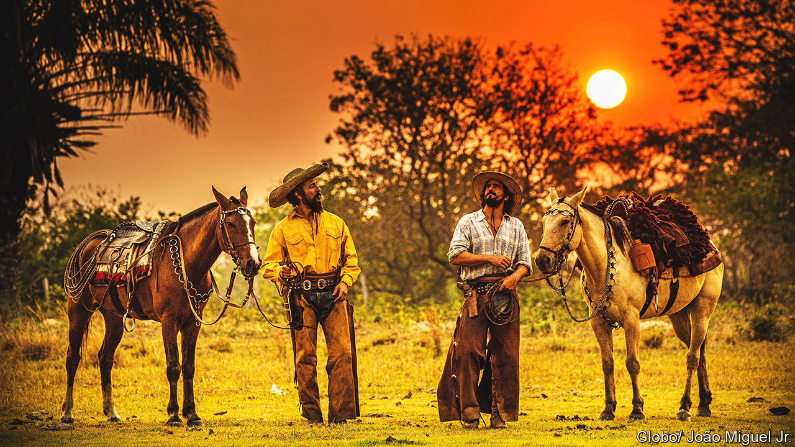

###### Frame the swamp

# A hit Brazilian telenovela is updated for a different age 

##### The new “Pantanal” is full of nostalgia, but much about its wetland setting has changed 

 

> Sep 7th 2022 

When benedito ruy barbosa first pitched “Pantanal”, a about rugged ranchers and landless peasants, to tv Globo, Brazil’s biggest television network, it was rejected. So Mr Barbosa took his idea elsewhere. For months his crew relocated to the region that gave the show its name, which is home to the world’s largest tropical wetland. They flew over floodplains in small aircraft to reach their locations. They filmed their actors silhouetted against sunsets.

The resulting drama, first aired in 1990, captivated audiences. At a time of hyperinflation, high crime and unemployment, the landscape of “Pantanal” seemed like paradise. Now, three decades on, paradise is being remade, this time by tv Globo.

These days streaming services threaten the network’s hegemony, especially among middle-class and younger Brazilians. Instead of Mr Barbosa, now in his 90s, his millennial grandson, Bruno Luperi, is in charge. The generational reset has paid off. Since the new “Pantanal” had its premiere in March, hordes of youngsters have followed it on tv and online. Parents and grandparents who remember the original are also tuning back in. At its peak the show has been watched by over a third of Brazilians, or 77m people. Even some supporters of the right-wing president, Jair Bolsonaro—who tend to think tv Globo is biased against him—have succumbed.

Adapting his grandfather’s work was daunting, says Mr Luperi. He has succeeded in large part by honouring the original. Revolving around three generations of the Leôncio family, the plot is a faithful retelling of their loves and losses. The cast and budget are bigger, but the locations—mostly in the municipality of Aquidauana—are often the same. (The actual Pantanal region stretches across more than 42m acres, from south-western Brazil into Bolivia and Paraguay.) Many scenes are again filmed at sundown, when the Pantanal’s waters sparkle and cattle stir up glistening dust.

Though set in the present, the new “Pantanal” looks back to bygone habits and draws on regional folklore. Characters dance the Paraguayan polka, wear straw hats woven from , a tropical palm, and drink , a kind of  tea. These customs barely survive in the Pantanal, notes Guilherme Rondon, a musician from a local family who has been involved in both versions of the show. The programme, he thinks, is helping preserve the region’s traditions. It is also attracting tourists.

But in other ways, says Mr Luperi, the “era has changed”, on-screen and off it. Over three decades deforestation in the Amazon has disturbed rainfall and flood patterns in the Pantanal. On the single-lane highways that cut through the vast cattle ranches, signs still warn drivers about armadillos and anteaters crossing the road. But sightings of them are rarer. Charred palm trees recall the fires that in 2020 blazed through roughly a quarter of the region, killing 17m vertebrates by some estimates. In the Pantanal’s southern reaches, a visitor’s best chance of spotting the jaguar, its most legendary creature, is now in the rice fields, not on the plains.

The writer should illuminate these changes, Mr Luperi thinks. Man’s relationship with nature is at the core of the show, he explains. Characters monitor crops and the silt building up in rivers. The show’s new generation of ranchers press their elders to farm their land in a more sustainable way. In 1990 Velho do Rio (Old Man of the River), a magically shape-shifting character, was one of the first figures in a Brazilian soap opera to defend the environment. This time around he comports himself like an activist. In one scene, to punish a forest arsonist, he is transformed into an anaconda and tries to drag the offender into the flames.

Other kinds of behaviour have been updated too. The protagonist of both versions is Jove Leôncio—a young man who in his Generation X incarnation enjoyed a barbecue, but as a Gen Z-er has turned vegetarian, observes Taís Ilhéu, a journalist and fan. The Jove of the 1990s would occasionally make homophobic jokes; now he chastises his father’s. 

Meanwhile, viewers who (surveys suggest) themselves have less sex than their forebears are also offered fewer racy scenes on ranches and in rivers. The sexualities depicted in the story are more diverse. And other tensions and scenarios are interpreted differently. Maria Bruaca, a downtrodden-housewife character, was often mocked by audiences of yore. Portrayed and viewed more sympathetically, she has become a fan favourite. 

Not everyone is enamoured of the remake. The pace of the series is quicker, and some scenes seem designed to be clipped for the internet, says Luiz Joaquim, a cultural critic who prefers the original. Other sequences are vehicles for (doubtless lucrative) product placement: in a recent episode, a character extols at length the virtues of her favourite washing detergent. In Portugal, where it has aired since May, the new “Pantanal” has flopped.

tv Globo does not seem too bothered. Amauri Soares, the network’s director, says its stories cater to contemporary Brazil and won’t always appeal overseas (though “Pantanal” will soon be broadcast across Latin America). That domestic audience is rapt. As Veneza Ronsini of the Federal University of Santa Maria says—paraphrasing Jesús Martín-Barbero, a distinguished anthropologist—Brazil has an urban face but a “peasant heart”. And as the lyrics of the s theme-tune insist, the “heart of Brazil” lies in the Pantanal. ■

