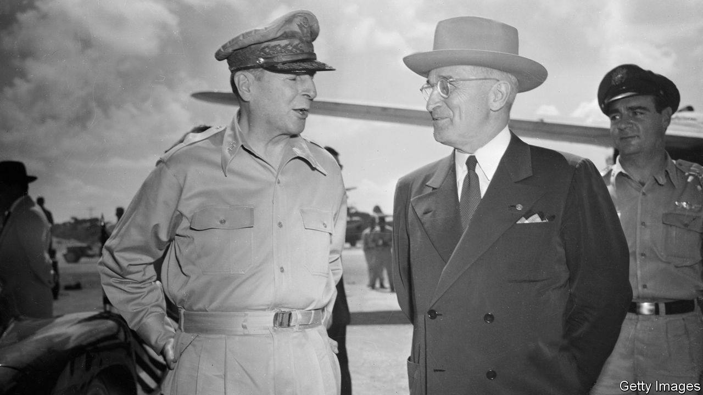

###### Masters and commanders

# In war, the key tussles are often between generals and leaders 

##### Sir Lawrence Freedman explains why in “Command” 

 

> Sep 8th 2022 

 By Lawrence Freedman. 

Carl von clausewitz, the Prussian general and theorist of war, is much-quoted and little understood. His most famous dictum—“war is the continuation of politics with other means”—actually suggests two ideas. One is that war must always be aimed at specific political ends. It is not spasmodic violence. The other is that politics does not stop when the shooting starts. Deterrence and diplomacy co-exist with combat. “Command” shows why generals must heed both those lessons—and what happens when they do not.

Sir Lawrence Freedman, Britain’s most distinguished scholar of war, surveys 15 different battles and campaigns. He begins with the paradigmatic case of disagreement between a general and his master: that between Harry Truman, America’s president, and Douglas MacArthur, his top commander, over strategy in the Korean war. “The case for limited war in the nuclear age had been made”, writes Sir Lawrence, “but in the military had not yet been accepted.” MacArthur, a chronic insubordinate, chafed at the constraints imposed by the White House. He agitated for the use of battlefield nuclear weapons and publicly criticised American foreign policy.

What is noteworthy is not that he was sacked, but that it was not easy to sack him. MacArthur was a “revered figure, beyond criticism” and a potential political rival to Truman. Yet he was, in the end, a bad commander who made poor decisions and lost the confidence of his officers and troops. It is trickier when a general is both insubordinate and brilliant.

One of the book’s most compelling chapters examines Ariel “Arik” Sharon, the Israeli commander who became prime minister. Sharon habitually ignored or defied his superiors if he spotted military opportunities. During the Yom Kippur war of 1973, he flouted orders by charging towards the Suez canal, later refusing to withdraw from the other side of the waterway. 

He was indulged in part because of his sense of daring and initiative. “Arik is conducting his own private war,” complained his superior officer. “Better a noble steed that you have to restrain than a lazy ox you have to beat,” retorted Moshe Dayan, the defence minister. In a later war in Lebanon, Sharon, by then minister of defence himself, described his philosophy: “In the morning I fight the terrorists, and in the evening I go back to Jerusalem to fight in cabinet.” Sharon’s contempt for procedure is one reason the war went so badly.

In Israel, where military service is mandatory and generals routinely become politicians, the line between civilian and military leadership has often blurred. In dictatorships, the distinction frequently collapses entirely. Despot-commanders are unaccountable and often incompetent. General Yahya Khan, Pakistan’s military dictator, was drunk or fornicating during key moments in a war with India in 1971. It culminated in his country’s dismemberment and the creation of Bangladesh.

Despots are also capricious and intolerant of bad news. Hitler sacked 11 of his 18 field-marshals and 21 of 37 colonel-generals, often micromanaging battles from his headquarters. Saddam Hussein executed 300 high-ranking officers in the summer of 1982, during an ill-conceived war with Iran. Vladimir Putin, Russia’s president, is thought to have sacked six generals in the first six months of his war in Ukraine. In May Western officials said that Mr Putin was taking decisions that would usually be made by a colonel or brigadier.

The result is often pathological decision-making. “Once it was required that all decisions had to be checked with him”, writes Sir Lawrence of Saddam, “the system became drained of all initiative.” Field commanders often find it easier to conceal setbacks than own up to them. Talking to Mr Putin early in the current war, European leaders described the heavy casualties Russia was taking because they doubted his own spooks had told him. (Though largely completed before the war began, the book contains an excellent account of how the conflict evolved between 2014 and 2022.)

Yet command presents serious challenges even in the most high-functioning democracies. Truman’s frustration with MacArthur was echoed 60 years later in Barack Obama’s concern that his generals were trying to force him to escalate the war in Afghanistan. And because almost all Western wars are now fought by coalitions, chains of command are tangled. War may be the continuation of politics—but whose politics? Sir Lawrence recounts how, during nato’s war with Serbia in 1999, Major-General Sir Mike Jackson, commander of British forces on the ground, refused an order from his American boss, General Wesley Clark, the alliance’s top officer, to seize Pristina airport from the Russians: “Sir, I’m not starting world war three for you.”

Such tussles between layers of command are often the most bitter and consequential relationships in war. During the Cuban missile crisis, Soviet admirals put their submarines in a “terrible predicament”, notes Sir Lawrence, by insisting they loiter in the Sargasso Sea while staying undetected. It was an impossible demand: the admirals did not grasp that the boats had to surface to recharge batteries and communicate. The lesson is that good command looks both ways, sensitive to the politics raging above while remaining in touch with the war being fought below. ■

