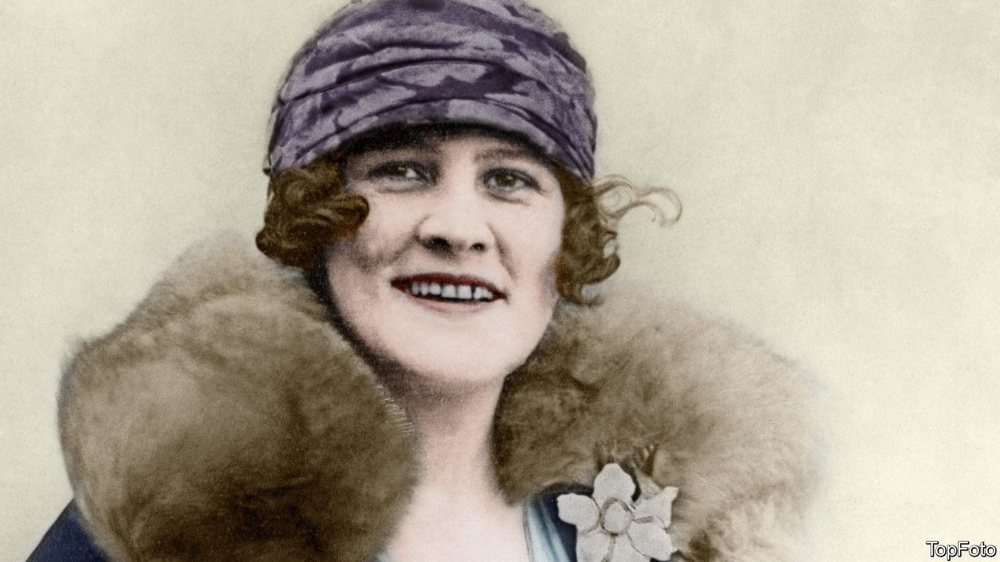

###### A life of crime

# Lucy Worsley takes on the mystery of Agatha Christie 

##### At the heart of her biography is the novelist’s 11-day disappearance in 1926 

 

> Sep 8th 2022 

By Lucy Worsley. 

On friday december 3rd 1926 Agatha Christie left her husband and young daughter and went missing for 11 days. Using detective work befitting one of Christie’s novels, Lucy Worsley puts this mysterious disappearance at the heart of her colourful new biography, piecing together what really happened that winter.

According to Christie’s own account of those 11 days, she lost her memory after crashing her car in a half-hearted suicide attempt. But her comments on the matter were misreported by the press, inflicting lasting damage on her reputation. Dismissive of her testimony as a female writer, the papers preferred the more salacious story that she had framed her adulterous husband for murder.

Ms Worsley’s version of events hews closer to Christie’s and is far more convincing. The novelist was seriously ill from a combination of depression and “dissociative fugue” (or stress-induced amnesia). The pain of her mother’s death, her husband’s infidelity and the possible loss of the family home did indeed culminate in a suicide bid, followed by a stay at a hotel in Harrogate, Yorkshire, under a false identity. Ms Worsley calls the press’s treatment of Christie at this time “the great injustice” of her life.

A more impenetrable mystery is why, when she died in 1976, her estate was worth only £100,000 (in today’s money, £550,000 or $630,000). Ms Worsley describes the drain on Christie’s finances of tax bills and the upkeep of assorted properties, but is at a loss to explain how the world’s bestselling author was consistently strapped for cash. She is on firmer ground in her poignant portrait of the complex relationship between Christie and her daughter, Rosalind, who was shipped off to boarding school and “internalised the fact that she was less impressive, less important, than her mother”.

Family life was eccentric. Christie, a teetotaller, quaffed glasses of cream in lieu of champagne and hosted generous parties at Greenway, a house in Devon that she crammed with art and silverware. She developed an impressive ability to churn out detective fiction without her guests ever seeming to witness it. Rosalind had to compete hard for her mother’s attention, yet was among the few people who could reassure her that she was a bona fide novelist. As Ms Worsley notes, Christie suffered from a lifelong case of impostor syndrome: even in her 80s she remarked that she didn’t truly feel like an author, preferring to present herself as a regular housewife.

But as this book ably demonstrates, the little girl born into a conventional Victorian household turned out to be anything but ordinary. She loved travelling (and went surfing in South Africa “in a pearl necklace”), had a weakness for fast cars and embraced psychology during periods of mental illness. She became a writer at a time when women of her background were expected to marry rather than work. This book concludes that she “redefined the rules for her social class and gender”. 

Ms Worsley herself writes engagingly, with a smattering of racy phrases (Archie Christie, that adulterous first husband, is said to have been “incredibly hot”). She combines an almost militant support for her subject with a considered analysis of her books and plays—making the case that, in her themes and formal innovation, Christie was much more than a writer of formulaic potboilers.

In the end, though, why the “queen of crime” was so self-effacing is never quite clear. Much about this “elusive genius” appears destined to remain secret. She seems to have preferred it that way. ■

