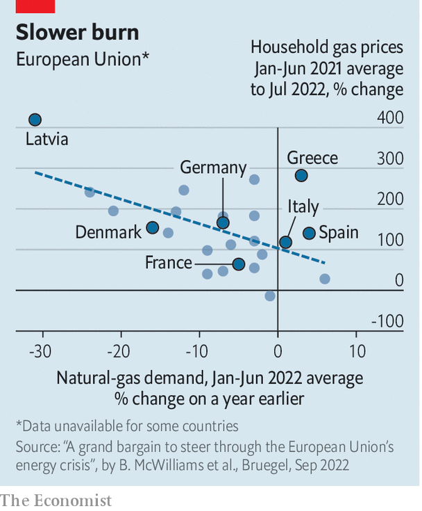

###### Preventing the big chill

# Europe scrambles to protect citizens from sky-high energy prices 

##### It is a test of European solidarity against Vladimir Putin 

 

> Sep 5th 2022 

“What we have to do is flatten the curve,” Ursula von der Leyen, president of the European Commission, announced on September 7th. She was talking not about the pandemic, but about Europe’s newest crisis: a surge in energy prices caused by Russia curtailing fossil-fuel exports to press the eu to stop supporting Ukraine. Ms von der Leyen proposed five eu-wide measures to frustrate Russian manipulation, including flattening peaks in electricity demand which help drive up prices. European energy ministers will discuss her proposals when they meet in Brussels on September 9th.

Ms von der Leyen’s measures would co-ordinate efforts to blunt rising energy prices at the European level. Besides smoothing of electricity use, they include windfall-profit charges both on non-fossil-fuel power generators, such as renewables and nuclear, and on fossil-fuel companies. The proceeds would be returned to consumers. Other measures would offer liquidity to energy companies hit with high demands for collateral, and cap the price of Russian gas. Vladimir Putin responded with a threat to end energy exports to Europe.

That threat may be moot. Europe already has plans to embargo Russian oil from December 5th, notes Simone Tagliapietra of Bruegel, a think-tank, and gas deliveries have shrunk by two-thirds from pre-war levels. After the g7, a club of big economies, imposed a  on September 2nd, Russia said that Nord Stream 1, its main gas pipeline to Germany, would stay shut indefinitely—supposedly for technical reasons.

Gas prices are now about ten times their average over the past decade. Europe’s governments are struggling to balance relief for citizens and firms with letting energy prices rise in order to discourage use. They must also avoid bidding wars with each other. The eu’s proposed measures attempt to tackle collectively a challenge that its member countries are struggling to meet individually. If they fail, European voters may demand their governments drop sanctions on Russia in the (forlorn) hope of getting cheaper energy—or make way for new leaders who will.

So far, measures have come from national governments. On September 4th the leaders of Germany’s coalition government emerged after 22 hours of negotiations, looking as exhausted as Berlin disco-goers, to announce a package that will cost at least €65bn ($65bn), equivalent to 1.8% of the country’s gdp. It is supposed to preserve social peace this winter when consumers are clobbered with sky-high energy prices. “You’ll never walk alone,” promised Olaf Scholz, the German chancellor, who has become fond of quoting the song by Gerry &amp; The Pacemakers in recent months.

The package, Germany’s third, brings the country’s total spending on energy relief to some €95bn. It includes tax breaks for energy-intensive industries, one-off payments for students and pensioners, subsidised public transport and higher child benefits. An electricity-price brake will cap the price of a basic amount of electricity for households and small businesses. The subsidies will be welcome but costly. Mr Scholz plans to finance them in part by bringing forward a planned 15% minimum corporate tax. He will pay for the electricity-price brake with a cap on profits of power firms that do not use fossil fuels, as in Ms von der Leyen’s proposal.

France’s parliament passed a relief package worth €64bn in August. President Emmanuel Macron is offering generalised rather than targeted subsidies, and capping price increases rather than compensating those squeezed by them. Gas prices are frozen until at least the end of 2022, and the rise in electricity prices is capped at 4%. From September 1st France raised its petrol-price subsidy to €0.30 per litre; government signs on gas pumps remind consumers of this generosity.

These measures are largely deficit-financed. The government is nationalising edf, the national energy giant in which it already holds an 84% stake, to make it easier to dump costs on the company. France usually exports electricity, but with over half of its 56 nuclear reactors down for repairs it is contributing to Europe’s shortage—and paying high prices as a result.

In Italy, efforts to offset the crisis helped bring down Mario Draghi, the departing prime minister. In June Mr Draghi’s government drew up an energy-cost relief bill which included provisions for a waste-to-energy plant that one of his coalition partners, the anti-establishment Five Star Movement (m5s), considered unecological. That led to Mr Draghi’s resignation and the calling of an early election to be held on September 25th.

The government has already shelled out €52bn, according to Daniele Franco, the finance minister. Helping the poor has been the priority, with energy-intensive businesses next. Inflation and strong economic growth have bumped up tax revenue, so the treasury has not yet been forced to borrow more. Yet Italy remains a weak point in Europe’s alliance against Russia. On September 4th Matteo Salvini, leader of the hard-right Northern League, called for reconsidering sanctions. The right is favoured in the election, and the League is likely to join the next coalition.

 


Even in central and eastern Europe, where support for Ukraine is strongest, high energy prices threaten to undermine sanctions. In Prague on September 3rd, 70,000 people joined a rally organised by far-right and far-left groups to denounce aid to Ukraine and demand more help paying their bills. The previous day the Czech government had withstood a no-confidence vote over its energy-relief package of $7.2bn, about 3% of gdp. In Bulgaria, the eu’s firm line against Russia may already have snapped. A liberal coalition government fell in June, and the caretaker government has suggested it will negotiate with Gazprom, the Russian state gas firm, to resume supplies, which were cut off in April.

If Ms von der Leyen’s proposals are adopted, countries will implement them differently. How they do so will be crucial. Spain, for example, has set limits on air-conditioning in shops and the like in order to reduce energy use. But its main policies subsidise fossil-fuel use by lowering vat on gas, capping gas prices for electricity generators and subsidising petrol. In Spain and some other countries that subsidised energy, consumption rose in the first half of 2022 (see chart).

The discussions in Brussels will be as contentious as those within countries have been. In France, Mr Macron has faced criticism because measures such as the petrol-price rebates can benefit the rich more than the poor. In Germany, industrialists grumble that the government is helping private households more than businesses. Siegfried Russwurm, the head of the bdi, Germany’s main industry lobby, called the latest package “disappointing and not specific”. ■

