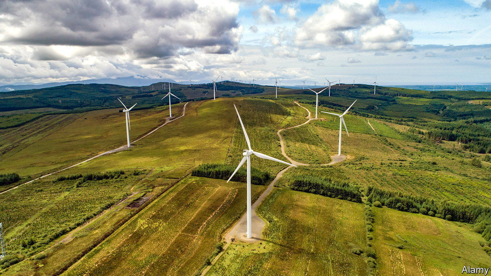

###### Western wind

# Ireland’s dreams of exporting wind power are plausible 

##### But first it will have to conquer deep and stormy seas 

 

> Sep 8th 2022 

They say it is an ill wind that blows no one any good. But rising temperatures—and the need to slash Europe’s dependence on Russian energy—are a boon for Ireland’s ambitions to become a big exporter of electricity. The country produces no nuclear energy, oil or coal, and only enough gas to meet some 30% of its needs. But it has one of the windiest coasts on the planet. “Wind is Ireland’s oil,” said Micheal Martin, Ireland’s prime minister, at Davos this year. “Certainly, by the mid-2030s we want to be exporting energy.” 

Last year 31% of Ireland’s electricity came from wind turbines, according to Wind Europe, an industry group. The share was higher only in Denmark, which managed 44%. Already this year Ireland’s figure has risen to 36%. The Irish government wants to push its renewables share up to 80% by 2030; it beat this target briefly during one especially stormy weekend in February this year. The hope is that improvements in energy storage, and a new electricity interconnector with France which is due to come online in 2026, will allow Ireland to sell surplus wind power to European countries that are struggling to decarbonise their own energy supplies.

Yet there are still many miles to go. Ireland has built about 300 wind farms on dry land already, and is running out of places to put new ones. For health and environmental reasons, turbines must be at least 500 metres from existing houses. Haphazard rural planning, which has allowed homes to sprout more or less randomly throughout the countryside, has not left many spaces large enough for big new projects, says Ian Lumley of An Taisce, an environmental lobby group.

There was consternation earlier this year when the national planning authority, citing the need to boost green power, approved a new wind farm that would show above the valley wall at Gougane Barra, a beauty spot and place of religious pilgrimage in County Cork. “There are already lots of wind farms in Ireland, and that’s good, but there’s only one Gougane Barra,” says Neil Lucey, a local hotelier leading a campaign to overturn the decision.

The obvious solution is to move production out to sea. Ireland’s only offshore wind farm, off County Wicklow on the east coast, was the largest in the world when it began spinning in 2004, but has since been dwarfed by newer ones elsewhere in Europe. Noel Cunniffe of Wind Energy Ireland, another industry group, says that in theory Ireland could install offshore turbines with a capacity totalling 80 gigawatts, more than triple Britain’s total current wind capacity, and that this figure will probably increase as turbine technology continues to improve.

Ireland will have to hustle if it is to catch up with Britain. That country has already developed the ports, special ships, planning laws and talent needed to push ahead with large-scale offshore wind farming, says Wind Energy Ireland. Ireland’s creaking transmission network also needs updating. And because Ireland has deeper waters and stormier coasts, its prospects hang on the development of new types of turbine that float on the water rather than having to be fixed to the sea bed. It will need the wind at its back. ■

