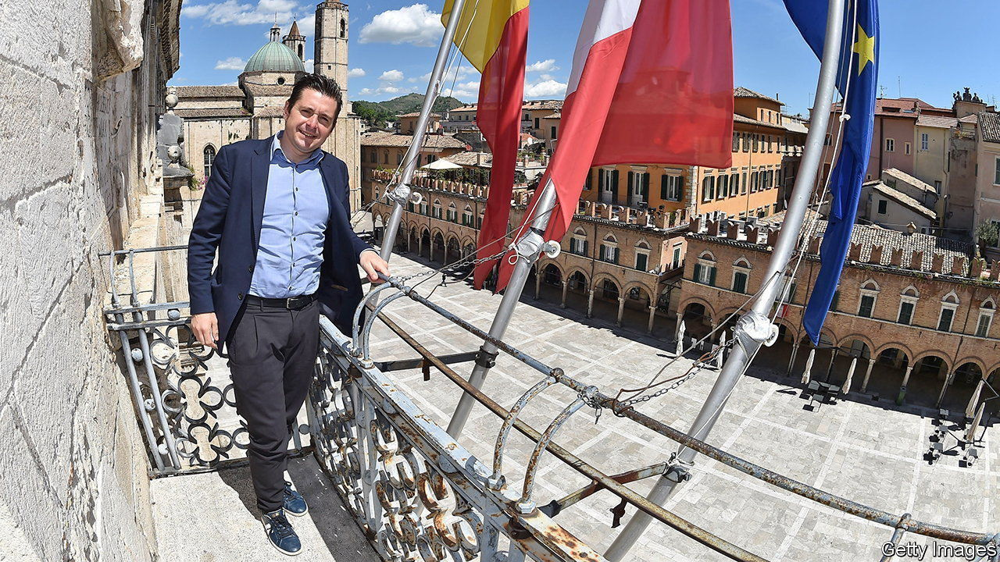

###### Big Brothers

# Meet the hard-right party likely to win Italy’s election 

##### The Brothers of Italy are responding to populist demand 

 

> Sep 8th 2022 

Marco fioravanti’s father died when he was a teenager, and he went to work in a factory to help support his family. But Mr Fioravanti never gave up on his dream of university, eventually winning a degree in political science. By the age of 26 he was a city councillor in his hometown of Ascoli Piceno, a picturesque place where Renaissance palaces nestle by a river winding out of the Apennine mountains. Three years ago he was elected mayor. Every month he makes himself available to voters in a local café. “Locked away in the town hall, you risk losing touch with the problems of the city,” he says.

Between 80 and 100 people turn up to air grievances and suggestions. With their input, Mr Fioravanti has drawn up projects that have earned Ascoli Piceno a handsome allocation from the eu’s covid recovery fund—the fourth-largest share per head, he says, among Italy’s 7,904 municipalities. Under his stewardship, he continues, local government property has been turned over to public housing; municipal welfare benefits have been increased; an “ethical hotel”, run by the disabled, has been opened; and the city has acquired a new park and a cycle path down to the sea. In a poll in July by , a financial daily, Mr Fioravanti was rated the second-most popular mayor of a provincial capital.

It is a record of which any left-winger would be proud. Mr Fioravanti, however, is a member of the radical nationalist Brothers of Italy (fdi) party, which is leading the polls and looks set to dominate Italy’s next government. At 39, Mr Fioravanti is too young to have been a member of the neo-fascist Italian Social Movement to which many of the fdi’s older members belonged. But in 2019 he allegedly attended a dinner commemorating the seizure of power by Benito Mussolini, Italy’s fascist dictator. Mr Fioravanti says he merely dropped by to greet fellow party members: “I absolutely did not take part in the dinner, nor would I ever do so,” he says.

Ascoli Piceno is in the region of Le Marche, on the northern Adriatic coast. Once a stronghold of the centre-left Democratic Party, Le Marche swung to the maverick Five Star Movement in the previous two general elections. But a vote in 2020 handed the regional administration to a coalition identical to the one expected to govern Italy after the next parliamentary election on September 25th. It is led by the Brothers, along with the hard-right Northern League and Silvio Berlusconi’s more moderate but dwindling Forza Italia party. Le Marche thus became a test bed for alt-right government . It was in the regional capital, Ancona, that the Brothers’ leader, Giorgia Meloni, launched her election campaign on August 23rd. 

Stealing the left’s clothes is one element of the “Marche model”, as it is known in the fdi. Other ingredients are more controversial. In Italy, regional governments’ most important job is running public health services. The Brothers’ new governor in Le Marche, Francesco Acquaroli, has improved some policies that proved disastrous during the pandemic. But his government has refused to follow national guidelines that allow family-planning clinics to dispense Mifepristone, an abortion pill. 

The Brothers oppose abortion both on religious grounds and because their flagship policy, at the top of their election manifesto, is to reverse Italy’s falling birth rate. Ms Meloni lauds what she calls “the natural family” and deplores “the lgbt lobby”. Mr Acquaroli has refused to sponsor the region’s annual Gay Pride event. The fdi hopes encouraging Italians to have more children will obviate the need for immigration. Ms Meloni endorses the notion that the eu and the Hungarian-American philanthropist George Soros are behind a plan for “ethnic substitution”, echoing the far-right theory of a “Great Replacement”.

Few in Italy think the Brothers are properly authoritarian. Neither they nor their neo-fascist predecessors have ever presented a threat to democracy. But while Ms Meloni has denied wanting to scrap Italy’s abortion law, the evidence from Le Marche suggests the Brothers will want to make abortion more difficult to obtain. Then again, with all the economic and geopolitical troubles Italy faces, an fdi government may have other things than culture wars on its mind.■

