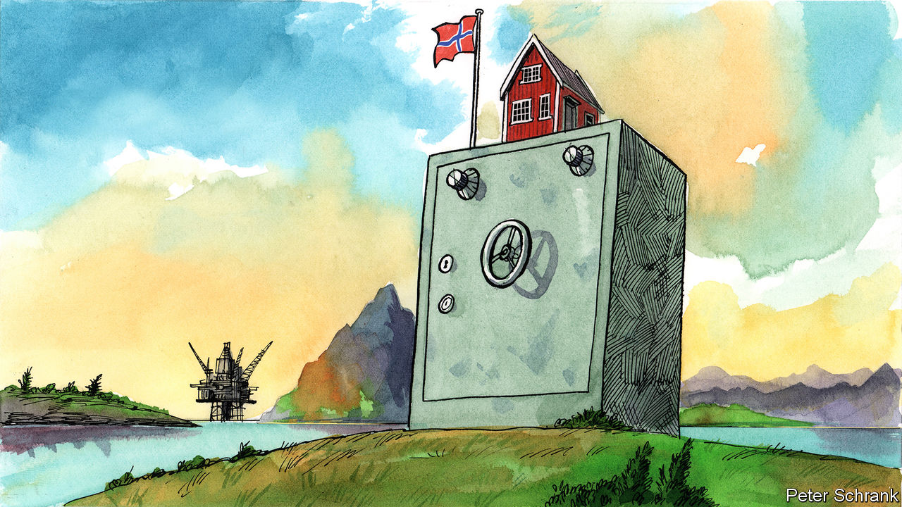

###### Charlemagne

# Norway is profiting embarrassingly from war in Europe 

##### It should think of ways to help the EU through the crisis 

 

> Sep 8th 2022 

Troubles in Europe have an unexpected way of drifting up to Norway, its northern frontier. The most literal example came in 1870, when two French soldiers sought to elude a months-long Prussian siege of Paris by using a hot-air balloon to deliver battle plans to troops outside the city. It did not go well. What was meant as a brief hop to the countryside became a 19-hour windswept odyssey over land and sea. The duo ultimately crashed into an icy mountain west of modern-day Oslo, some 1,400km from their intended destination. Locals dazzled by the flying contraption rushed the frozen Frenchmen to the capital. Parties were thrown in their honour, poems written, much champagne consumed and a passion for France proclaimed. The thawed soldiers left a week later with 23,800 francs in public donations, a sizeable sum. The incident, according to Paal Frisvold, a political analyst, showed that Norway’s people had “a keen desire to show sympathy and support to resolve conflicts in Europe”. 

Does this passion still stir in Norwegian hearts? For months, as Ukrainians have fought and Europeans shuddered at the prospect of opening their energy bills, the continent’s richest country (bar Luxembourg) has been getting conspicuously richer. Supplying energy to Europe was always lucrative for Norway, the world’s fourth-largest exporter of natural gas. It has become indecently so since Russia, once its rival in keeping Europe warm, turned pipelines into weapons. As the war and ensuing power crunch drag on, the sums flowing north are proving embarrassing. A place keen on its image as a force for good in the world is having to fend off charges of war profiteering. 

Norway would be prosperous even had it not stumbled upon offshore oil five decades ago. The vast quantities of energy it exports nowadays are merely a balloon-sized cherry on the cake. In a normal year sales of oil, gas and electricity bring in over $50bn, or $10,000 per Norwegian. That is enough to turbocharge a Scandinavian welfare state and lots of summer cabins on picturesque fjords. Now, thanks to the war, Norway’s energy-export revenues have shot up to a run rate of over $200bn a year. If not for the fact that it sensibly squirrels away such cash in a sovereign wealth fund, at these prices each Norwegian could get an annual cheque worth around $40,000—roughly the gdp per capita of the eu. Instead, its 5.5m citizens have to make do with a nest egg worth $1.2trn, despite a recent fall in the value of its investments.

Until recently Europeans, Norway’s main customers, did not quibble. Any non-Russian energy source was welcome, and the alternatives were mainly in the Middle East and north Africa. For Western politicians, pleading for hydrocarbons from a Norwegian minister is less awkward than doing so from an authoritarian petro-potentate. Norway merely demanded that the eu tone down its lectures about the country’s need to move away from fossil fuels faster. It boosted gas output as much as was possible, even suppressing trade-union strikes to keep the energy flowing. Norway sent money to support Ukraine and joined sanctions on Russia imposed by the eu, a club to which it does not belong. (It sits within the broader European Economic Area, a form of standoffishness it can afford thanks to its oil wealth.) 

Yet the mood has soured as the energy crisis has deepened. Facing bail-outs of utilities and consumers, Europe is no longer keen to feather the Norwegian nest. Poland grumbled first: in May its prime minister denounced the “sick” prices of gas from up north. Others protest more discreetly, suggesting that an enlightened supplier might choose to cap gas prices, at least while the war rages. Norway has long insisted that market pricing works, and that large profits now are needed to fund its green transition.

Politicians in Oslo have their own power problems to contend with. Because of abundant hydroelectricity, Norwegians feel entitled to cheap juice: many consider turning off the lights upon leaving a room a quaint habit. But a drought has depleted reservoirs, sending electricity prices spiking in parts of the country. Even in a rich country, this hurts. Some industries, such as the production of fertiliser or the smelting of metal, only exist by dint of low-cost power. Most Norwegians heat their homes with electricity and buy electric cars—Oslo traffic jams can feel like slow-moving Tesla showrooms. A Facebook group griping about power prices has over 600,000 members, many of whom blame transfers of electricity to Europe for their woes. The government has responded with generous subsidies, but also with hints that it could throttle exports of electricity, ostensibly to protect its depleted reservoirs. That has irked its eu neighbours, who want power markets to stay open so that what little energy there is can be allocated efficiently.

My way or Norway

The longer gas prices stay higher than an out-of-control hot-air balloon, the greater the pressure will be on Norway to donate some of its windfall. Solidarity with Europe is a form of self-interest, argues Georg Riekeles of the European Policy Centre, a think-tank. Good relations with its neighbours matter more to Norway than squeezing out the last drop of profit. Beyond oil and gas, Norway’s wealth depends on being part of a Europe that works. 

Granting a discount on gas to European customers may be too sensitive for Norwegian politicians. But the prime minister, Jonas Gahr Store, this week suggested its energy firms (the biggest of which, Equinor, is mostly state-owned) might agree to long-term contracts that underprice gas today in exchange for stable profits later. That would be a start. Better yet, Norway should offer to pitch in to whatever relief schemes the eu comes up with, perhaps of the sort that helped alleviate the effects of covid-19. As Ukraine has discovered, Europe is willing to help its neighbours when disaster befalls them. For it to continue to do so, countries that happen upon an unexpected bonanza may need to toss some of it back into the common pot. ■


