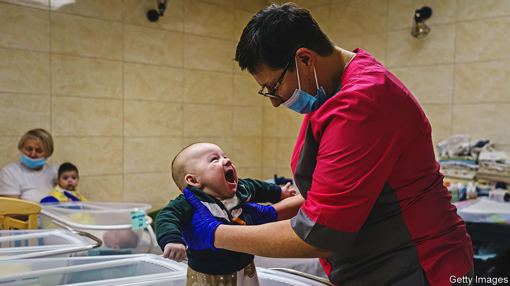

###### Thursday’s children

# The war has thrown Ukraine’s surrogacy industry into crisis 

##### But there are not many other places couples can go 

 

> Sep 8th 2022 

When missiles began falling on Ukraine in February one woman from the centre of the country faced an especially perilous evacuation. She was 30 weeks pregnant—with someone else’s baby. The 31-year-old, who goes by the name Tamara for fear of abuse, was put on a bus to Poland by Delivering Dreams, the surrogacy agency she was working through. Her legs swelled up during the long journey. But Tamara made it to safety and in April gave birth to a healthy baby, who is now with its intended parents in America. 

Before the war about 2,500 surrogate mothers gave birth in Ukraine every year, according to Sam Everingham, who runs Growing Families, a non-profit. The babies’ intended parents are generally foreign couples, mostly from Europe and China. They appreciate Ukraine’s clear laws about surrogacy, which ensure that they are recognised as their baby’s legal parents from the moment of conception. They also like the cost. Mr Everingham reckons that having a baby by a Ukrainian surrogate costs between $35,000 and $55,000—about one-third of the price in America.

The Russian invasion, unsurprisingly, has thrown the industry into disarray. Surrogates have had to deliver in hospital basements. All pregnant women have had to put up with more limited health care, particularly in the east of the country where conflict is fiercest. Foreign parents, many of whom have been through lengthy fertility treatments and lost pregnancies before, fret from afar. 

Ukraine’s surrogacy agencies have responded to the catastrophe in very different ways. At the start of the war a handful of agencies initially stopped responding to emails and phone calls—leaving pregnant women with no way of contacting the parents of the babies they are carrying. Online groups sprung up to connect parents and surrogates who have found themselves in this situation. Tamara used Facebook and her own detective skills to track down about 20 foreign couples on behalf of other surrogates.

But as the conflict continues agencies have found ways to keep delivering on their promises. Sensible Surrogacy, an agency with partners on the ground in Ukraine, paid to evacuate Ukrainian surrogates to Poland and the Czech Republic. There, the agency hired local staff to check in on the women and continue doing weekly blood tests for alcohol and other drugs. The catch is that surrogates have to return to Ukraine near their due date. If they give birth in Poland, where surrogacy is illegal, the intended parents do not automatically have any rights over the child.

For a while foreign couples who would normally have travelled to Ukraine for the births of their children had to pay local nannies to hand over newborns at border crossings. Britain began issuing visas to Ukrainian surrogates who were carrying babies for British couples. But now that fighting is predominantly in the south and east of the country, foreign couples are once again travelling to cities such as Kyiv and Lviv to collect their children.

Indeed, international surrogacy agencies say that interest in Ukrainian surrogacy crashed at the start of the war but is now rising once more. Global demand for surrogacy is increasing, in part because people are starting families later in life, which increases the risk that they will no longer be fertile. But in recent years Cambodia, India, Nepal and Thailand have banned surrogacy for non-residents for fear that women might be exploited. In Britain, only “altruistic surrogacy”, where the surrogate receives cash only to cover expenses, is allowed. That reduces the number of women willing to provide it.

Ukrainian women who have lost everything in the war could be exploited if dodgy types enter the industry. But Olha, a Ukrainian surrogate who is carrying her third baby for a foreign couple, says she doesn’t regret her decision. She is being paid $450 per month during her pregnancy. She will earn another $18,000 when she gives birth. That is a life-changing sum in a country where gdp per person before the war was about $4,800. “Surrogates are grown-ups,” she says. “We know what we are doing.” ■

