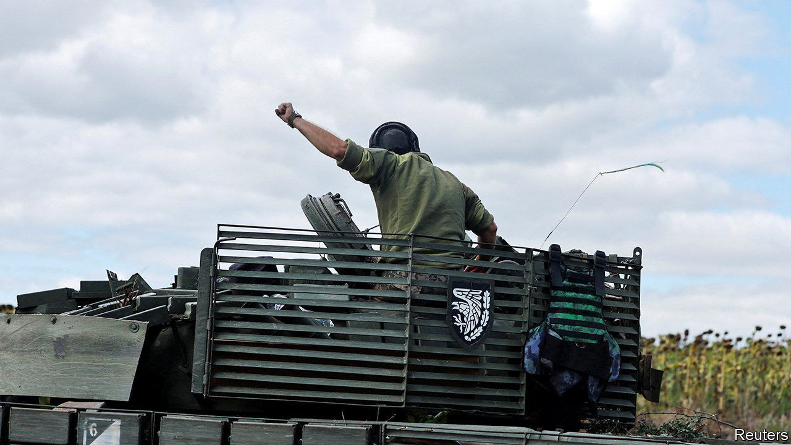
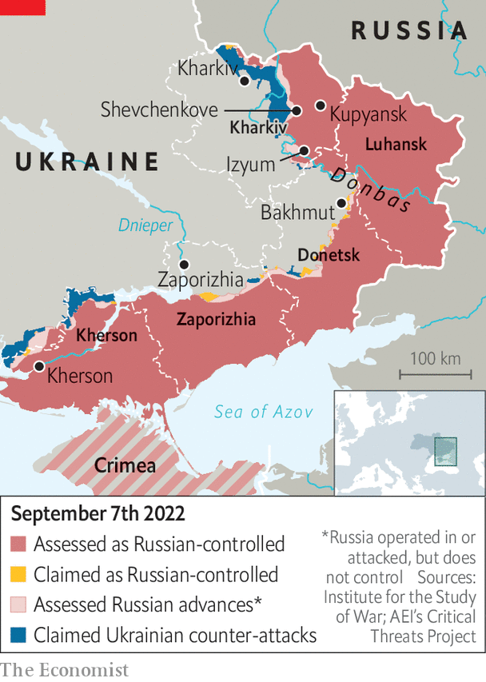

###### Breakthrough

# Ukraine’s army pierces Russian lines near Kharkiv 

##### Meanwhile Vladimir Putin’s prison state grows ever harsher 

 

> Sep 8th 2022 

“We have not lost anything and will not lose anything,” Vladimir Putin told an economic forum in Vladivostok on September 7th. Even as he spoke, his troops were falling back. On September 6th Ukraine announced a surprise offensive in north-eastern Kharkiv province, throwing Mr Putin’s creaking army into turmoil. 

All eyes had been on a long-awaited Ukrainian offensive in southern Kherson province, which began on August 29th. Russia had thinned out its forces in the east to reinforce the south. On September 6th Ukraine’s army took advantage, slicing through a weak point in the front lines east of Kharkiv city. It rapidly encircled Balakliya and was reported to have advanced 20km to Volokhiv Yar. By September 7th Ukrainian forces were advancing towards Shevchenkove, a similar distance away. 

The breakthrough is a significant moment after months of grinding advances by Russia in the eastern Donbas region. Russia’s army now faces “multiple concurrent threats spread across 500km”, noted British defence intelligence. There is fierce fighting not only in Kherson and Kharkiv provinces but in Donbas itself, where Russia has been attacking towards Bakhmut, largely without success. It now faces the trilemma of whether to send scarce reserves to Kherson, Kharkiv or Bakhmut. 

 


The decision will depend on how the Ukrainian offensives unfold. The attacks around Kharkiv appear to have routed Russian defenders in places. Ukraine might now threaten Kupyansk, a key rail junction which supplies Russian forces in Izyum to the south. Ukrainian artillery is probably within range of the town. 

In Kherson, Ukraine appears to have made more modest progress. Some experts say the offensive may have stalled. But to judge it solely in territorial terms would be a mistake. Ukraine’s strategy is probably not to storm the city but to wear down its Russian defenders and compel them to withdraw—though it must be careful not to wear itself out in the process.

Ukraine’s offensives are clearly spoiling Mr Putin’s plans. He was hoping to demonstrate results from his “special military operation” by the end of the summer, and made plans to annex Kherson and neighbouring Zaporizhia provinces this autumn. Sergei Kirienko, deputy chief of Mr Putin’s staff, was dispatched to Kherson to make preparations and Ria Novosti, Russia’s state news agency, advertised upcoming “referendums”. These sham spectacles were supposed to coincide with Russia’s local elections on September 11th. 

But on September 5th a Russian-appointed official in Kherson said the referendum was postponed. On September 7th Russia’s ruling party, United Russia, suggested holding referendums in Russian-occupied territories on November 4th. Mr Putin has said nothing about the offensives and is still convinced that he is winning, Western officials said. He hopes Western leaders facing an energy crisis will press Volodymyr Zelensky, Ukraine’s president, to negotiate. And he is compensating for failure in Ukraine with terror at home. 

On September 5th Ivan Safronov, a respected military journalist who was arrested in 2020 and accused of divulging state secrets, was sentenced to 22 years in prison. The fact that he had no access to secret information and used only open sources made no difference to the court. Observers say the case is a vendetta by the Russian army and security services: in 2019 Mr Safronov wrote about the secret sale of Russian Su-35 fighter jets to Egypt. He rejected an offer to reduce his sentence in exchange for accepting the baseless charges. The draconian sentence, says Kirill Rogov, a political analyst, is meant to distract Russia’s public from the incompetence of the Kremlin’s security services, who failed to conceal the invasion plan for Ukraine from American intelligence agencies.

Mr Safronov’s sentence is intended to deter others from talking about Russia’s military failures. , a Russian business daily where Mr Safronov worked, defiantly responded with a front-page letter to him: “You are a real journalist…In other times, in other circumstances, you would have been acquitted.”

On the day Mr Safronov was sentenced the Kremlin banned , Russia&#39;s most critical independent newspaper. It was edited by Dmitry Muratov, who won the Nobel Peace Prize in 2021, and sponsored by Mikhail Gorbachev, the former Soviet leader who died on August 30th. 

The Kremlin also inflicted more pain on Alexei Navalny, the jailed opposition leader, placing him—for the third time in the past month—in an unheated punishment cell in one of its harshest colonies. “I hate this war, and my colleagues and I are doing whatever we can to bring it to an end,” Mr Navalny said earlier in a public message through his lawyers. He has devoted all of his political and media resources to opposing the war. He is currently urging citizens to vote in local elections for any candidate who does not support it. ■


