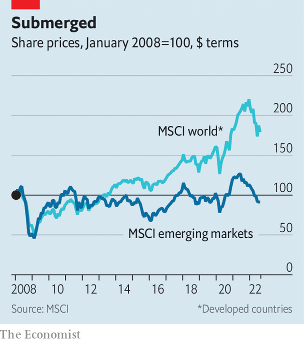

###### Buttonwood

# Emerging-market stocks are struggling in an intangible world 

##### Firms need better protection from copycats 

 

> Sep 8th 2022 

Halfway through the year, as commodity prices soared and stockmarkets plunged, it looked as if emerging-market stocks might do something they had managed only once in the past decade: to beat the returns of American ones. Two months on and the hope is gone. A small bounce in rich-world share prices means emerging-market underperformance will probably continue.

America’s interest-rate rises—and the expectation of more to come this year—have not helped emerging-market economies, especially those with large import bills and dollar-denominated debts. Over the past decade, though, the performance of the dollar has been mixed and interest rates low. In the same period, the msci em index has returned just 2.9% a year, against 9.5% for rich-world stocks. 

A big problem is the growing gap between emerging-market and rich-world profits. In the heyday of emerging-market returns, before the global financial crisis of 2007-09, margins for the two indices were similar. But unlike American stocks, emerging-market profits never recovered. Forward margins—net profits expected by analysts this year and next—sit at 7.5% in emerging markets, compared with 12.8% in America and 8.9% in the euro zone. The gap is the widest it has been this century.

 


Several factors explain this. For commodity-exporting countries like Indonesia, Brazil and Mexico, enormous margins before the collapse of Lehman Brothers reflected sky-high prices of commodities as varied as soyabeans, oil, coal and nickel, rather than good management. Since then, prices have come back down to earth. Even at the Bloomberg Commodity Index’s recent peak, after Russia’s invasion of Ukraine, it sat 43% below its high in that period. 

More than a fifth of the msci em Index is made up of state-owned enterprises, which are lumbered with responsibilities beyond profits. Many are also in energy and finance, which have had a poor decade. In the ten years to the end of June, state-owned firms in the index offered annual returns of 2.6%, against the 4.2% offered by their private counterparts.

The change in which countries make up the index, something investors hoped would give them more exposure to fast-growing economies, has done little to help. In 2005 four markets—Brazil, South Africa, South Korea and Taiwan—each made up larger shares of the index than China. Now, Chinese stocks listed in Hong Kong and the mainland account for a third of the index, by far the largest share. 

But despite economic growth, Chinese profits remain depressed. The msci China index sits, astonishingly, below its peak in dollar terms, which it hit in 2007. In 2013 Yu Yongding, then of the China Society of World Economics, a think-tank, said that the profit on a few tonnes of steel was “just about enough to buy a lollipop”. Overcapacity in crucial Chinese industries, which have been flooded with investment, is still a problem.

Will profits grow? it outsourcing offers a chance to pair the traditional emerging-market strength of lower wages with an increasingly digital global economy. But digitisation is also reason to be sceptical of an emerging-market resurgence. The rise of firms with large stocks of intangible assets, such as software and intellectual property, explains much of the increase in profits in the rich world, and America in particular. One estimate suggests that intangible assets, mostly undisclosed, were worth 90% of s&amp;p 500’s market value in 2020, up from 50% in 1990. 

Developing economies spend far less on r&amp;d. Of those typically included in emerging-market indices, only South Korea and Taiwan surpass American r&amp;d spending, which sits at 3.5% of gdp. The equivalent figure in China is 2.4%, and the government’s campaign against the country’s most successful consumer-tech firms—like Didi, in ride-sharing, and Alibaba, in e-commerce—bodes ill for intangible-focused firms. According to the World Bank, r&amp;d investment runs to less than 1% of gdp in India, Indonesia, Mexico and South Africa. 

Firms that invest in intangibles are often found in bustling cities, of which emerging markets have no shortage. But they also need reliable governance and legal systems, so that investments can be protected from copycats. Openness to foreign expertise and cross-border collaboration are also crucial. Given the absence of these conditions in many developing economies, it may be a while until emerging-market returns, and thus the performance of emerging-market stocks, match those in the rich world. ■


