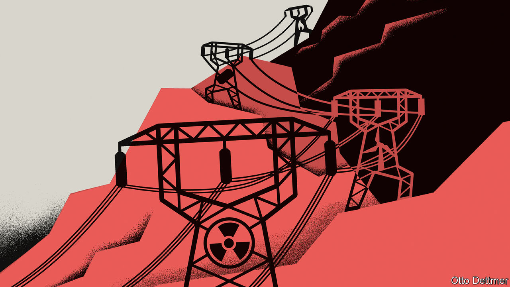

###### Free exchange

# Europe’s energy market was not built for this crisis 

##### It must be reformed without jettisoning what makes it work in normal times 

 

> Sep 8th 2022 

Most people hate fluctuating prices. When they fall too far, they are seen to be threatening firms. When they rise too high, they are seen to be unjustly enriching them. But economists look at price movements and see the revelation of crucial information. The recent frenzy about interventions in European electricity markets is an especially brutal example of this age-old dynamic. 

In recent weeks, forward prices for daytime electricity for the fourth quarter of the year briefly spiked above €1,200 ($1,200) per megawatt hour in Germany and above a surreal €2,500 in France. The usual price is around €50. The reason for this is simple: scarcity. The loss of generating capacity to maintenance (in France), closure (in Germany) and drought (across the continent) brought more and more gas plants into action, and their fuel has become extremely expensive since Russia wielded its energy weapon. 

Just like in any other market for a homogenous good, the price of power is set by the most expensive supplier. This means that even power plants with low operating costs, such as nuclear ones or wind farms, receive the high prices that gas plants are charging. The result is vast profits—and public outrage. Based on forward curves, Morgan Stanley, a bank, reckons that electricity spending in the eu could rise by more than €800bn, an increase worth an astonishing six percentage points of gdp. Thus politicians have started to ask whether a different pricing mechanism is needed. 

The problem is that designing an electricity market is hard. The juice cannot yet be stored at scale, and has to be delivered at the exact moment it is needed. Producers need to spend a lot of money upfront to build a windmill or power plant, and need to be able to recover it and make a profit over decades. Climate-change policies dictate that more and more renewable electricity is fed into the system, despite being mostly at the whim of wind and sunshine. 

Europe’s current design is a sequence of markets, some continent-wide, where electricity providers such as power plants meet retail suppliers, large industrial customers and others. Some deals are made months or even years before electricity is delivered, as suppliers and customers need clarity over revenues and costs. The reference price for electricity and for the settlement of many long-term agreements is set on the spot market, where the physical delivery of electricity is traded for the next day. Suppliers bid according to how much it would cost to provide an extra unit of power, known as its marginal cost. 

The idea behind this is straightforward. To generate electricity at low cost and in an increasingly carbon-free manner requires a lot of information. Some technologies, such as nuclear, are good at providing a constant stream of power. Gas is good for firing up quickly. Solar is best around lunchtime. The marginal price of power provides the information needed to switch between them, by signalling the value of an additional unit of electricity. 

The market also provides incentives to use power when it is cheapest to generate. Currently, prices are lowest at lunchtime and in the night. The transition to renewable energy means that prices will become more volatile. But that volatility is what drives innovation and investment in storage, smart meters and hydrogen. A high-capacity battery, and the storage it provides, will be most useful when prices oscillate between extremes. 

For a while, it looked as though the problem with Europe’s market was that prices were too low. With more and more renewable energy entering the market, the price of electricity sometimes fell to zero and even turned negative. The question was how marginal gas power plants—that might be needed to cover a windless, cloudy winter day—could make enough money during the rest of the year to survive. Some countries opted to add a capacity market; that is, they auctioned off payments to generators just for being there. Others stuck with an “energy-only market”. 

The question now is very different. Europe’s markets face sky-high prices for electricity, as the result of a war. It is a situation for which they were not designed. Thus policymakers face three challenges. The first is to preserve the marginal-price signal, for both generators and consumers, in the face of political pressure to weaken it. Lowering prices, for example by subsidising gas used in electricity generation, as Spain and Portugal have done, would elsewhere require some other form of rationing to allocate scarce energy. (Spain and Portugal can get away without rationing because Spain is an important gas hub, so can easily import more.)

The second is how and if to redistribute profits. The German government has recently decided to grab those it considers excessive, while leaving the price signal alone. (The European Commission may advise countries to do something similar.) It will do this through what is essentially a windfall tax that limits the share of the spot-market price that suppliers can keep. The problem is that generators have hedged their exposure to differing degrees, meaning the true recipients of the windfall profits may prove hard to find, and may in fact sit outside the energy market. 

Bright sparks needed

The third is to ensure that Europe’s energy market is ready for the next crisis, and to do so without sacrificing its advantages. At present, the spot market efficiently allocates capacity and provides signals on energy scarcity, offering an incentive for investment in renewables. But to guard against sustained shortfalls in capacity, and thus another price crunch, Europe’s energy markets must adapt. Long-term hedging markets are not very liquid, because consumers used to see little need for price security. In the future, they will probably see more. Regulators could help. A proposal by researchers at the Massachusetts Institute of Technology advises them to buy “affordability options” from generators, a form of insurance that would return profits from excessive prices to consumers, in effect creating an automatic windfall tax. How politicians would love to have something like that in place now. ■


