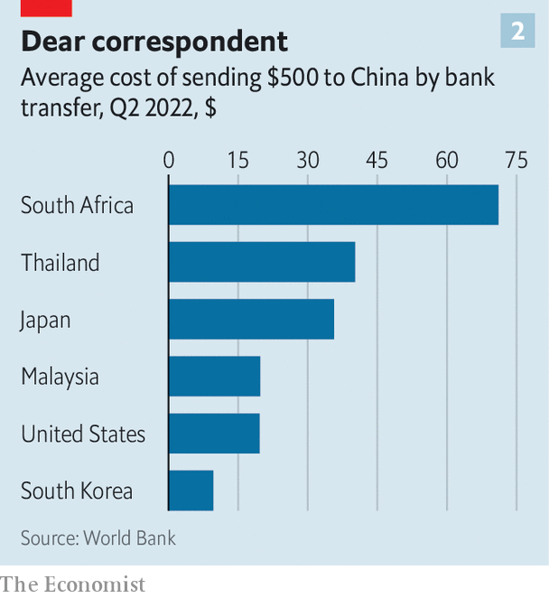

###### China’s financial system

# The digital yuan offers China a way to dodge the dollar 

##### In Beijing, officials are preparing for conflict 

 

> Sep 5th 2022 

In recent military drills, China has simulated an invasion of Taiwan, which it considers a “renegade province”. Talk of war has preoccupied Chinese bloggers, pundits and politicians since Nancy Pelosi, speaker of America’s House of Representatives, visited Taipei in August.

Finance officials in Beijing have no doubt been prepping for a conflict, too. They have watched with dismay as America and its allies imposed crippling sanctions on Russian banks and kicked seven of them out of swift, a Belgium-based messaging network used to send payment instructions. A Chinese invasion of Taiwan could result in similar measures, freezing Chinese banking activity abroad. In a shooting war over Taiwan, no one knows who would win. In a financial war, an American victory seems assured.

China’s dependence on the dollar has long been a source of frustration in Beijing. It not only cements China’s vulnerability to sanctions, but also exposes China to America’s macroeconomic whims. To many officials, it is perverse that their country, the world’s largest exporter and official creditor, should rely so heavily on the currency of the world’s biggest importer and borrower. For over a decade, China has tried to promote the yuan as an alternative. Yet progress has been hampered by another source of Chinese discomfort: uncontrolled capital flows (see chart 1). China’s limits on the movement of its money—in place to prevent speculation—make the yuan difficult for the world to embrace. 

 


Thus few bankers think the yuan will soon replace the dollar as the world’s currency of choice. But that is not the only prize worth pursuing. Other goals are more feasible and more urgent. In particular, China’s technocrats aspire to build a payments system that is easier for its trading partners to use and harder for America to block. They might also hope that such a system could make the yuan more influential abroad, without compromising China’s capital controls at home.

New technology might help. Since May 2020, China has been  with a digital version of the yuan, now known as the e-cny. Residents of 23 pilot zones across 15 provinces can download “e-wallets” onto their phones. The wallets are provided by their banks or popular payment platforms, like Alipay. But the e-cny they contain represent a claim on the central bank itself. Some 260m individuals and 4.5m shops can now handle the digital yuan, according to the People’s Bank of China (pboc), the central bank. Thanks to promotions and handouts, the digital currency has been used in over 260m transactions worth about 83bn yuan ($12bn) since its inception until the end of May, with an average transaction size of about 300 yuan. 

China insists the e-cny is first and foremost for domestic use. Officials were spooked by innovations like  and Diem, the digital currencies proposed by Facebook. They also want a secure backstop, and perhaps a rival, to Alipay and WeChat Pay, the hegemonic private payment platforms. For this reason, the e-cny has been designed for retail use. It can be held by individuals and non-financial firms, rather than just banks.

Yet a few Chinese scholars are willing to voice greater ambitions. Sun Lijian of Fudan University has argued that a digital yuan might help break the dollar’s monopolistic status and could be used to finance projects associated with the , China’s overseas infrastructure-building programme. Some of the biggest believers in the e-cny’s potential seem to be wary observers in America. A recent book published by the Hoover Institution, a think-tank, argues that the e-cny could play an important role in internationalising the yuan and “transforming the geo-economic landscape”. In particular, “it is likely that countries seeking to circumvent us sanctions will explore using the e-cny as an alternative channel for cross-border transactions,” it noted.

The e-cny could help internationalise the yuan in several ways. It could make it easier and cheaper for foreigners to make cross-border payments—and harder for America to block those transactions for geopolitical purposes. That would increase the appeal of the yuan, even if China’s capital controls remained in place. The digital yuan could also change the way those controls work, by programming them into the currency itself.

Within China, e-cny payments are quick and free, for now. (The central bank may charge a fee in future, according to , a Chinese magazine, to operators of the wallets and linked services, if not to end users.) The pboc has made no announcements about how an overseas user might receive a wallet. But China’s bankers are full of speculation. Some believe Chinese regulators will set up a special financial zone where users abroad could apply for wallets. Here, banks and other financial-services firms would be invited to create “know-your-customer” businesses for the screening of applicants. Foreign users might eventually be allowed to do this remotely through Chinese banks in their home countries.

Once a foreigner has qualified for a wallet, e-cny transactions with other wallet-holders should be quick and cheap, even if they are separated by a geographical border. In the early stages, most transactions would be with Chinese firms or customers. But once the number of foreign wallet-holders reaches a critical mass, some payments need not have a Chinese user on the other side of the trade.

Cross-currency transactions seem a more distant prospect. But China’s experiment with the e-cny has spurred many other governments to look into digital currencies of their own and how they might be exchanged with each other. Take, for example, mBridge, a programme set up by the Hong Kong Monetary Authority and joined by the pboc, the central banks of Thailand and United Arab Emirates, and the Bank for International Settlements, a club of central banks in Switzerland. One initial aim is to enable digital-currency transactions in the Greater Bay Area, a large region in southern China where three currencies (the yuan, the Hong Kong dollar and Macau’s pataca) now operate. The involvement of other central banks indicates mBridge’s long-term ambitions are much larger.

 


Platforms like these could eventually help settle international payments at a fraction of the expense of the current correspondent-banking model. The cost of sending a $500 remittance through a bank from South Africa to China now averages over 14%, or $70 (see chart 2). The technologies underlying digital currencies have been found to cut the transaction, energy and storage costs connected with these legacy systems. Moving away from centralised clearing and creating competition among various platforms could also help bring down costs. For China, the project is strategic, not commercial, and therefore it will almost certainly seek to undercut other systems on price, notes a recent paper by Ross Buckley of the University of South Wales, Douglas Arner of the University of Hong Kong and others. 

Such systems might also be less vulnerable to sanctions. America’s response to Russia’s war in Ukraine has shown that Western powers can debilitate foreign banks by kicking them out of swift. America can also bar its financial institutions from dealing with a country under sanctions, making it impossible for the country’s banks to settle dollar payments with the rest of the world. Payments in digital yuan would use neither the dollar nor swift and could conceivably bypass commercial-banking institutions altogether.

The e-cny might make America’s financial weapons less convenient and less precise, thus raising the bar to their use. But it would not spike them altogether. Even if America could not directly prevent an e-cny transaction from going through, it could still deny access to its clearing system to any institution using the e-cny in a way it did not like (ie, to serve a blacklisted country). Since America could not monitor e-cny activity as closely as it can monitor dollar payments, some transactions might escape its notice. Yet if the inscrutable e-cny became too big a threat to its sanctions regime, America could in theory ban its use by any institution that wants to retain access to the American clearing system. That would force the world to choose between the dollar and the digital yuan. 


Lower transaction costs and less vulnerability to sanctions could make the e-cny more appealing to foreigners. Other characteristics of the digital yuan could make its overseas use less nerve-wracking for China’s authorities. Officials worry less about capital leaving the country than about it leaving the currency. They are fairly relaxed about Chinese residents and firms accumulating yuan-denominated claims on the rest of the world. But they worry about runs on the currency, especially if those runs develop speculative momentum. In China, regulators can limit the amount of yuan that residents are allowed to sell for foreign currency. They can also quiz residents about why they want dollars. Regulators do not have the same control over non-residents, especially if non-residents hold yuan in foreign banks.

Several aspects of China’s existing financial plumbing betray this nervousness. Its own cross-border interbank payments system, cips, has been slow to admit foreign banks, for example. Within this system, yuan payments can leave China but stay within a trusted circle of largely Chinese intermediaries. Its “Wealth Connect” programme, introduced last year, creates another kind of closed loop. It allows rich individuals in China to buy investment products in Hong Kong, thereby gaining exposure to assets denominated in foreign currencies. But when they cash out of those investments, they may do so only in yuan. This stops people from moving trunk-loads of yuan out of China. 

The e-cny could enable another closed loop. Transactions in e-cny take place across the balance-sheet of China’s central bank. That makes it easier for the authorities to monitor the use of China’s currency even among non-residents. Because the e-cny can only pass between approved e-wallets, China’s authorities could also weed out potential speculators during the approval process. Digital wallets would be likely to encode a number of user characteristics, such as their country of residence and the industry they work in. These sorts of details could be used to grant or deny people and firms access to yuan payments, or limit their payments to certain sizes. China could then be confident that any digital yuan circulating outside its borders would not fall into the wrong hands for the wrong reasons. With such control, academics speculate that demand for e-cny among unsavoury parties would be low.

China’s digital currency is also “programmable”. The e-cny can be distributed with conditions, such as a time frame for spending it. In theory any condition can be programmed into digital currencies, says Michael Sung of FreeFlow Finance, a cross-border payments firm. Regulators could, for example, set limits on how much could be sold for foreign currencies. That would help them to limit any runs on the currency, even if the yuan were held by foreigners beyond their normal regulatory reach.

Imagine, for example, that e-cny wallets were granted to a number of grain traders in Africa, alongside related businesses, such as farmers, pesticides vendors and logistics firms. Money lent to these companies could be programmed to be exchangeable only with approved companies within this supply chain. The pboc could also monitor payment flows closely. Cashing out the e-cny into other currencies with unapproved banks could be easily stopped.

Such control and a god’s eye view of the currency could make the pboc more comfortable with allowing flows of its currency into trade finance and supply chains. Charles Chang of Fudan University points out that authorities have already been experimenting with changes to yuan-convertibility rules in Hainan. Officials have said that Hainan will become a free-trade port by 2035. They aim to make the island province an offshore trade and finance centre, much like Hong Kong. As Mr Chang notes, it is not hard to imagine this type of finance zone being used as a base to conduct digital-yuan trade finance.

But will users outside of China want it? In poorer countries, probably yes. Securing financing in dollars in poor parts of Africa can be incredibly difficult. Supply is limited. Business owners often wait weeks and pay hefty fees and bribes for access. Many firms in poorer countries already opt for yuan-based trade finance when it is available. A switch to e-cny could only help, as long as there is ample supply of it and overseas users can get digital wallets.

A restricted currency is naturally less appealing than an unrestricted one, just as food stamps are worth less than their equivalent in cash. So a programmed digital yuan would be less appealing than a currency free of restrictions. Yet if China’s conventional currency remains hard to come by, because of the government’s nervousness about speculation and misuse, then the digital yuan could be a viable alternative. It would be less freely usable, but more freely available. Moreover, most users of a currency have no intention of panic-selling the currency unless everyone else does. So technological speed bumps designed to prevent runs need not be fatal to the digital yuan’s international appeal.

Much of this is still speculation. As tensions rise with America, the domestic roll-out of e-cny will bring little comfort to Chinese technocrats who fret about imminent conflict. In the long-term, though, the digital currency will be more significant. It may eventually help the yuan span the world without leaving its lane. ■


