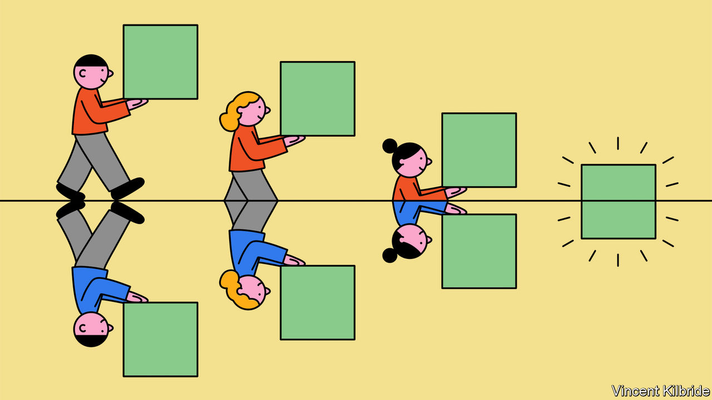
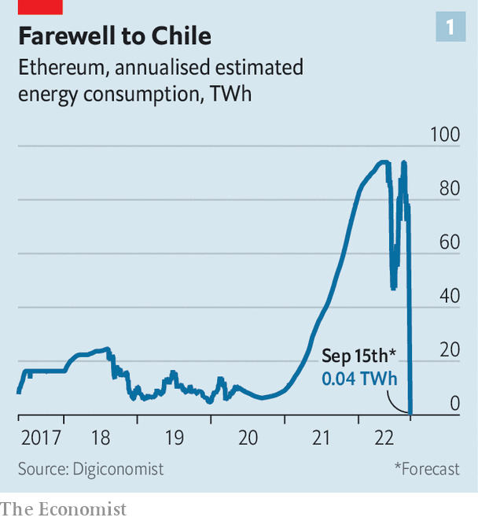
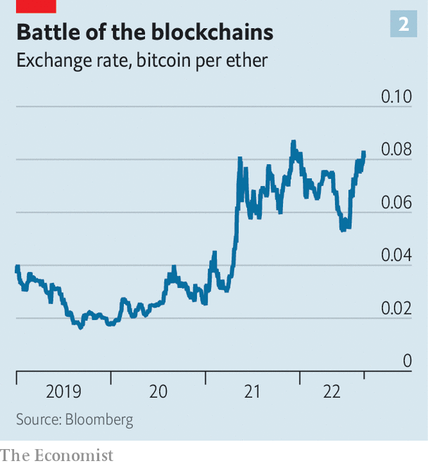
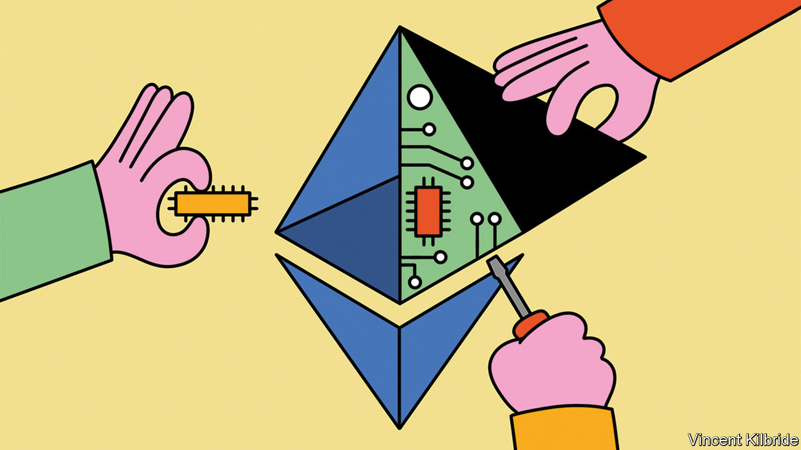

###### Post-crash cryptocurrencies

# The future of crypto is at stake in Ethereum’s switch 

##### Can decentralised networks reform themselves? 

 

> Sep 6th 2022 


It is 2pm Universal Coordinated Time (utc) on August 18th and all over the world people are dialling in to a fortnightly “core developers” Zoom call, which is broadcast live on YouTube to anyone who wants to watch. None of the participants have their cameras on. Most appear as just black squares with names—including one labelled Vitalik, behind which lurks Vitalik Buterin, the inventor of Ethereum. 

A handful of users have adopted a panda avatar, with cartoon faces swaying and smiling in time to their human counterparts. That they picked the monochrome bear is thanks to Hsiao Wei Wang, an Ethereum researcher, who created a meme showing two bears, one black and one white, doing the “fusion dance” from “Dragon Ball z”, a popular anime show. In the show the dance fuses two creatures into a single, stronger one. The panda—a combination of the two bears—has since become a symbol for “the merge”.

The merge is the name the crypto-community has given to the point at which the Ethereum blockchain will transition from using “proof-of-work” as a consensus mechanism—the method by which all the computers maintaining a blockchain agree to add new transactions to it—to using “proof-of-stake”. They call it the merge because, for almost two years, a separate proof-of-stake blockchain, called the Beacon chain, has been running alongside the original Ethereum one for developers to test, improve and test again. The Zoom call is for the developers to agree on when the two chains will join together. The date and time of the event will depend on how much computer power is being used to maintain the blockchain, but should happen at around 1am utc on September 15th.

 


This is no mere technical tweak. It is a complete overhaul of a $200bn software project that has been running for seven years, which will, if all goes to plan, be implemented with no downtime. People in crypto compare the process to changing the engine of an aeroplane mid-flight. Proof-of-work is hugely energy intensive, requiring vast amounts of computing power, and has resulted in blockchains, such as Ethereum and Bitcoin, consuming as much energy as small countries. Proof-of-stake will require 99.9% less energy to operate. The effect on emissions will be as though, overnight, Chile had been switched off (see chart 1). More important still, the merge will, if successful, show that Ethereum has the capacity for self-improvement, opening the door to more sweeping changes.

Crypto is in need of good news, for the past year has been a torrid one. A handful of dodgy deposit-taking ventures have gone bust, wiping out savings; a crypto hedge fund has blown up; a stablecoin was revealed to be anything but stable. The total market capitalisation of crypto has crashed to around $1trn, about $2trn lower than it was this time last year. Ethereum’s improvements would not unpick any of this destruction. But, by reducing crypto’s environmental impact and highlighting the potential for future improvements, it would suggest that it has a brighter future than many now appreciate.

The idea for the Ethereum blockchain was first published in 2014 by Mr Buterin. As with Bitcoin, it is a large database of all the transactions that have ever taken place in the cryptocurrency. But Mr Buterin’s crucial insight was that the blockchain could do much more than that—it could also keep track of lines of code. This allows Ethereum to record transfers of the currency, but also of all the assets and functions that are maintained in “smart contracts”, self-executing agreements in which a chain of actions follows when certain conditions are met. This capability has made it possible for developers to build a large network of financial institutions, such as exchanges and lenders, in code on the Ethereum blockchain.

The blockchain is maintained by about a dozen pieces of software, called “clients”, that are worked on by the core developers. These are built in a variety of programming languages, including Go, Rust, Java and C#, and the software is run by the “nodes”—computers that run the client software to maintain the history of the Ethereum blockchain. All decisions about what to do, and whether upgrades will be implemented, are made by a consensus among developers, people who hold ether, the native token of the Ethereum blockchain, and people who have built applications on top of Ethereum or listed real-world assets on the blockchain. Any plans and code are published in real time on GitHub, a repository for programmers. The core developers meet, as pandas or otherwise, to discuss potential upgrades every two weeks. Anyone can in theory become a core developer just by working on the software. 

The result is that developers are a rag-tag bunch. Some are employed by firms like ConsenSys, a Brooklyn-based blockchain-software outfit established by Joe Lubin, one of the handful of people who helped found Ethereum after Mr Buterin’s white paper in 2014. Some are employed by the Ethereum Foundation, a non-profit organisation set up in Zug, Switzerland, in 2014 with the proceeds of the sale of ether tokens. Others are hobbyists incentivised to help out because they hold tokens. At least 122 developers in 30 countries have worked on the merge software. 

Ethereum is not a company, and Mr Buterin, for all his clout and importance as its creator, is not its chief executive. It is open-source—much like Linux, an operating system, and Firefox, a web browser—but the ability to buy a stake in its success, through ether tokens, provides an incentive to get involved in maintenance. The extent to which governance is truly decentralised is not entirely clear. In a recent interview with Noah Smith, an economics blogger, Mr Buterin said that, at the start of the project in 2015, he was doing most of the research and thinking about what Ethereum should be, as well as a lot of the coding to make it a reality. By 2020 he was doing perhaps only a third of the research, very little coding, but most of the “high-level theorising”. In the past two years, he said, even the high-level theory “has been slowly but surely slipping away from me”.

To implement a change like the merge requires sufficient consensus among the interested parties. All the major clients must be rewritten to use the new code, enough nodes must update their software and all the applications layered on the blockchain—like stablecoins backed by dollars in bank accounts—must accept the new merged chain is the one that will maintain the status of their assets. It can be surreal to watch in real time. It is as if  started to live stream its editorial meetings and allowed subscribers to commission articles and select covers.

The miners strike

Nor are all the interested parties in favour of the merge. Miners have invested as much as $5bn in hardware to run the proof-of-work consensus mechanism. On September 15th or thereabouts that hardware will no longer earn them much of a return. The way proof-of-work maintains the security of a blockchain is by incentivising hundreds of thousands of computers to solve a mathematical puzzle. The computer that first finds a solution alerts the other miners and, if they confirm the result, updates the blockchain and is paid. As such it pays, in lovely, freshly minted ether, to have lots of mining hardware. 

Proof-of-stake makes decisions about updating the blockchain by a vote among the holders of a cryptocurrency. Voting power, as well as the share of the rewards, depends on how much ether has been staked. If stakers misbehave, such as by putting through faulty transactions, their stake can be destroyed. Thus on September 15th the advantage of having lots of mining hardware will disappear. Instead, the advantage will be in holding ether. 

Miners could attempt to put off the merge by revolting. But the nodes appear to be mostly going along with the update. According to ethernode, a website that tracks Ethereum activity, around 75% have updated their software to be ready. The alternative is to attempt to “fork” the blockchain, by still running the old software and hoping that enough others do the same that the old version of the blockchain will continue to exist. A dispute over a hack in 2016 led to Ethereum splitting into two chains: Ethereum (the dominant one) and “Ethereum Classic” (a much smaller one). 

For a split this time, “there basically needs to be one single miner in the world who decides they want to continue with the proof of work,” meaning there almost certainly will be one, says Justin Drake of the Ethereum Foundation. The question is how many miners stick and how many twist. Chandler Guo, who supported the Ethereum Classic fork in 2016, is attempting to organise miners around a proof-of-work token called “ethw”. “I fork Ethereum once, I will fork it again!” he has said. Although the miners have reason to stay with the old way of doing things, the economics of trying a forked chain will probably not add up. It will only make sense to mine ethw if the value of the token is worth enough. And a version of Ethereum minus DeFi apps, stablecoins and developers is probably not worth very much. 

Institutions such as Circle, a stablecoin operator, have thrown their weight behind the new approach, rather than any forks. In a statement on August 9th the firm said that it “intends to fully and solely support the Ethereum proof-of-stake chain post-merge”. Wallet operators and exchanges are also backing the proof-of-stake chain. 

These dynamics reveal the balance of power inherent in Ethereum. The developers cannot put through updates that are universally hated, because doing so would cause a messy fork; the miners cannot resist an update if everyone else supports it. The decisions made by those that run applications on top of the blockchain, like Circle, can help solve disputes between the camps. This is very different from traditional tech platforms. Apple can push through an update that neither iPhone users nor app developers like, and there is little either group can do about it short of ditching iPhones altogether. There is no such thing as a “forked” iPhone. 

The way Ethereum gets to a consensus is “kind of a messy and ad-hoc process”, admits Mr Drake. But there are enormous benefits if things go well. The impact of the overnight elimination of its energy needs will be thinly spread as Ethereum is mined all over the world. Almost half the nodes are in America; around a tenth are in Germany. Other countries, like Singapore, Britain and Finland, are home to less than 5%. But in smaller countries where mining is disproportionately popular, like Singapore, it is possible energy prices could fall. 

The change also reduces the need for mining hardware. Nvidia, a chipmaker, makes graphics cards for gaming that can also be used for mining ether. From May to July, in part fuelled by rumours of an impending merge, revenues from its chips fell by almost half compared with the previous three months. On eBay prices of second-hand graphic cards are tumbling.

Since the network will no longer need so much energy and hardware to maintain it, rewards for validating transactions can be reduced. “With proof of work the scarce resource offered in return for rewards is computing power. That is very expensive because you have to pay for electricity bills and you have to cover hardware costs,” notes Mr Drake. With proof of stake, the scarce resource is instead digital money. “So the maintenance cost is essentially the opportunity cost of that money, which is maybe 3% or 4%.” Thus Ethereum will pay out just 10% as many tokens per block validated by stakers post-merge as it did to miners before it. 

 


This change in the monetary system is probably one reason why, since the timing of the merge began to firm up in mid-July, ether prices have jumped. The currency has climbed by almost 50%, even as bitcoin and other crypto tokens have traded sideways (see chart 2). Ethereum’s boosters think a successful merge could pave the way for “the flippening”, when the market capitalisation of ether surpasses that of bitcoin for the first time. It is currently about half as valuable as its rival cryptocurrency, which is close to its highest share since 2017. 

The other big benefit is security. At the moment, to take control of the Bitcoin or Ethereum blockchain an attacker needs 51% of the total computing power used to mine the currency. Rough estimates put the cost of this at $5bn-10bn. To attack a proof-of-stake blockchain would require buying up and staking half of all tokens, which would currently cost around $20bn. 

Some think these benefits will come at the cost of centralising power, since under proof-of-stake big holders reap more rewards, increasing their holdings further. But, says Ben Edgington of ConsenSys, the blockchain-software firm, this argument is wrong-headed. Small stakes will earn less than big stakes, but they will hold the same percentage of total outstanding tokens through time, meaning their relative power will not increase. With proof-of-work there are also returns to scale from building huge mining rigs, which are more efficient. “There is no way someone could set up a competitive at-home mining rig,” notes Mr Edgington.

Blocking progress

Another risk is that the transition fails in some way, which could undermine public support. Mr Lubin, Ethereum’s co-founder, is unperturbed. He says “there has just been so much testing that I think the blockchain elements will go perfectly smoothly.” The only potential missing link in the transition, Mr Edgington thinks, is the wider community. Given the complications in installing new components, and the need to get to grips with a new way of working, some participants may be lost. But there will only be problems if more than 40% are, and that is unlikely, he says. Applications, such as exchanges, that run on top of the blockchain may, though, experience some hiccups. Major software updates reveal all kinds of bugs in previously sound-looking code. Important DeFi apps, like Aave, a lending platform, are readying themselves by suspending transactions in ether over the merge period.

 


If all goes smoothly, the merge will be a step towards a much more useful technology. Many of the financial applications that operate on top of the blockchain are extremely efficient, in part because they automate the functions of a financial system. Smart contracts automatically match buyers and sellers or borrowers and lenders at an exchange. An imf paper found that the marginal costs of financial intermediation by DeFi apps were about a third as much as rich-country banks and a fifth of emerging-market banks. But the efficiency for users is hampered by how slow and expensive using the Ethereum blockchain can be. At times when the network is busy the charges to have transactions recorded, called “gas fees”, can spike to as much as $100 for a single transaction. 

Upgrades after the merge are mostly aimed at improving scale and efficiency. In July, at an Ethereum conference in Paris, Mr Buterin joked that the path for the blockchain is first to “merge”, and then “surge”, “verge”, “purge” and “splurge.” The surge, next on the list, refers to “sharding”, which is the process of splitting a database into pieces to spread the load. This will allow the blockchain to process many more transactions and should reduce the fees required to use it. ”Ethereum today can process about 15-20 transactions a second. This Ethereum…it’s going to be able to process 100,000 transactions a second,” Mr Buterin proclaimed.

The verge will implement a new kind of mathematical proof known as “Verkle trees” and make “stateless clients” possible. That will mean someone can run the software to operate a node without having to store the entire “state” of the blockchain, an enormous amount of data. The purge will remove old data on the blockchain’s history. The splurge is “all of the other fun stuff”, which could be anything that Mr Buterin and the cryptoheads fancy. A successful merge is the first step on the path towards all of these changes. It would prove that decentralised groups of people can do risky, contentious and important things. Time to find out if they can. ■


