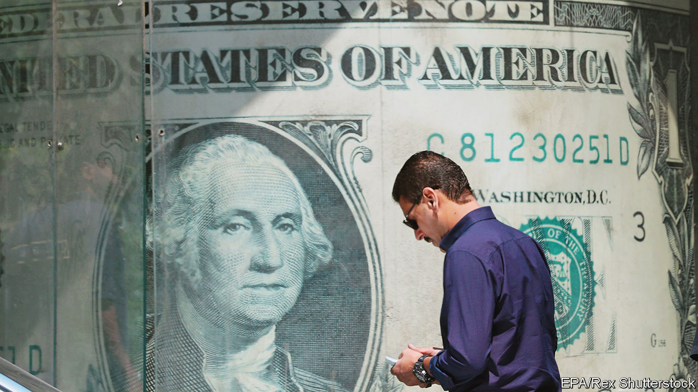
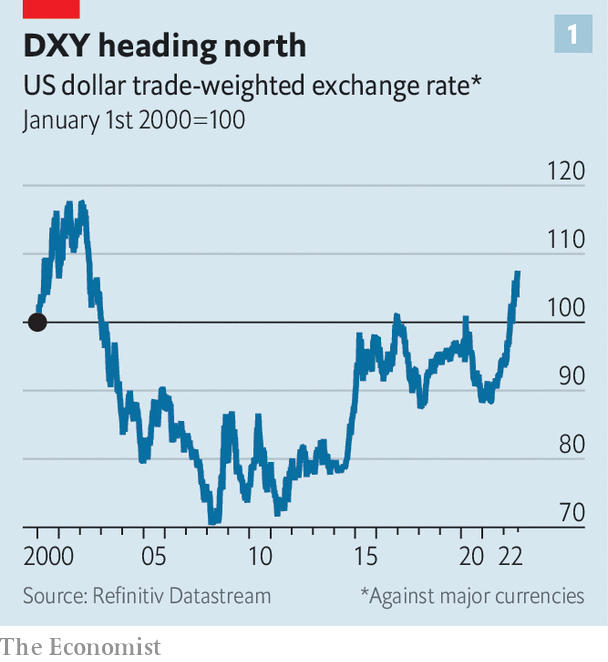
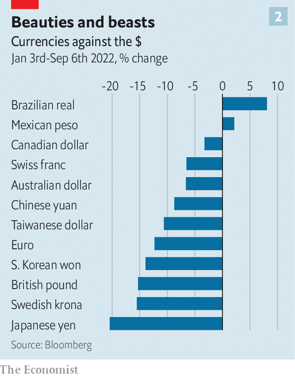

###### Pretty green

# Why the dollar is strong and why that is a problem 

##### Every fresh lurch upwards prompts some big questions 

 

> Sep 8th 2022 

Here are a few familiar descriptions of the dollar: “the cleanest shirt in the laundry basket”, “the least-ugly mug in a beauty contest”, “the one-eyed man in the kingdom of the blind”. Nobody, it seems, loves the dollar; they just really dislike the alternatives. And that aversion is only growing. The dxy, an index of the dollar against half a dozen major currencies, is at a 20-year high (see chart 1). Among the dirtiest of the dirty linen are sterling, the euro and the yen (see chart 2). 

Every fresh lurch upwards prompts some big questions. First, what is driving it? Much of the recent rise reflects differences in monetary policy. At the turn of the year, the Federal Reserve became more determined to tackle inflation. A series of interest-rate increases since then, with more expected, has turned the dollar into a high-yielding currency. Lofty interest rates are a draw to global capital, which in turn has pushed up the dollar. 

 


The dollar is also a refuge in troubled times. Scared investors tend to reach for the currency. And high oil and gas prices are generally bad for energy importers, such as Europe, but good for energy exporters, such as America. The handful of currencies that have kept pace with or beaten the dollar this year tend to be those of energy-producing countries. 

In short, the dollar is the go-to currency largely because America has proved a reliable source of economic growth. That is particularly true now. Europe is edging closer to recession. The closely watched purchasing-managers’ index suggests the euro-zone economy shrank in August. 

Less noticed is that Asia is also losing steam. Sluggish export growth is the latest worry for China’s economy, the vitality of which has been sapped by a property hangover and the country’s zero-covid policy. China’s weakness is apparent across Asia. Industrial output fell sharply in South Korea, Taiwan and Japan in July. Export orders have slumped. High energy costs have not helped. The currencies of these countries have wilted against the dollar. In Japan, where the central bank has stuck with ultra-low interest rates, the authorities have hinted that they may intervene to halt the yen’s slide. In China there has been renewed action to support the yuan. 

 


So is the dollar now a problem? In principle, its strength is a remedy for unbalanced global growth, since it gives European and Asian exporters an edge over domestic producers in the stronger American market. In practice, a strong dollar makes matters worse. It squeezes global credit, because countries and companies beyond America’s borders borrow in dollars. So when the dollar rises, it becomes more expensive to pay back debts out of local-currency revenues. For many emerging-market economies, the higher cost of dollar borrowing trumps the boost to exports they get from a weaker currency. Dollar strength may not even be a boon for rich countries, says Steve Englander of Standard Chartered, a bank. Exporters in Europe are hamstrung by energy disruptions, so cannot take full competitive advantage of a favourable exchange rate. 

Will the dollar ever weaken? For that three conditions need to be met. First, the global growth gap has to narrow. A hard landing in America won’t do the trick. A synchronised downturn in all regions of the world would only spark a run to the safety of the dollar (although the beleaguered yen might finally catch a bid). What is needed is for growth prospects outside America to improve. A second condition is a rapid reduction in price and wage pressures in America. This would allow the Fed to ease off the monetary brake, withdrawing some yield support from the dollar. The third condition is related to the first two: a weaker dollar requires some kind of good news on global energy. Absent that, it is hard to see Europe closing the growth gap with America. 

None of these conditions seems likely to be met soon. Until they are, the dollar will stay mighty—but only because the yen, the euro and the rest are so puny. ■


