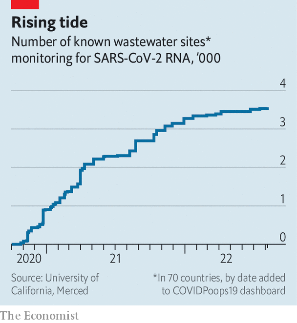

###### Where there’s muck, there’s data

# How covid-19 spurred governments to snoop on sewage 

##### Monitoring wastewater can help track diseases, drugs and even explosives 

 

> Sep 7th 2022 

Nuhu amin is a medical researcher at the International Centre for Diarrhoeal Disease Research in Bangladesh. Later this month one of his colleagues will dig into a pit latrine in Cox’s Bazar, a refugee settlement in Bangladesh where 900,000 stateless Rohingya Muslims live. A sample will be extracted, refrigerated, and sent on a 12-hour bus journey to a laboratory in Dhaka, Bangladesh’s capital. Once there, it will be tested for the presence of many different bugs, including cholera, typhoid and sars-cov-2, the virus responsible for covid-19. With aid from the Rockefeller Foundation, a big philanthropic organisation, Dr Amin plans for his team to repeat the process every week. That, he hopes, will give him insight into how covid-19 is spreading through the camp.

Surveying sewage for pathogens is not a new idea. Several American cities, including Charleston, Detroit and Philadelphia, tracked polio that way in the early 20th century. But the covid-19 pandemic proved to be, as the inevitable joke goes, a “watershed moment”. Figures from the jauntily named CovidPoops19 project, hosted at the University of California, Merced, show that the number of survey sites has risen from just 38 in October 2020 to more than 3,500 now, scattered across 70 countries (see chart). “It’s been the silver lining of the pandemic,” says Anna Mehrotra at the Water Environment Federation, an American organisation. “We’ve done a decade’s worth of science in the first year,” says Doug Manuel, an epidemiologist at the University of Ottawa. 

 


Now public health officials are hoping that all this newly built infrastructure can be transformed into a worldwide early-warning system for all sorts of diseases. America and Europe are dealing with an outbreak of monkeypox, an infectious disease related to smallpox that has, for the first time, spread outside its African home. Cities are already scouring wastewater for strains of the virus. In India, typhoid, dengue fever and avian influenza are high up the list. In Malawi, cholera, rotavirus and shigella are priorities. 

Even polio is still of interest. Researchers in London discovered poliovirus in sewage in June this year, alerting authorities to the fact that the virus, thought to have been eradicated in Britain decades ago, was in fact circulating in the capital. In August public-health officials in New York made a similar discovery.

And there may be broader applications, too. Sewage surveillance could measure antibiotic resistance, and help public-health researchers track the consumption of everything from cocaine and alcohol to fruit and vegetables. Monitoring what Bernd Gawlik, an engineer at the European Commission Joint Research Centre, calls “the collective intestine” could offer doctors, officials and police an unprecedented insight into the lives of local populations.

Flushed with success

The first team to publish results from wastewater testing for covid-19 was based at kwr, a water-research institute in the Netherlands. Researchers discovered early in the pandemic that about half of infected people shed sars-cov-2 in their faeces. The Dutch team began testing water from Schiphol airport in February 2020. They spotted the virus just as the country’s first cases were being confirmed in hospitals. (Italian researchers might have beaten them to it, had Italy’s lockdown not kept them out of their labs). By September every one of the Netherlands’ sewage-treatment plants, which cover more than 99% of the population, was being monitored. 

Researchers reckon a single infectious case of covid-19 can be detected amid the waste of up to 14,000 people. Testing the effluent of an entire population is much cheaper than individually screening each resident, and can often spot cases earlier. Had wastewater data been widely available in March 2020, says Dr Mehrotra, it might have changed the course of the pandemic.

As it was, much of the effort in the early days was piecemeal, led by academics volunteering their expertise to local public-health bosses. From Bangalore to Ontario, all reported that it was difficult to convince harried officials that messing about with sewage could contribute anything useful. But the benefits became quickly apparent. Wastewater analysis proved capable of spotting waves of infections one to two weeks before conventional, nasal-swab testing. Countries with lower rates of conventional testing, such as Malawi, got up to a month’s notice. 

Besides simply collecting the data, many countries made it accessible online. That allowed all kinds of organisations to make use of it. University campuses in Arizona used wastewater data to catch infection waves early, for example. Boston Children’s Hospital decided to postpone non-urgent procedures in response to signs that the Omicron variant of covid-19 was surging in local wastewater.

Building a proper global surveillance network will require techniques improvised during the covid-19 crisis to be tidied up. Collecting, testing and reporting procedures must be standardised, to allow comparisons between different places. Many existing procedures are strikingly low-tech. Tampons are often used as a tool to soak up water for testing, for example. That will probably change. Andrew Engeli, who works at Kando, an Israeli wastewater-data company, believes that the technology necessary to cram a miniaturised laboratory onto a sampling device could be developed within four years or so. That would allow water to be analysed in the field. 

Perhaps the most important change, though, involves funding and organisation. Public health measures cannot long be sustained by volunteer academics. In America, an organisation called the Association of Public Health Laboratories is working to help its members develop the capacity to take on more of the routine surveillance work themselves. 

Private organisations are also offering their expertise. Verily, the life-sciences subsidiary of Alphabet, Google’s corporate parent, is offering testing facilities to sewage treatment plants in eight American states. Biobot is another American firm, founded explicitly to pursue wastewater epidemiology. It has more than 500 testing sites across the country. It hopes to offer sampling and screening to public-health authorities across America and eventually across the world. Kando already runs Israel’s sewage-testing system. That covers around 85% of Israel’s population, as well as new arrivals who use the loos at the country’s biggest airport. 

Not all countries will find it easy to set up monitoring systems. Kando relies for its success on accurate maps of watersheds as well as the sewage network itself. The privatisation of water in Britain has made such information “almost unobtainable”, says Dr Engeli. But the biggest challenge is to provide useful data in places with no centralised sewage system at all. And since places such as these are also likely to have only limited health care, disease outbreaks are more likely to spread quickly, which makes tracking them even more urgent.

The mudlark’s progress

The surveillance networks Dr Amin is setting up in Bangladesh highlight some of the challenges. In refugee camps such as Cox’s Bazar, 80% of the toilets are pit latrines that require laborious manual testing. Even big cities such as Dhaka have antique and unevenly distributed infrastructure to contend with. 

Malawi is also keen on the technology, at least in theory. But as of 2017 only 5% of Lilongwe, its capital city, was served by a sewage system. Wastewater frequently soaks through the ground and into the water table. That means that wastewater surveillance involves monitoring nearby rivers and other bodies of water, says Gama Bandawe of the Malawi University of Science and Technology. 

The success of sewage monitoring in tracking covid-19 has boosted interest in other targets, too. Sewage is already monitored in some places for drugs, both legal and otherwise. Biobot started off with the objective of monitoring dosage levels of 30 different painkillers to help better understand America’s opioid crisis. In May 2021 analysis of effluent in Seoul found levels of Viagra, a drug which treats erectile dysfunction, that were several times higher than would be expected given the number of prescriptions that doctors had written. A Europe-wide network of sewage analysts called score has been monitoring levels of cocaine and cannabis in cities across the continent since 2011. 

Farah Ishtiaq, a researcher at the Tata Institute for Genetics and Society in Bangalore, is interested in using sewage sampling to track antibiotic resistance, in which bacteria evolve defences against drugs that had previously been fatal to them. Antibiotic resistance worries Indian public-health experts in particular. One paper, published in 2020, estimated that around a quarter of new tuberculosis cases in the country were resistant to at least one of the drugs commonly used to treat the disease; 3.5% were resistant to several. 

Others want to monitor health in a broader sense. In 2019 researchers at Arizona State University published a wastewater study that analysed levels of phytoestrogens, chemicals found in plant-based foods. It suggested that sewage monitoring could be used to keep track of a nation’s eating habits. Kando has a list of over 500 biomarkers potentially detectable in wastewater. The company hopes that levels of one of these, serotonin, might yield interesting data on depression. In Australia, researchers use sewage to keep track of nicotine and alcohol consumption.

One question is just how precise such monitoring might become. Sewage from an entire city, or even a specific neighbourhood, is pretty anonymous stuff. But in Singapore and Hong Kong it has proved possible to monitor waste from individual apartment buildings and hospitals. In both places, these techniques—coupled with shoe-leather epidemiology—allowed authorities to identify individual covid-19 patients from within individual blocks of flats. In China, the police have already taken an interest in the technology, with at least one drug bust in Zhongshan, a city in Guangdong province, being aided by wastewater monitoring. 

Mindful of where the technology may one day lead, some researchers have started to ponder the balance between surveillance and privacy. Steven Hrudey, a toxicologist at the University of Alberta, has adapted existing World Health Organisation guidelines on epidemiological surveillance for use with wastewater. He argues that data should only be collected when a specific, legitimate public health usage is intended, and that personally identifiable data should not be shared with bodies unaffiliated with public health.

For now, though, such worries are secondary. The covid-19 pandemic has made officials more interested in the sorts of disease-surveillance systems that epidemiologists have wanted for years. Sewage sampling is cheap, non-invasive and piggybacks on existing infrastructure. It is a hundred-year-old idea whose time may at last have come. ■

