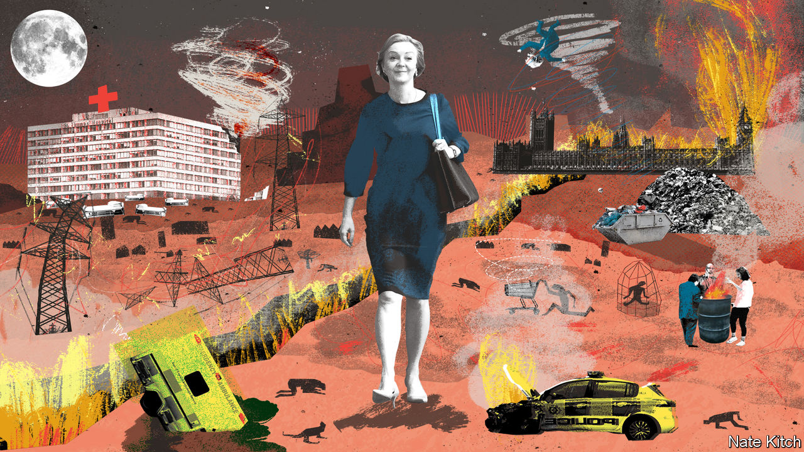

###### The in-tray from hell

# Can Liz Truss fix Britain? 

##### The new prime minister must eschew pantomime radicalism if she is to succeed 

 

> Sep 7th 2022 


During liz truss’s campaign to become leader of the Conservative Party, her team tweeted a promise to “hit the ground from day one”. The post was widely derided and swiftly modified, but it inadvertently captured the scale of the problems facing . Ms Truss, now ensconced in Downing Street, has an enormous job in front of her. 

The energy crisis tops the pile of priorities, as it does for governments across Europe.  is worse than in many other places, in large part because it is more dependent on gas. Inflation is already in double digits; some have predicted that it might exceed 20% in 2023. Shortly before Ms Truss won, the Resolution Foundation, a think-tank, forecast that falls in real incomes would wipe out all pay growth since 2003. 

Industrial action afflicts the transport network and the criminal-justice system. Parts of the National Health Service (nhs) are in disarray: almost 1,000 patients a day wait more than 12 hours in accident-and-emergency departments. Underlying everything is the challenge of reinvigorating British growth and productivity, which have been , denting living standards and weakening the quality of public services. No one could solve all these problems in the time that remains before the next general election, currently due in January 2025. But can Ms Truss at least start to turn things around? 

The sceptics have many reasons to be dubious. Her own record in government is thin. She has the lowest level of support among her own mps of any Tory leader elected under the current system. She has spent an interminable summer making promises she cannot keep to a tiny electorate of party members. Like the rest of her party, she maintains the fiction that Brexit is an unalloyed good. And the sheer exhaustion of 12 consecutive years of Tory government shows up in her cabinet of loyalists. Jacob Rees-Mogg, the business secretary, should be put in a museum, not in charge of anything. 

And yet underestimating Ms Truss is a mistake her opponents have already made to their cost. This newspaper shares her view that boosting economic growth should be the government’s overriding objective. Prime ministers can set the weather by articulating simple messages well. Boris Johnson, Ms Truss’s shambolic and unlamented predecessor, managed to make “”, his goal of reducing gaping regional inequalities, part of the political vernacular. Ms Truss can do the same in the service of growth. 

She has a streak of radicalism that matches the seriousness of the problems Britain faces. She is impatient with the orthodoxies of the Treasury, the powerful finance ministry, and will be in lockstep with Kwasi Kwarteng, . She is prepared to question the way things are done, from utilities regulation to the remit of the central bank. She is also canny enough to have survived in the cabinet since the days of David Cameron. And Ms Truss has a useful habit of surprising on the upside: during the course of the leadership campaign, she improved markedly as a public performer. 

The immediate test Ms Truss faces is the cost-of-living crisis. Her plan for dealing with soaring energy bills was unveiled on September 8th. Ms Truss has swiftly ditched her campaign stance of opposing “handouts” and is guaranteeing that average annual household energy bills will not exceed £2,500 ($2,870) over the next two years. Businesses will get help, too. That is one of the most generous handouts in Europe, a stunning reversal. 

The fact that the lady is for turning on energy bills makes sense. The price shock for households and firms requires bold action. But pragmatism need not mean reckless abandonment of free-market principles and fiscal responsibility. It would be better to offer consumers a big rebate rather than mute price signals altogether through a cap. The plan will initially be funded through borrowing, a splurge that will force the Bank of England to raise interest rates even higher. 

Her desire to ignite growth—to create, in her words, an “aspiration nation”—is still to be sketched out. The risk is that her formula will depend too much on a cartoonish mixture of tax cuts, deregulation and Brussels-bashing. Ms Truss seems to be betting that headline tax cuts will lead to higher growth, when the evidence for that is ambiguous at best. The targeted investment incentives and r&amp;d tax breaks proposed by Rishi Sunak, her erstwhile rival for the leadership, make more sense.

Her blunt commitment to scrap any remaining eu laws by the end of the 2023 would keep the Brexit headbangers happy but do little to help British businesses. There are opportunities profitably to diverge from the eu in areas such as competition policy, but seizing them requires time and effort, not an arbitrary deadline and a bonfire. Stoking confrontation with Europe over the status of Northern Ireland would be a similar sort of pantomime radicalism. Rather than shows of bravado abroad, a true radical would show courage at home by letting the bulldozers roam, making it much easier to build houses, labs and wind farms where they are needed. 

Small state or big talk

It’s the same story with the welfare state, about which she has said very little beyond that she does not want new taxes and would not cut public services. A true radical would initiate a candid conversation about the nhs, which is fraying badly, not repeat canards about it having too many managers. A true radical would be taking on her own base when it comes to funding the state, raising inheritance taxes and ending the triple-lock rule that buoys state pensions. 

Boldness of this sort would make it hard for Ms Truss to pretend that she is still cleaving to the manifesto that won the Tories the election in 2019. But calls for another general election should be ignored for now: Britain cannot afford yet more weeks of political limbo. If Ms Truss can genuinely focus her government and ministers on the goal of growth, and deliver fine-grained policies to encourage investment and unlock capital, she can surpass expectations. If she opts for a pastiche of 1980s-style policies, slashing taxes and red tape and not much else, then she will be remembered as a reactionary, not a radical. ■

