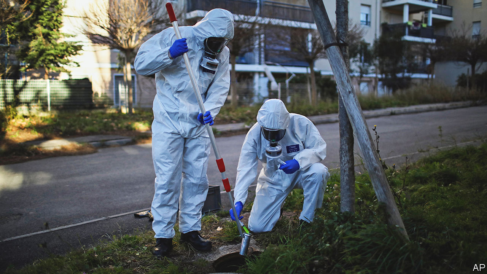

###### From lavatory to laboratory

# How spying on sewage could save lives 

##### Wastewater surveillance is a cheap tool to spot health problems, but it is open to abuse 

 

> Sep 8th 2022 

If, as the saying goes, you are what you eat, then it stands to reason you also excrete what you are. Vladimir Putin apparently appreciates this fact. When he relieves himself on trips abroad, it is reported that a modern-day “groom of the stool” discreetly retrieves the dictator’s waste for subsequent disposal, lest it fall into the hands of hostile intelligence agencies, whose analysis might reveal compromising signs of ill-health.

Mr Putin is right to pay attention to poo. The analysis of a city’s wastewater—the product, as some put it, of the “collective gut”—can provide all sorts of insights into the health and behaviour of its residents. Such surveillance is inclusive enough to sample all toilet users. It is also anonymous; billions of dollars cheaper than alternative sampling techniques; and flexible enough to monitor everything from drug use to diet and even mental health.

Its main use at the moment is to track the spread of disease. This is not a new idea— was used in some places to track polio during the 20th century—but it has come into its own in the era of covid-19. Ad hoc programmes have been set up by volunteer academics in over 70 countries. They have managed to spot infection waves and the arrival of new variants weeks ahead of clinical sampling. 

As the pandemic recedes the danger is that interest in wastewater surveillance does likewise. Britain’s effort was being wound down when this summer’s discovery of poliovirus in London sewage reignited interest. Dismantling such systems would be a mistake. As other sorts of covid-19 testing slow down, and as people become less likely to report symptoms, wastewater will become a more effective early-warning system for dangerous mutations. This is especially true in poor countries, where alternative means of testing are onerously expensive.

There is no reason to limit the system to looking for covid. It could be applied to many other diseases, including monkeypox, typhoid and shigella. But for wastewater surveillance to fulfil its potential, today’s improvised systems need to be transformed into something more stable and organised. That will require standardisation, and rules governing the collection and sharing of data. And the job should no longer be left to civic-minded academics—public-health authorities need to shoulder the load.

It would also be wise to think about how exactly the resulting data will be used. As the dust settles, law-enforcement agencies may find that public-health authorities have installed and legitimised a tool that could help spot criminal behaviour. Anything from the consumption of illicit drugs to the handling of bomb ingredients could potentially be detected in sewage. Though present-day sampling is done on watersheds containing hundreds of thousands of people, well-placed samplers could help authorities surveil anything from a small neighbourhood to a single block of flats. Some universities already use such techniques for covid surveillance on campus.

But popular support will be harder to secure if people worry that their data might be widely shared. Testing bodies should therefore be open about the extent of their capabilities, and exactly how data will be used. They should also consult with the people being monitored, so that something approaching informed consent can be obtained. 

For years, epidemiologists have been calling for worldwide surveillance systems to help them track emerging diseases. Covid-19 has made a powerful case for such investments. Cheap, ubiquitous wastewater monitoring could be just such a system. It would be a shame if privacy worries caused support for it to vanish down the toilet. ■

