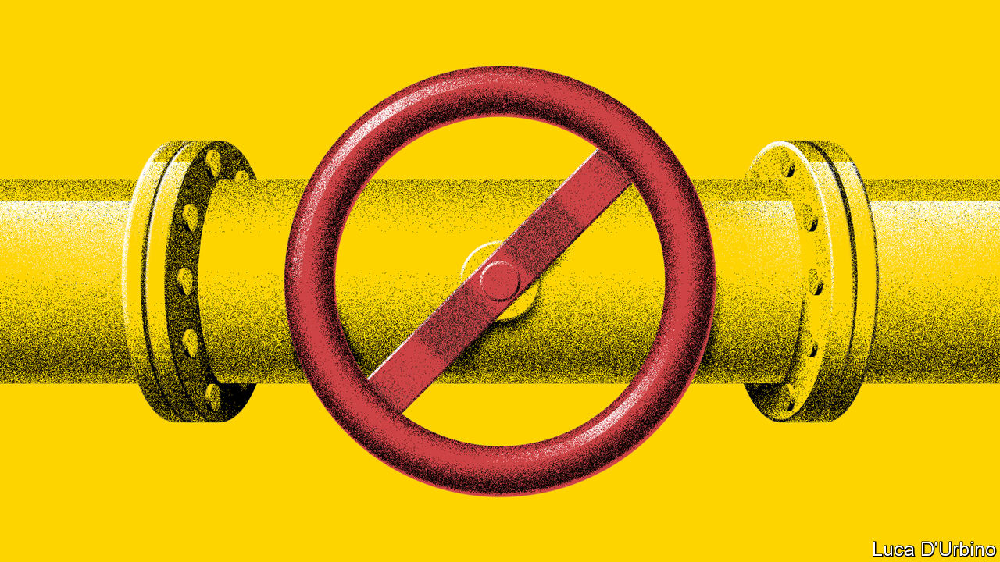
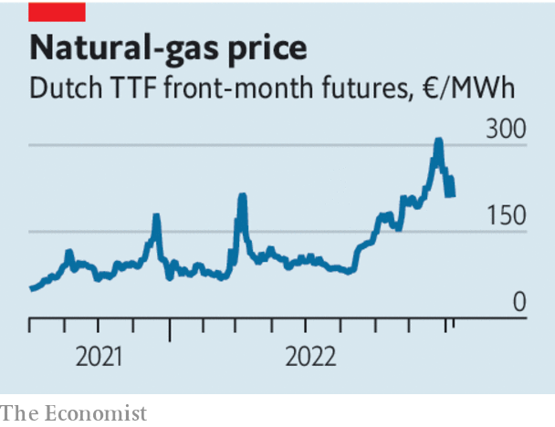

###### Crunch time

# How to deal with Europe’s energy crisis 

##### Russia is turning off the gas. Power cuts loom. What should governments do? 

 

> Sep 8th 2022 

For a year Europe has lived under the shadow of an energy blockade as Vladimir Putin threatened to turn off the gas taps to the continent. Now the threat has become reality and the prospect of a cold, dark winter is hitting home. On September 5th Russia said it will shut down its Nord Stream pipeline for as long as Western sanctions are in place, sending benchmark gas prices surging by another 30%; they currently stand at the equivalent of around $400 for a barrel of oil. At today’s futures prices, annual spending on electricity and gas by consumers and firms across the European Union could rise to a staggering €1.4trn, up from €200bn in recent years, reckons Morgan Stanley, a bank. 

The  is now a full-blown political and economic crisis. Already 14% of families in Britain are behind on their utility bills. ArcelorMittal, a steelmaker, will shut down a plant in Bremen. As consumers and businesses reel and a recession looms, behind the scenes there is chaos in energy markets. Because Europe’s power prices are set by the costs of the marginal producer, which is often gas-fired, the gas surge has become an electricity shock, too. With prices haywire some generators are facing a cash crunch as counterparties demand more collateral: utilities from Düsseldorf to Vienna are seeking bail-outs (see Business section). Meanwhile renewable and nuclear firms with low marginal costs are eyeing hundreds of billions of euros of windfall profits.

Just as when the pandemic struck, governments are reacting with a mad scramble of handouts and interventions. The economics textbooks are being ripped up and the sums are vast. Germany is spending a further €65bn ($65bn, or 1.8% of gdp) on measures including a price cap for a basic amount of electricity for households and firms. As we went to press Liz Truss, Britain’s new prime minister, unveiled a plan to freeze prices for two years, which could cost more than £100bn ($115bn, or 4.3% of gdp), and will be financed through borrowing. The eu is considering capping power generators’ revenues.

 


The scale and intensity of the crisis warrants broad and generous support. But in their haste to act, governments must not throw economic logic and prudence out of the window. The most popular tactic—retail energy-price freezes, like those in France and on Ms Truss’s agenda—are superficially tempting. They are easy to understand and bring down measured inflation, which might ease some of the pressure on central banks to raise interest rates. But they have huge drawbacks, too. 

If prices are capped, demand for energy will remain too high, delaying the crucial adjustment that needs to take place to a world where gas is no longer as cheap as it was before Mr Putin launched a war. You can already see the evidence for this: higher prices meant that Germans consumed nearly 10% less natural gas in the first half of this year compared with a year earlier. And it may prove politically impossible to end price freezes once they are in place. Already Ms Truss is capping prices not just for one winter, but two. 

Instead of fixing prices there is a better approach. Governments should offer households relief through lump-sum cash rebates on bills, possibly disbursed via utilities firms. This would protect living standards while leaving markets to set the incentive to curb energy use. For the poorest, for whom energy bills eat up as much as a sixth of total spending, rebates will need to be supplemented with other benefit payments. 

Firms will also need help. In order to avoid a domino effect of collapsing power companies, some may need temporary state credit lines, as banks did during the financial crisis: the cost can be recouped by levies later on. Swathes of other businesses, meanwhile, may find themselves in danger of closing down rather as they were when lockdowns were imposed in 2020. Some may no longer be viable—think of German chemical firms with business models built on abundant Russian gas. That is why government-backed loans can only provide a temporary lifeline. Such support must be time-limited. 

Rebates and temporary loans are the way to help the economy, then. But how on earth should governments pay for them? The cost will be enormous and come after huge pandemic bail-outs. Europe, including Britain, is spending at least €450bn fighting the energy shock, even before winter has struck. Italy and Germany have spent 2-3% of gdp; Ms Truss’s plan could push Britain’s total bill to twice that. The temptation is to finance the spending through even more borrowing. But wider deficits in a time of inflation will force central banks to raise interest rates even higher, making it more expensive for governments to service their debts. 

That is why windfall levies on some generators must be considered. Under the intricacies of Europe’s electricity markets they are paid today’s exorbitant spot prices even if their costs are far lower and unrelated to gas. Retroactive levies on risk-taking firms that compete in free markets are to be avoided because they undermine the very basis of capitalism. This is not one of those cases: the firms are operating in highly regulated markets and may make windfall profits that are multiples of the capital they have deployed. Our estimates based on research by University College London suggest that generators’ excess profits may be around £30bn ($41bn) in Britain. Much of the spending on top must come from wider tax increases. 

Current affairs

It would be madness to make long-term decisions about redesigning power systems in the midst of chaos. Some principles are already obvious, though. Keeping the market mechanism is essential in order to incentivise investment in new capacity and innovation in  such as batteries. But it makes sense to shift more of the energy system away from spot prices to long-term contracts, especially as cheap wind power is a growing share of production. Finding new sources of energy—from gas in Qatar to renewables—is also imperative. With the right response Europe’s citizens can be protected and the transition to a cleaner energy system kept on track. The wrong response could bankrupt governments and trap Europe’s power industry in the past. ■

