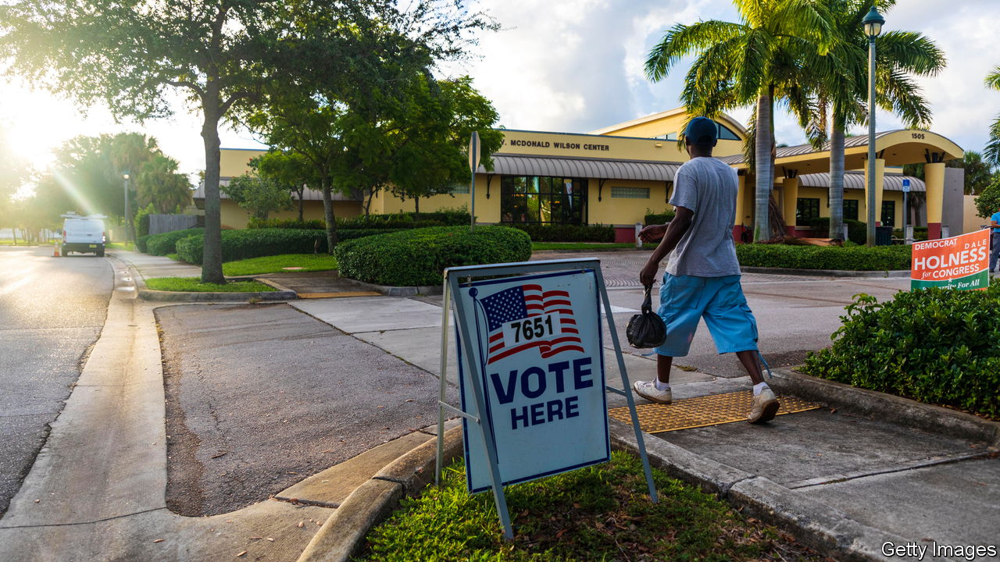
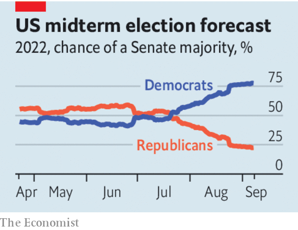

###### Meet our midterm model

# Republican candidates are doing much worse than they should 

##### The party’s embrace of extreme positions and infatuation with Donald Trump are to blame 

 

> Sep 7th 2022 

In pennsylvania, a celebrity cardiologist who rages against the inflated price of  faces a tattooed lieutenant governor with heart trouble. In Georgia, the choice is between a pastor on one side and a former star of “Celebrity Apprentice” and “Celebrity Cook-Off” on the other. In November the results of these contests, and a few others like them, will determine control of the us Senate for the next two years. On this hinges the ability of the White House to staff its administration, to confirm judicial nominations and to pursue legislation.

Because so much is riding on this election,  has built a  to try to predict what will happen. Our past forecasts—of France’s presidential elections in 2017 and 2022, America’s midterms of 2018 and its presidential election of 2020—all favoured the eventual victor months in advance. Of course, a probabilistic forecast that correctly puts a 70% chance on something happening will look wrong 30% of the time.

Our 2022 midterm model has two main findings. First, though Republicans are favoured to win the House, it won’t be a blowout. We currently think the likeliest outcome is that they win 224 seats. Second, we think Democrats are favoured to hold on to the Senate. The likeliest outcome there is that they end up with 51 seats.

 


These predictions are surprising because 2022 ought to be a bumper year for Republicans. The party that holds the White House normally gets thwacked in the midterms—a pattern that stretches back 80 years. The only recent exceptions are the midterms after Republicans started impeachment proceedings against Bill Clinton and those following September 11th 2001. Furthermore, President Joe Biden is about as popular as an eggwhite omelette at a barbecue contest. His approval rating matches Donald Trump’s at this point in his presidency. Inflation is high, and near the top of Americans’ concerns. Voters perceive the Democratic Party to be just as extreme as the Republican Party (and some Democrats are determined to prove them right).

Against this backdrop, narrowly winning the House and remaining the minority in the Senate would be a rotten result for Republicans. Pinpointing the cause of this likely underperformance is not a science: inflation has fallen a little, petrol prices are coming down and Democrats, having given up fantasies of another New Deal, have passed some smaller but meaningful pieces of legislation. But two things stand out.

The first is that Republican states have pursued extreme positions on abortion that alarm many voters. A majority of Americans think abortion should be legal in the first trimester and restricted thereafter. Several Republican states have banned abortion entirely since the Supreme Court overturned  this year. Previously, anti-abortion purists had little grip on public policy. Now, in some states, they control it. As a result, a ten-year-old rape victim had to travel out of Ohio for an abortion, and there has been a surge of women registering to vote. Back in June, before the Supreme Court’s bombshell, our model favoured Republicans to win a majority in the Senate. Their chances of doing so have since declined by 30 points.

The second is Mr Trump’s enduring hold over the Republican Party. Trumpy candidates triumphed in the primaries. As a result, the former president has saddled the party with some odd people who hold even odder views in winnable Senate races in Arizona, Georgia, Ohio and Pennsylvania. Mr Trump, in addition to his other flaws, is a proven vote-loser—as the 2018 midterms and the 2020 presidential election demonstrated. The sooner the Republican Party recognises this the better, both for its own electoral prospects and for America’s democracy. ■


