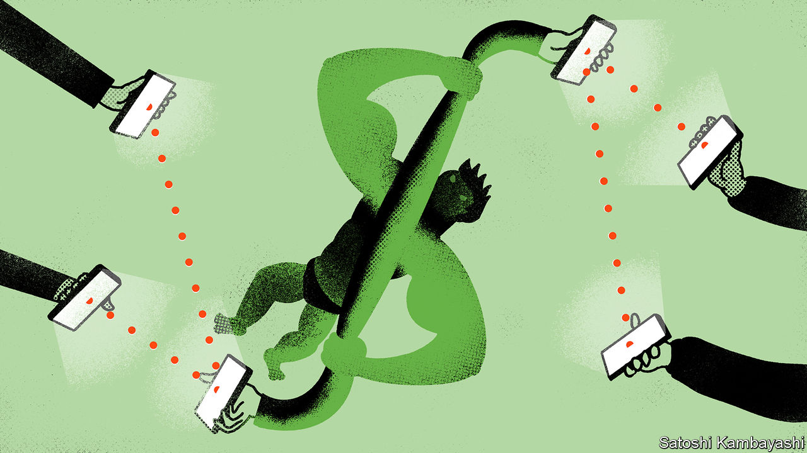

###### The mighty dollar

# The dollar is as strong as ever. Isn’t it? 

##### Technology is undermining the clout of the global reserve currency 

 

> Sep 8th 2022 

The most important currency in the world is on a roll. The dollar has climbed by around 20% over the past year against a basket of global currencies, and is at its highest level in 20 years. One euro is worth less than a dollar, and other pretenders to the dollar’s throne as the world’s reserve currency, such as the yen, yuan or even crypto, have slumped. Even as America has used its financial clout to squeeze Russia, others have rushed to the dollar-based financial system as a safe haven. This cyclical strength of the dollar dominates the global financial landscape. But look closer and technological shifts that could eventually challenge it are gathering momentum.

The dollar’s run reflects several forces. Even as Europe and China face a downturn, America’s economy is proving remarkably resilient, with job growth and profits still strong. Inflation is high and the Federal Reserve is raising rates faster and higher than other big central banks. Energy crises are terms-of-trade shocks that favour energy exporters and punish the currencies of importers. Thanks to the shale revolution America became a net energy exporter in 2019 for the first time since 1952. None of these dynamics looks likely to abate soon. 

For America a strong dollar has some advantages. It will help bring down inflation, even if it might pose some longer-term competitiveness problems. For much of the world, though, it is bad news. The greenback remains pre-eminent in trade invoicing and cross-border debt. As a result, as the Fed raises rates and capital shifts to America, the finances of emerging markets get squeezed. So far big economies such as India have held up well, but smaller places with heavy debts, such as Sri Lanka and Pakistan, are in big trouble.

The endurance of this global dollar-based system, in spite of the resentments it arouses, is testament to America’s staying power. It has been through difficult times in the past 15 years, with a financial crisis, a badly handled pandemic, a widening fiscal deficit and a constitutional crisis in 2021. Nonetheless, even as the greenback soars,  bear close attention.

First, new state-run digital currency and payments systems are, at last, gaining traction. China’s e-yuan now has 260m users and the technology involved might eventually allow China to run its own global payments network while maintaining capital controls, which it regards as necessary to maintain stability. That could make it all but immune to American sanctions. Elsewhere, state payments systems are exhibiting powerful network effects. India’s upi system is vast and Brazil’s payments system, Pix, has been used by 126m people. Today these payments networks are domestic; tomorrow they could facilitate cross-border transactions as alternatives to the dollar-based system.

Second, if you look beyond the scams and bubbles in cryptocurrencies, decentralised finance technologies continue to improve. Developers are pushing through an upgrade to the Ethereum blockchain, on which most DeFi applications are based. On September 15th it will switch to a new mechanism for making collective decisions known as proof-of-stake that is far less energy intensive: the drop in power consumption will be equivalent to Chile being switched off. It could pave the way for Ethereum to become more efficient at handling high transaction volumes—and a more credible global rival to traditional finance. 

In the 20th century the dollar eclipsed sterling as the world’s reserve currency, to become widely used as a unit of account, store of value and means of payment. The next change in currency regimes may not be so clear-cut, as new technologies make it possible to separate out some reserve-currency functions—allowing countries to establish autonomy in payments, for example—without contesting the dollar’s role in other areas. The dollar’s reserve-currency status is not changing yet. But technology will change what it means to be a reserve currency. ■


