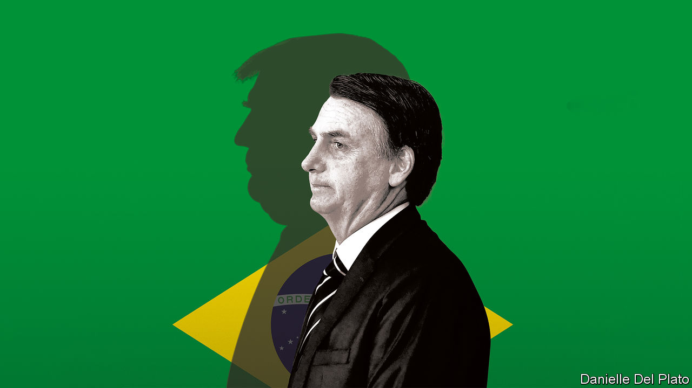

###### The man who would be Trump

# Win or lose, Jair Bolsonaro poses a threat to Brazilian democracy 

##### All the signs are that he will lose an election and say he won it 

 

> Sep 8th 2022 

Joe biden was talking about the United States when he warned, on September 1st, that “Democracy cannot survive when one side believes there are only two outcomes to an election: either they win or they were cheated.” He might as well have been talking about Brazil. 

Next month its president, Jair Bolsonaro, faces an election that every poll says he will probably lose. He says he will accept the result if it is “clean and transparent”, which it will be. Brazil’s electronic voting system is well-run and hard to tamper with. But here’s the catch: Mr Bolsonaro keeps saying the polls are wrong and he is on course to win. He keeps insinuating, too, that the election could somehow be rigged against him. He offers no credible evidence, but many of his supporters believe him. He seems to be laying the rhetorical groundwork to cry ballot fraud and deny the voters’ verdict. Brazilians fear he could then incite an insurrection, perhaps like the one America suffered when a mob of Donald Trump’s supporters invaded the Capitol on January 6th 2021—or perhaps even worse. 

One reason for worrying that Mr Bolsonaro might borrow a page from  is that he has often done so before. He sows division: the other side are not merely wrong but evil. He dismisses criticism as “fake news”. His instincts are as authoritarian as Mr Trump’s: he waxes nostalgic about the days of military rule in Brazil. One of his sons, who is also one of his closest advisers, openly applauded the Capitol rioters. Mr Bolsonaro was one of the last world leaders to accept that Mr Biden had won. 

Mr Bolsonaro, previously a foul-mouthed congressional gadfly, was elected president in 2018 on a wave of anti-establishment fury. To pull off this unlikely feat, he had learned tricks from another foul-mouthed, widely underestimated outsider. The most important of these was the skilful and mendacious misuse of social media. He remains Brazil’s uncontested master of this, and has thus convinced his supporters of two things. First, that if he loses, it is evidence that the vote was unfair. Second, that a win for his main opponent, Luiz Inácio Lula da Silva, would hand Brazil to the devil. In the parallel reality that Mr Bolsonaro has constructed, a President Lula would shut down Brazilian churches, turn the country into a narco-state and encourage boys to wear dresses. 

This is nonsense. Lula is a pragmatic leftist and was a fairly successful president between 2003 and 2010. Buoyed by a commodities boom, he presided over rising incomes and a big expansion of the welfare state. The boom collapsed after he left office, and his successor and protégée, Dilma Rousseff, was impeached amid a vast corruption scandal dating back years. Lula himself was found guilty of taking bribes, though his convictions were later thrown out and he denies wrongdoing. In short, he is far from the ideal candidate, but he is squarely within the realm of the normal—and he is a supporter of democracy. 

Mr Bolsonaro, by instinct, is not. He may operate within a democratic system, but he is constantly looking for ways to evade its strictures. And the worry is that the system constraining him is less robust than the one that constrained Mr Trump. It is inconceivable that the American military would abet a coup, but Brazil’s last military regime only ended in 1985. The army is deeply entrenched in government and has asked questions about the voting system. The country is buzzing with talk of a possible putsch. 

It probably won’t happen, but some kind of insurrection might. Mr Bolsonaro routinely incites violence. (It is hard to know how else to interpret phrases like “Let’s machinegun…Workers’ Party supporters.”) More than 45 politicians were murdered in the first six months of 2022. Mr Bolsonaro’s followers are better armed than ever before: since he took office and widened loopholes in gun controls, the number of guns in private hands has doubled to 2m. If Brazil’s electoral tribunal announces that Lula has won, armed Bolsonaristas might attack the tribunal. The question then is which side military police forces, nearly 400,000-strong in all, who are supposed to keep order, would take. They are trigger-happy and fond of Mr Bolsonaro, who has proposed a shield law for officers who kill suspects. Some might prove more loyal to him than to the Brazilian constitution. If there is chaos in the streets, Mr Bolsonaro might invoke emergency powers to postpone the handover of power. 

He thus poses as great a threat to Latin America’s largest democracy as he does to the world’s largest rainforest. (On his watch, the slashing and burning of the Amazon has proceeded 70% faster than before, because he does almost nothing to stop it.) And whatever happens, he and his movement are not going away. He has learned from Mr Trump how to snatch influence and power from the jaws of defeat. 

When normal candidates lose elections, their parties tend to dump them for someone fresh. When Mr Trump lost, by contrast, he told his core supporters that they had been robbed, and turned this Big Lie into a rallying cry. It unites his movement and gives him a chokehold over the Republican Party: hardly anyone who denies it can win a Republican primary. The same Big Lie could make Mr Bolsonaro the most influential opposition politician in Brazil. His base—evangelical Christians, gun-owners and rural folk who feel over-regulated and vulnerable to land invasions—may stick with him, convinced that he is Brazil’s rightful president. His supporters in the legislature and in the states may hobble Lula’s ability to govern. Brazil may grow ever more divided. 

Nothing to lose but your chainsaws

The best outcome would be for Mr Bolsonaro to lose by such a wide margin that he cannot plausibly claim to have won, either in the first round on October 2nd, or (more likely) in a run-off on October 30th. It will be a tense, dangerous few weeks. Other countries should publicly support Brazilian democracy, and quietly make clear to the Brazilian military that anything resembling a coup would make Brazil a pariah. Brazilian voters should resist the pull of a shameless populist. They, and their country, deserve better. ■


