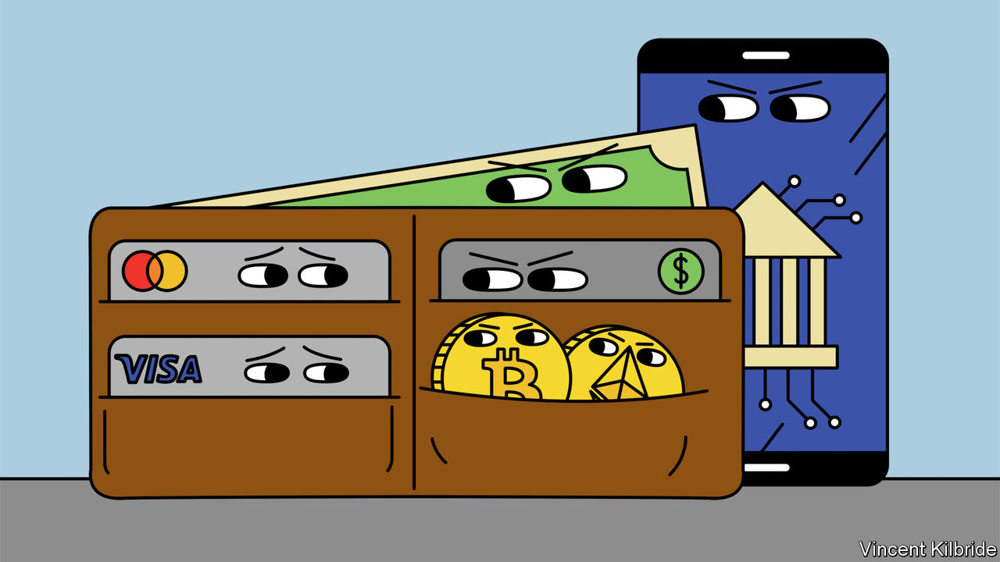
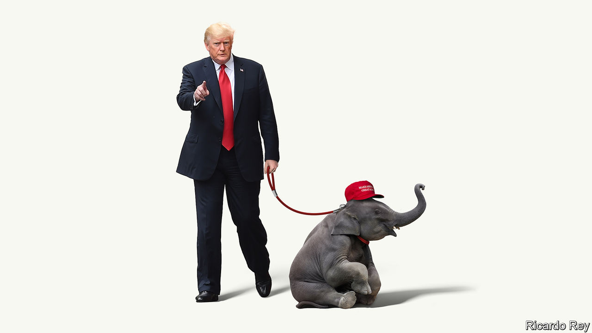
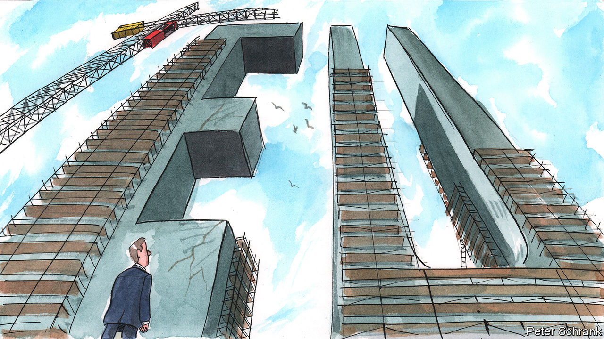

###### On children in war, Australia, credit cards, the Republicans, gene therapies, the European Union

# Letters to the editor 

##### A selection of correspondence 

 

> Sep 8th 2022 

Children in war zones

Modern urban warfare (“”, August 20th) is forcing humanitarian organisations to assess how they can best support and protect civilians, who make up 90% of the casualties when explosive devices are used in populated areas. The latest data from the Peace Research Institute Oslo show that the number of children living in high-intensity conflicts has increased to 193m, up from 162m in 2019, a jump of 19%. 

In Ukraine the prevalence of basements and bomb shelters has led to local organisations distributing bunker kits to help children in the harshest of circumstances. The world’s first “Paediatric Blast Injury Field Manual” has been translated into Ukrainian and is used by medics dealing with the unique challenge of children who have been hurt by the weapons that dominate city fighting. 

There is hope on the horizon. In June, after three years of negotiation, consultations concluded on the final text of a political declaration on strengthening the protection of civilians from the use of explosive weapons. The declaration has the support of big military powers, including America, Britain and France. Turning these commitments into operational and tactical changes that will protect civilians is essential for armies learning how to fight in cities in the future. 

james denselow

Head of conflict and humanitarian policy and advocacy

Save the Children


 


Labor squeaked through

To say that Labor “swept” to power at Australia’s general election in May is stretching the meaning of words one would associate with a strong victory (“”, August 13th). In fact, Labor’s share of the vote actually fell by 0.8% from the previous election in 2019. The incumbent Liberal coalition secured 450,000 more first-preference votes than Labor and had a higher vote share in more seats. Labor won through the preference system, not in its own right. Winning 32.6% of the overall vote, fewer than one in three voters endorsed Labor directly. 

neil sutcliffe


 


Credit-card fees

“” (August 20th) argued that the Visa-Mastercard duopoly is bad for American consumers and retailers. Interchange fees are collected by financial institutions and credit-card companies from merchants, who offer electronic-payment options within their establishments. For smaller financial institutions, like the ones I work with every day, costs such as interchange fees impact their very livelihood. Legislation that limits these fees has proved to benefit only large retailers, who have pocketed the profits rather than helped consumers as they promised. 

Congress recently introduced the Credit Card Competition Act, attempting to sever the link between card networks and financial institutions in order for retailers to have more options and cut costs. Instead of fees being charged by a card network that the bank chooses, banks and credit unions will be forced to offer retailers additional network options. This will directly limit much-needed revenue that smaller banks and credit unions rely on to survive.

This legislation is modelled after the Durbin Amendment, which put an artificial price cap on interchange fees in the hopes of allowing retailers to drop their prices. Yet that hasn’t been the case. Only about 1% of retailers have actually reduced prices for consumers since the legislation was put in place. And the amendment ranks as one of the most harmful laws and regulations for its negative impact on fundamental banking services.

Why would Congress even consider repeating such harmful legislation? Are we voting to protect small financial institutions and consumers, or only large retailers?

charles “chuck” fagan

President and ceo

Payment Systems for Credit Unions


 


Run as an independent

It will be interesting to see if Liz Cheney, Ron DeSantis and Adam Kinzinger, all compelling Republicans, decide to contest the presidential election in 2024 as independent candidates if Donald Trump emerges as the candidate of a much smaller far-right Republican Party (“”, August 20th). Similarly, it appears that some Democratic presidential aspirants might split from their party, just as Andrew Yang has, and run against a smaller Democratic Party represented by Joe Biden or Kamala Harris. 

A multi-candidate split of Republican and Democratic votes based along regional or micro-ideological lines could break the 50-50 political gridlock that has ailed American democracy for decades. With some luck, it might give rise to a newer, stronger and better represented America. 

lisa verma


 


Funding gene therapies

The problem of funding rapid innovation in the manufacturing of gene therapies (“”, August 27th) could be solved by a retroactive funding pool, combined with a market for impact certificates for specific contributions to solving that problem. Impact certificates would represent specific research projects. They would have tradable shares and the option to issue new shares for future capital raises, similar to publicly traded companies. 

Governments, foundations and donors could pool their resources and lock them into a digital safe that would be opened when the problem has been solved, with rewards retroactively flowing to the owners of the most highly ranked impact certificates. Such a mechanism could leverage the funds from non-profits with funds from speculative entities, bringing both more money and more allocative efficiency to the table. 

The idea of an impact market for science is broadly applicable and could potentially spur new scientific breakthroughs. These approaches are being developed right now and they will be available in the near future, at least as prototypes.

philipp koellinger

Professor in economics

Vrije Universiteit Amsterdam

 


Horribile Latin

spoke of a  that the European Union went through (August 20th). That is bad Latin.  being a neuter noun the adjective should be .

johan loogman


Charlemagne used the scaffolding that has been wrapped around the Palais de Justice in Brussels over the past decade as an analogy for the additional roles that the eu has accumulated in that time. Should these roles be removed, just as the scaffolding should be removed from the Palais de Justice? Institutions rarely give up powers once they have been assumed. 

Maybe unesco should amend its description of the Palais de Justice as “unique” to include the permanent scaffolding. As with the eu’s accumulation of powers, it would probably be easier than trying to fix the underlying problem.

stuart smith


