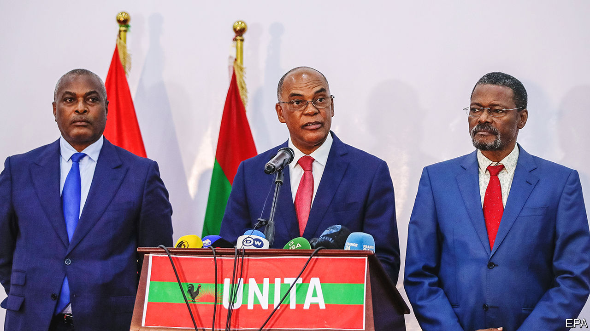

###### Who’s counting?

# An unofficial tally exposes Angola’s dodgy election 

##### The opposition may have won, but it won’t taste power 

 

> Sep 8th 2022 

As sadly expected by Angolans thirsting for real change, the People’s Movement for the Liberation of Angola (mpla), which has ruled the country since 1975, made sure by hook or by crook that the elections on August 24th would give the party and its incumbent president, João Lourenço, another five years in power. Even so, the official result—51% for the mpla against 44% for its eternal opposition, the National Union for the Total Independence of Angola (unita)—was closer than ever before.

Indeed, civil-society groups, using an unofficial parallel tallying system, say the true result was a tie—or even a victory for unita, which duly published a score of 49.5% to 48.2% in its favour. Sure enough, the mpla-packed constitutional court dismissed unita’s claims of rigging. But even the official result, however doctored, was a slap in the mpla’s face. 

The electoral commission, generally viewed as an mpla cipher, could not deny that voters in the province of Luanda, which includes the capital and is by far the country’s most populous, had plumped massively for unita. Even the city’s fanciest quarters, home to the mpla elite, are said to have voted for unita. Other reports suggested—worryingly for the ruling party—that unita received large votes where the army and police, recently put on “high alert”, were major constituents.

Even though the true vote is impossible to verify, there are good reasons both to query the official results and to lend some credence to the tallies issued by civil-society groups, whose calculations come closer to those of unita. The main technique used by these unofficial counters (and increasingly by the canniest election monitors around the world) is to record, photograph, collect and transmit tallies from every polling station, agreed upon by agents from all sides on the spot. By contrast, Angola’s central electoral commission gathers results at provincial centres without detailing the precise breakdown of polling-station figures.

However, although unita deployed cohorts of party agents as widely as possible, it will have lacked the resources and the security to cover the entire country, especially in rural areas, where the ruling party has extensive powers of bribery and intimidation. The mpla, after all, has held all the levers of state at every level for nearly half a century. Still, unita’s assertions of victory are indicative rather than definitive. 

In any event Mr Lourenço, though officially the winner, has been sorely weakened. The mpla has been divided, especially since July, when its long-serving and notoriously crooked leader, José Eduardo dos Santos, died in Spain, prompting bitter disputes over his legacy—and even over his funeral arrangements. When Mr Lourenço assumed the presidency in 2017, he set out to curb the influence and wealth of his predecessor and his family, which earned the new man some credit among ordinary Angolans. Few were sorry when the former boss’s daughter Isabel, said to be one of Africa’s richest women, who used to head the state oil giant, fled into exile.

But such house-cleaning shook the foundations of the party, many of whose bigwigs were tainted with oil-fuelled corruption. Moreover, since Mr Lourenço’s early fulminations against graft, the system of patronage and perks has persisted almost as brazenly as ever. Above all, development of the economy apart from oil has failed. Even mpla old-timers admit that the party has become hugely unpopular. The young—most Angolans are under 25—are particularly angry. 

Against such a backdrop the rise of unita has been palpable. It has shed its reputation as a violent ex-guerrilla movement with an ethnic base in the central heartlands. In its earlier days under its longtime leader Jonas Savimbi, who was killed in 2002, it disparaged the mpla for its “unAfrican” metropolitan leadership and Marxist ideology, often espoused—as unita sneeringly saw it—by mixed-race intellectuals based in Luanda and Lisbon. 

Since then unita has “detoxified” its image, says Ricardo Soares de Oliveira of Oxford University. Its leader for the past three years, Adalberto Costa Júnior, a persuasive 60-year-old engineer, himself of mixed race, has reached out from unita’s tribal strongholds to embrace a wider, more urbanised national constituency, more inclined to speak Portuguese, which has abandoned the mpla in droves. 

For the time being Mr Costa Júnior is sounding cautious, perhaps unsure whether to boycott legislative proceedings or to build on his parliamentary status of near-parity, presenting his party as a government in waiting while the mpla tears itself apart. He is surely determined to avoid the violence that followed a disputed election in 1992, when at least a thousand unita activists, including many of its leaders, were slaughtered in Luanda. 

Meanwhile, Mr Lourenço will seek to shrug off suggestions that he has lost his legitimacy. Regional and international election monitors, led by the African Union and the Southern African Development Community, declared the election more or less adequate, as they invariably do, while the European Union was almost as undemanding. Portugal, the former colonial power, is evidently happy to deal with the devil it knows—and from which it profits. While Angola implicitly supports Russia over Ukraine for historic reasons, Western governments are in no mood to badger a major African oil-producer over human rights or democracy. But they may be wise to take Mr Costa Júnior more seriously. ■

