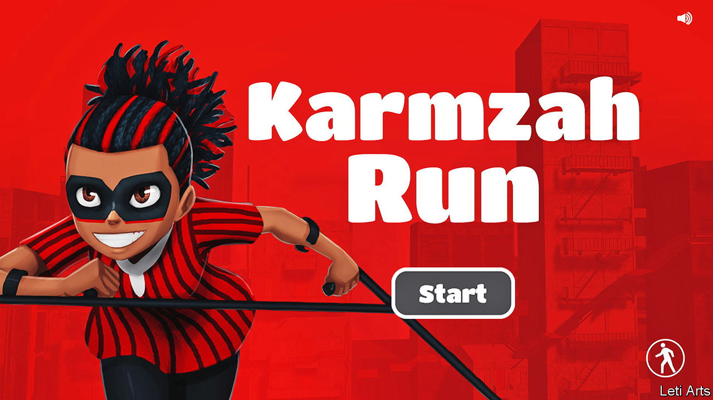

###### Local heroes

# Game developers draw on African stories to create new worlds 

##### The money may come when paying is easier 

 

> Sep 8th 2022 

Eyram tawia always wanted to be a superhero. As a boy he was Wuzu, “the Great One”, sketching comic-book stories from his lair in the living room. It was the 1990s and the first video games were reaching Ghana: “beat ’em ups” such as “Mortal Kombat” and “Street Fighter”, which he played on a fake Nintendo console. He recalls waiting eight months to run a demo of “Tomb Raider”, rigging up a computer with parts sent from an uncle in Australia. 

Today Mr Tawia creates games and comics himself at his studio, Leti Arts, in Accra, Ghana’s capital. His African characters inhabit their own world, which he compares to the Marvel universe. An assassin from Niger might face off against a witch doctor from Kenya, or the spider god Ananse against Shaka, the mighty Zulu king. His studio’s next game, “Karmzah Run”, follows an archaeologist with cerebral palsy who has superhuman powers.

Dozens of games studios have sprung up in Africa in the past decade. Insiders think African video games are poised to soar, and reel off statistics to support their case. The continent has a billion people under the age of 35 and more smartphones than North America. Mobile internet use is rising by 9% a year. Drawing on local folklore, developers hope to do for gaming what Afrobeats has done for music and Nollywood for film. Games can give new life to “the stories that our grandfathers used to tell us”, says Douglas Ogeto of Ludique Works, a games publisher in Kenya.

Developers let their imaginations run riot. A Cameroonian studio, Kiro’o Games, takes players to a mythical planet, Auriona, where a royal couple fight for their throne. Masseka Game Studio, founded by a Central African entrepreneur, weaves a traditional board game into a story of two kingdoms battling for riches. In “Kukulu”, designed by Qene Games, an Ethiopian outfit, a fugitive chicken leaps over coffee pots to escape a farmer. A Kenyan studio, Mekan Games, has topped the casual gaming charts in America with its app “The President”, inspired by Donald Trump.

Programmers are often self-taught. “The universities weren’t catering to game developers,” says Hugo Obi of Maliyo Games in Nigeria. “Why would they?” In 2020 his studio launched a skills curriculum. It is working with Google to train more than a thousand people this year. “We’re democratising knowledge for gaming,” he says.

African video games are not yet very lucrative. Most are designed for casual players to download for nothing on mobile phones. Revenue from adverts or selling in-game goodies is modest. “It’s been a struggle, frankly, in Africa to find a business model for a lot of games,” says Jay Shapiro, a Canadian entrepreneur who runs Usiku Games, a studio in Kenya. He thinks one answer is for developers to build economies of scale through initiatives such as the Pan-African Gaming Group, a network of nine studios that he chairs.

Venture capitalists are starting to take notice. In January investors put $20m into Carry1st, a South African publisher which helps studios worldwide launch their content in Africa. Its platform offers punters more than a hundred ways to pay (many African gamers lack credit cards or live in economies hamstrung by foreign-exchange restrictions). Cordel Robbin-Coker, its co-founder, agrees that studios have found it difficult to make money from video games in Africa but argues that “payments access is the biggest reason, not disposable income”.

For the moment the industry gets much of its revenue from charities and foreign donors, who like to fund worthy games about peaceful elections or sexual health. “Once you are making a game from Africa, people are asking you: ‘Is it for malaria? What is it teaching?’” says Mr Tawia. “Why can’t we make a game and just have fun?” 

He does not mind do-gooders, as long as he can explore his fictional worlds. At school, when his head teacher threatened to ban his “demonic” creations, he introduced a character called Faith the Conqueror and briefly rebranded them as “Christian Comics”. A superhero finds a way. ■

