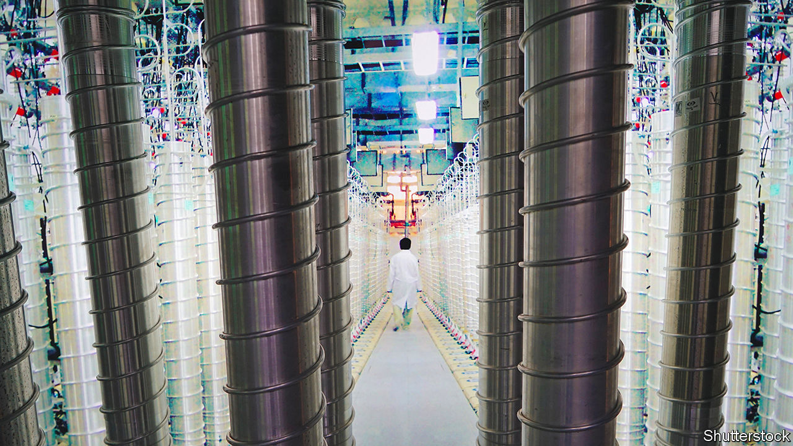

###### An unenriching debate

# Never-ending nuclear talks with Iran are bordering on the absurd 

##### America and Europe may soon have to decide whether to pull the plug on the process 

 

> Sep 8th 2022 

Much has changed in the nearly 18 months since Iran and world powers started trying to salvage their nuclear deal of 2015. Three of the seven parties to the accord have new leaders. A fourth invaded its neighbour. What was meant as a brief run of negotiations became a marathon. Yet negotiators flock back every few months for more meetings at the home of the un’s watchdog, the International Atomic Energy Agency (iaea) in Vienna.

Last month they seemed optimistic. America, which left the deal in 2018, had resolved some of its outstanding issues with Iran. The European Union (eu) prepared what it said was a “final text” of an agreement. There was talk of foreign ministers flying to Vienna to sign it.

But Iran, not for the first time, pushed for more. On September 1st it sent a formal reply to the eu’s draft. America called it “not constructive”. European diplomats were displeased. Talks seem headed for a two-month intermission, until after the American midterm elections in November. Even Western diplomats who support the deal are starting to question whether Iran really wants it, or merely wants to play for time—and when they should call its bluff.

Known as the Joint Comprehensive Plan of Action (jcpoa), the deal eased sanctions on Iran in exchange for limits on its nuclear programme. It was meant to enforce a break-out time—the period Iran needed to produce a bomb’s-worth of weapons-grade uranium—of roughly a year. Donald Trump withdrew from the agreement and restored American sanctions in a fruitless quest for a “better deal”.

Iran stayed compliant for another year. Since then, it has made irreversible progress towards mastering the uranium fuel cycle. It has installed thousands of advanced centrifuges, which would be mothballed but not destroyed under the revised deal. The iaea says Iran has 56kg of uranium enriched to 60% purity, enough to make a bomb if refined to weapons grade.

Even with a revived agreement, Iran’s break-out time would probably be closer to six months. Parts of the deal would begin to lapse as early as next year; many restrictions on centrifuges would “sunset” in 2024 and 2025. For the West, it thus offers fewer benefits than in 2015. Still, it would improve on the status quo.

Whenever a deal has seemed close, though, it has been derailed by Iranian demands. Some have been reasonable, such as wanting guarantees America will not pull out again under a Republican president. Others, such as its insistence that America remove its designation of the Islamic Revolutionary Guard Corps as a terrorist group, are outside the agreement’s scope. Iran has retreated from both demands: the former is impossible under America’s political system, and President Joe Biden balks at the second.

The latest obstacle relates to an iaea probe into Iran’s nuclear past. The agency found traces of enriched uranium at three sites, none of which had been disclosed as nuclear facilities, and rightly wants Iran to explain what it was doing. But Iran wants the probe dropped as a condition for returning to the jcpoa. Neither America nor the Europeans will agree to that course.

If the impasse cannot be broken, talks will probably pause. By law, Congress has 30 days to review any nuclear deal with Iran and could pass a resolution of disapproval, barring Mr Biden from lifting some sanctions. Such a measure would probably clear the House—34 Democratic members of Congress recently sent the president a letter expressing “deep concern” about a deal—but Mr Biden could veto it. Still, Democrats would like to avoid such a row before the midterms on November 8th.

Prolonged uncertainty has widened divisions in Israel, which officially opposes the nuclear deal. Mossad, its foreign spy agency, endorses that view. It thinks Iran would receive billions of dollars to fund its proxies but be freed to build a bomb once the sunset clauses kick in. Israel’s army, by contrast, sees the deal as flawed but beneficial. Its intelligence officers argue that even a temporary limit on Iran’s nuclear work would let Israel focus on other threats, and that the financial gains are overstated, as it will take years for Western firms to resume business with Iran. Israelis also disagree on whether a military strike could meaningfully slow Iran’s nuclear work. The air force thinks it could delay the programme by two or three years—but many other Israelis disagree.

Both Yair Lapid, the prime minister, and Binyamin Netanyahu, who hopes to displace him after an election in November, are convinced by Mossad. But Mr Lapid recognises that Israel has little influence over Mr Biden’s decision-making. Mr Netanyahu, for his part, is looking for ways to boost his electoral fortunes; he says Israel should badger the Biden administration into dropping the jcpoa for good.

Neither Mr Biden nor European powers want to walk away. That would force hard decisions about how to handle a nuclear-threshold Iran. Yet the endless talks have begun to seem farcical. In January Antony Blinken, the secretary of state, said there were only “a few weeks left” to save the deal. A few weeks passed, then a few more; 34 weeks on, the jcpoa looks like Schrödinger’s cat, not quite alive or dead.

Observers of Iran, inside the country and out, are unsure if it truly wants a deal. One view is that it does and is simply holding out for more concessions from a solicitous Biden administration. The status quo, after all, is not ideal. Iran is forgoing tens of millions of dollars a day in oil revenue at a time when its currency has collapsed and inflation is around 50%.

Even if a Republican kills the deal again in 2025, Iran could still enjoy two years of relief from sanctions. Bijan Khajehpour, an Iranian economist, estimates a deal would add six points to Iran’s gdp growth in 2024 and shave two points off the unemployment rate. Yet some of the advisers around Ebrahim Raisi, the president, see economic pain as a trial to be endured. 

In any case, the stalemate may on balance have suited Iran quite well. It has spent three years enriching its uranium without incurring more European sanctions or triggering the jcpoa’s mechanism known as a “snapback”, which would reactivate un Security Council restrictions on Iranian arms deals and missile research. 

Even Josep Borrell, a font of optimism throughout the negotiations, now sounds deflated. The indefatigable eu foreign-policy chief said on September 5th that America and Iran were moving farther apart in their positions. “The whole process is in danger,” he concluded glumly. No one is ready to admit failure—but it seems a growing possibility. ■

