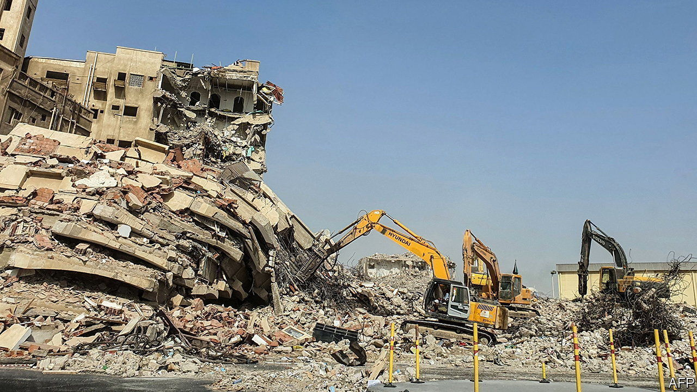

###### Make way for the prince

# The ancient city of Jeddah is being bulldozed 

##### In today’s Saudi Arabia modernity is everything 

 

> Sep 8th 2022 

No wonder saudis call Muhammad bin Salman, their crown prince and de facto ruler, the Bulldozer. Fly into Jeddah, Saudi Arabia’s second and most charming city, and vast empty patches scar the landscape. Most of its southern districts and much of its centre have gone. Herds of mechanical diggers paw at the remnants of mosques, schools, factories and blocks of flats. Bustling neighbourhoods are turning into ghost towns as the authorities, without warning, scrawl “”, Arabic for evacuate, in red paint on the walls, then switch off the electricity and water. “It looks like a war zone,” says a Saudi writer. 

Like Prince Muhammad himself, many of Jeddah’s 4.7m people initially welcomed the bulldozers. They flattened the slums reputedly home to criminal gangs, drug mafias and prostitution rings, as well as the poor quarters housing foreigners doing menial work. Bereft of proper drainage, the city is prone to flooding and needed a facelift. But joy turned to consternation as the bulldozers moved north, levelling old Saudi houses, mosques and handsome villas, and reaching perilously close to the old city, a unesco heritage site. 

Arab dictators tend to like megaprojects. Abdel-Fattah al-Sisi, Egypt’s leader, has ambitious plans for Cairo, too. But at least he compensates and rehouses the displaced before dispatching the diggers, with the developers fast behind. Prince Muhammad focuses on clearance, leaving his subjects to fend for themselves. As Jeddah’s housing stock shrinks, rents have soared and traffic is gridlocked. Those with means often head for Riyadh, the capital, or go abroad. Descendants of stateless pilgrims with no identity cards have nowhere to go. Some are said to camp in the desert. “The collateral damage of authoritarianism,” explains a Jeddah official. 

No one dares protest. It is brave merely to mutter. Some grumble that the House of Saud, the dynasty of Bedouin originally from the parched hinterland, like to punish the port’s cosmopolitans for never truly embracing Saudi rule. Before the founding king, Abdel Aziz bin Saud, conquered the whole country only a century ago, Jeddah was the grand seaside capital of the rival kingdom of Hijaz, while Riyadh, homestead of the Al Saud, was a mud hamlet.

Over past decades, embassies and most recently businesses have had to relocate to Riyadh. King Salman, Riyadh’s governor for five decades before taking the throne in 2015, turned the new capital into a metropolis of 7m people, almost twice Jeddah’s size. As crown prince, Muhammad has continued his father’s work. To drive his point home, he arrested and fleeced some of Jeddah’s top businessmen. He suspended work on what would have been the world’s tallest skyscraper, leaving it an unfinished stump. The fabled “Bride of the Sea”, says a local author, referring to ancient Jeddah, is being defiled. 

Officials say a better city will rise up. They liken Prince Muhammad to Emperor Napoleon III, who replaced Paris’s slums with leafy boulevards and parks in the 1850s and 1860s. One speaks of turning southern Jeddah into a gateway to the nearby holy city of Mecca. Jeddah recently hosted a film festival, a Korean pop show and a grand prix, a foretaste of excitements to come. It will be a second Venice, says another, replete with lagoons and canals. 

Locals have heard it before. A project costing $45bn to overhaul Jeddah was unveiled 13 years ago, but never materialised. This time befuddled residents have seen plans only for the waterfront and for converting an obsolete desalination plant into an opera house. For homeless Saudis, the prince’s masterplan, Vision 2030, augurs destruction more than reconstruction. ■

