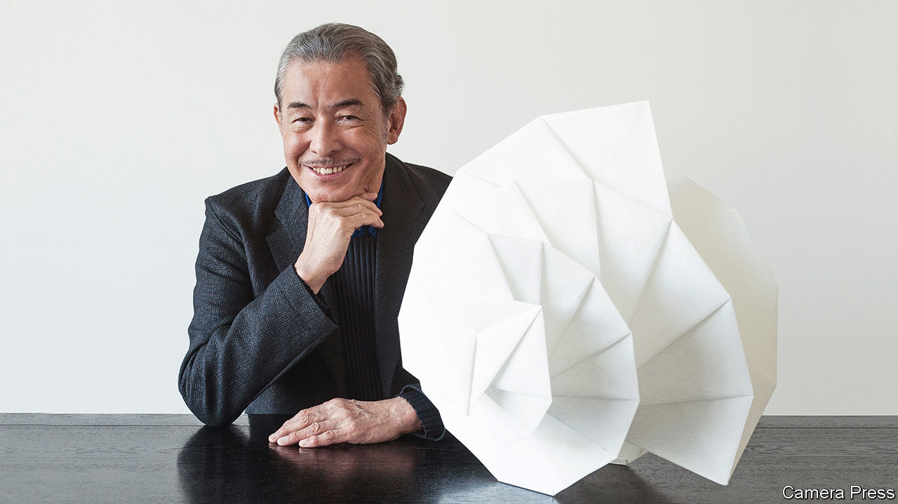

###### A piece of cloth

# Issey Miyake saw clothes in a completely new way 

##### The Japanese maker of extraordinary things died on August 5th, aged 84 

 

> Sep 7th 2022 

In 2016, an elderly woman sent Issey Miyake a sheet of  paper. It had been hand-made by her in Shiraishi, in northern Japan, from the inner bark of the gampi tree or the paper mulberry bush. Once soaked in water and dried in the sun, the fibres were tougher than those of wood pulp. For a thousand years  had been used for everyday clothes, toys and priests’ vestments; there had once been dozens of factories in Shiraishi. Now the only provider was this woman, who thought Japan’s most famous designer might like a sample for his archive. But he did not store it away. His first thought was, what can I make with this?, and his first act was to pin it into the rough shape of a kimono jacket. All clothing in ancient times had started like this, as a simple rectangle of woven stuff from a hand-loom. That simplicity remained the touchstone from which his ideas sprang. 

The world saw him as a fashion designer, a highly successful one, the name behind a brand that has around 300 stores worldwide and offshoots into scent, bags and furniture. But fashion itself did not interest him, nor the fame of a name. He hid from the commercial side, leaving that to well-trained deputies, while he stayed as a small cog of creativity, playful but self-effacing, travelling constantly to see local textiles and materials and, over much tea-drinking in his design laboratories, inspiring the team of daring minds he had gathered round him. 

A designer’s work, he kept insisting, was neither elitist nor frivolous. He was engaged in , the art, science and craft of making things, and his vivid colours and extraordinary shapes had a serious purpose. He wanted his clothes to work in real life and to bring people joy. (, clothing, sounded much like the word for happiness.) That was no small aim. Yet he had to argue his case hard, first as a student who had no chance, as a Japanese male, to study clothing design, and then as a young designer, who had to go to Paris to learn his trade with Laroche and Givenchy when he found no encouragement and no respect at home. 

As a maker he cared about every part of the process, from yarn to fabric to machinery. Almost anything could be turned into clothes. He used rattan, bamboo and paper, all of which had been tried in Japan long before, but forgotten. Recycled plastic and bottle caps, with an ingenious tweak in the process to soften their brittleness, were woven into shirts that he wore himself. Yarns derived from petrochemicals, rayon and nylon, were useful rather than despised. He actively favoured polyester, the fabric he used for his “Pleats Please” range, which when heat-pressed in layers of paper produced pleats that never crushed or lost their edge, fitting and swirling as beautifully after weeks in a suitcase as on the very first day of wearing. He had tried silk, but it hadn’t worked. 

Most fascinating, to him, was the way clothes worked with the human body and the space that lay between fabric and living skin. His clothes were not finished until they were being worn, lived and moved in, just as music was unfinished until it was played. Even his Bao Bao bags, wildly popular constructions of polyvinyl triangles on a hard mesh, changed shape as they were filled and adjusted themselves to the wearer. He moulded his fabrics to bodies in ways that looked hard and sculptural but were flexible and soft, making customers feel cocooned and courageous both at once. As a child he had wanted to be an athlete or a dancer, and on the catwalks of Paris and New York models sometimes danced in his clothes, to reinforce the point. 

In Paris, witnessing the student revolt of 1968, he decided that his clothes should be not just for the upper bourgeoisie, but for everyone. (His prices were not exactly mass-market, but reasonable for haute couture.) That principle also lay behind “A Piece of Cloth” (a-poc), a computer-controlled process that produced tubular pieces of polyester jersey, woven from a single thread, which each customer could cut into their own seamless clothes. In 1999 his models launched the idea by parading in one continuous piece of red cloth, each robed slightly differently but all swathed together, like the ribs of a fan. 

The first pieces of a-poc were produced on a disused machine that had once made fishing nets. Though he claimed to know nothing about machines, such chance discoveries delighted him. An older process could be used to realise a futuristic idea, technology as much as art. While tradition inspired him, optimism and nagging dissatisfaction drove him on, towards a time when gender in clothes could be forgotten, anyone could wear anything (as men could, and did, wear his pleats), recycled fabric became the norm, and pattern-makers, sweatshops and middlemen disappeared from the world of fashion. 

His fixation on the future also had a deeper cause. In August 1945, at the age of seven, he saw the blinding red flash of the atomic bomb exploding over his city, Hiroshima, and the black rain that followed. He was just going back to class after morning assembly; instead he had to run home, desperate to find his mother among the crowds of panicking and burning people. She had survived, but was so badly burned that she died three years later. He himself was soon lamed by osteomyelitis, a disease caused by radiation. Among the striding and dancing models in his free and easy creations he walked with a broad smile, and with a limp. 

This story lay hidden until 2009. He did not want to be known as the designer who had survived Hiroshima. The focus had to be shifted away from destruction, towards creation; away from shadows, to the light. As a young man struggling to survive in the blasted city, he had taken up painting, using his fingers because he could not afford brushes. On his way to classes he would pass the city’s twin Peace bridges, East and West. The designer Noguchi Isamu, who later became his friend, had built concrete balustrades for them. Those on the West bridge (“To die, to depart”), ended with a broken flower-stalk plunging into the ground. Those on the East (“To live, to build”) ended with flowers growing, lifting their heads to the dawning sun. Live, build. Make things. ■

