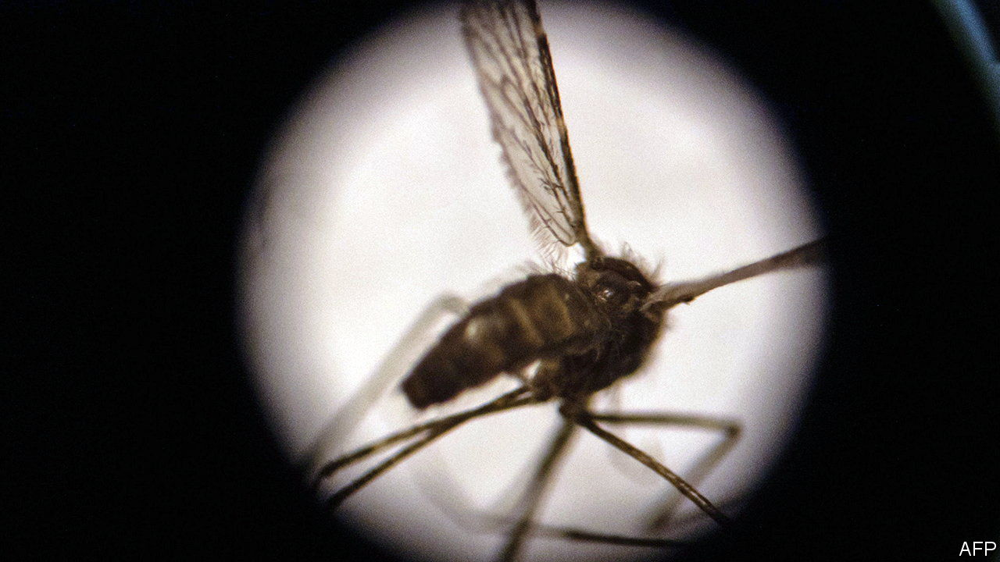

###### Parasites prevented

# A new malaria vaccine shows promising results 

##### If further tests remain successful, it could be deployed in the field as soon as 2023 

 

> Sep 8th 2022 

Most diseases that used to kill children in large numbers have succumbed to vaccines.  is an exception. In 2020 it , mostly African children under five years old. Scientists have not ignored the scourge: the first candidate vaccine trial took place in the 1940s; more than a hundred jabs have been in development since. 

But the malaria parasite, spread by mosquito bites, is  than viruses. The first successful vaccine was rts,s developed by GlaxoSmithKline (gsk). It was approved by the World Health Organisation in 2021 but only prevents 44% of malarial episodes in young children. The results from a new vaccine, reported in , suggest improvements are on the way. The new jab, called r21, was developed at Oxford University. It is paired with an adjuvant (a substance that boosts the immune response to a vaccine) called Matrix-m, which was developed by Novavax, an American biotech firm, for its covid-19 jab. The latest results are from a trial in Burkina Faso, where almost half of people get malaria each year. The trial enrolled 450 children aged 5-17 months. One group received the vaccine with a lower dose of the adjuvant; a second got the vaccine with a higher dose of the adjuvant; and a third, which served as a control group, received the rabies vaccine. All children were given a primary course of three jabs spaced four weeks apart and a booster jab 12 months later. They were followed for a year to see how many . 

The efficacy of the higher-adjuvant jab was 80% in the follow-up year; for the lower-adjuvant jab it was 71%. A booster extended the efficacy of the primary three-dose regimen from 12 to 24 months. The booster seems important because antibodies resulting from the primary course wane—something seen with other malaria jabs too. And higher levels of antibodies were found to be correlated with protection against malaria. The booster restored antibodies to the level they reached 28 days after the primary three-course regimen. Whether further jabs will be needed to maintain immunity is being investigated.

Comparing r21’s efficacy with that of gsk’s jab is not simple. The r21 trial took place in an area where malaria is seasonal and all children got their shots just before the malaria season began. The gsk trial was done in several countries in Africa, some with year-round malaria transmission. In such places vaccinated children can be bitten by malaria-carrying mosquitoes before they develop antibodies or when antibodies have started waning. That would seem to make the jab less effective. How much better the Oxford jab really might be should soon become clear, when results from a larger trial are expected.

Where r21 has a clear advantage, however, is in its availability. The Serum Institute of India, which has teamed up with Oxford University, can make up to 200m doses per year, compared with 18m doses coming from gsk in the next three years. r21 should also be cheaper, in part because it uses less of one of the key ingredients, a hepatitis b “carrier” protein. If the final trial of the new vaccine goes well, it may be deployed as soon as 2023. And malaria’s days as a mass child-killer could at last come to an end. ■


