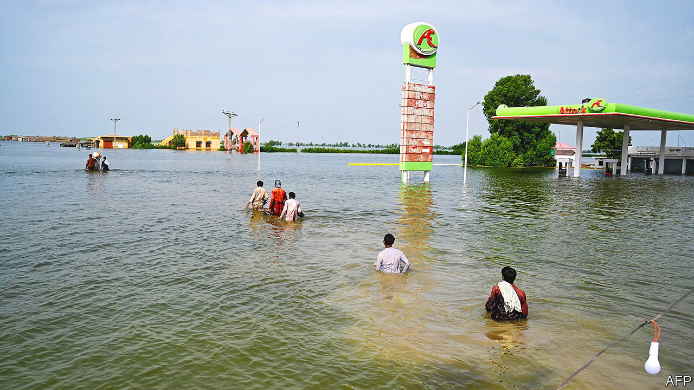
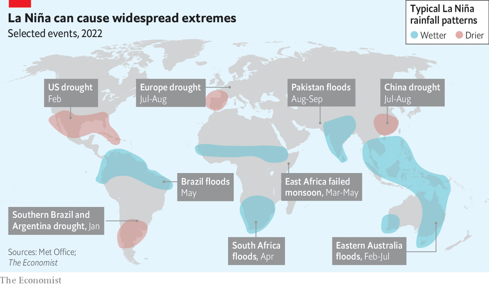

###### Weather

# Heatwaves and floods around the world may be a taste of years to come 

##### La Niña and climate change combine to create a spate of extreme weather in 2022 

 

> Sep 5th 2022 

The recent  have submerged a third of the country and left more than 1,100 people dead. Monsoon rains, the heaviest in a decade, caused flood surges of more than a metre in parts of the country. It is not the only part of the world to have endured extreme weather this year. Early on, Australia was hit with unprecedented rain and heat. In May record rainfall in Brazil led to mudslides and floods that killed over 100 people. By the summer, east Africa was suffering its fourth consecutive year of drought. Meanwhile, temperature records were broken in cities , and rivers there ran drier than at any point for 500 years. A 70-day heatwave  saw temperatures regularly exceeding 40°C, with the country’s two largest lakes dropping to their lowest recorded heights.

What explains the series of extreme events? Attributing any single weather event to climate change is a complicated business. Part of the difficulty reflects the intricate mechanisms of Earth’s climate, where persistent warming is the ominous background hum against which numerous other patterns play out. “Every event is a combination of climate change and climate variability,” says Caroline Wainwright, a climate scientist at Imperial College London.

Weather versus climate

One of the most powerful sources of natural climate variability is the El Niño-Southern Oscillation (enso), a phenomenon in which the climate all around the tropics (and in some regions beyond) moves into one of two extreme states. It takes the first part of its name from conditions in the Pacific Ocean. In a year without enso effects, the trade winds blowing east to west across the Pacific push near-surface warm water in the same direction. When the winds blow more weakly than usual, the warm water remains in the central and eastern Pacific, causing more rainfall in that part of the world, an event known as an El Niño. 

When the winds blow particularly strongly, more warm water than usual accumulates in the western Pacific, causing more rainfall there, and more cold water comes up from the depths off the coast of South America. This is known as —a condition that the world has been in for almost all the past two years.

 


La Niñas bring with them certain statistically predictable effects, including droughts in Chile, the Middle East and the horn of Africa, and higher rates of rainfall in west Africa and South Asia (see chart). Though the interconnectedness of the global climate means that some effects will inevitably be felt farther afield, the strength of the causal chain fades with distance from the tropics. The fluctuations are big enough, though, to affect average global temperatures. Because they keep heat in the ocean from getting into the atmosphere, La Niñas tend to make the world cooler than it would otherwise be.

What is happening in Pakistan is likely to be a catastrophic concatenation of multiple factors. A hotter planet means there is more moisture in the air (an additional 7% for every extra degree Celsius), leading to more extreme rainfall and greater risks of flooding. This means La Niña-induced rainfall can be unusually deadly. Global warming also has an indirect effect, as high temperatures experienced in the Himalayas earlier this year accelerated the melting of glaciers and overloaded rivers. It is also possible that air pollution in the area, which complicates air-circulation patterns, may have a role to play as well. The World Weather Attribution Project, a global network of climate modellers, began work recently to disentangle the various factors involved in Pakistan, with an assessment expected within the next few weeks.

La Niña itself may start to look different in a warming world, however. Though  does not operate in isolation from climatic warming, the exact relationship between the two continues to perplex modellers. This year, for example, will be the third in a row with a La Niña, the first time this century such a “triple dip” has been recorded. Ordinarily, enso operates on a three- to seven-year cycle, with strong El Niños tending to be followed by a balancing La Niña. Not only is this year’s triple dip unexplained, says Mat Collins at the University of Exeter, it is not consistent with what climate models suggest will happen with climate change.

Climate models, however, are in greater agreement that the regions affected by La Niña will tend to expand over time. Angola, for example, which lies beyond the boundary of Africa’s traditional La Niña flooding zone, has this year experienced high rainfall during the La Niña season.

La Niña years are also getting warmer. This March, the authorities responsible for the Great Barrier Reef in Australia announced that the coral reef had experienced a mass  in which corals expel their symbiotic algae as a reaction to rising temperatures. Only the sixth such event of modern times, it was also the first to take place in a La Niña year. 

This year’s La Niña may well be representative of those to come, with its higher temperatures, increased flooding and severe droughts. A pressing concern is the impact this will have on a world where resources are already sapped by a rapid succession of disasters. “We’re already not coping and it’s only getting worse,” says Maarten van Aalst, director of the climate centre for the International Red Cross and Red Crescent.

Equally fraught are questions of responsibility. Whether or not specific disasters were made more likely to occur by enso, climate change is doubtless playing a role in increasing their severity. This implicates richer countries most responsible for historic pollution, which have thus far largely been spared the worst consequences of their emissions. 

This year’s extreme-weather events, therefore, set a particularly dramatic backdrop for the upcoming cop27 meeting in Egypt, which will be held in November, with its long-awaited discussions on who bears the blame and, more important, who will foot the resulting bill. ■


