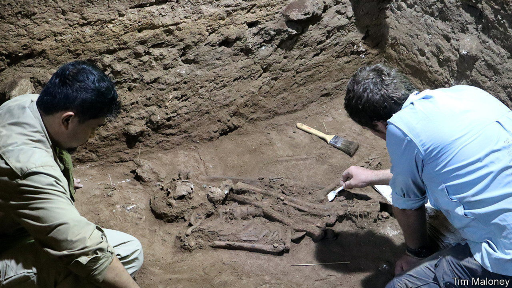
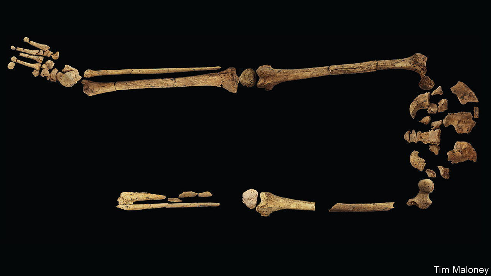

###### One foot in the grave

# Humans were performing amputations earlier than thought 

##### A new find in Borneo puts the advent of surgery back by almost 24,000 years 

 

> Sep 7th 2022 

The eastern side of the island of Borneo—or Kalimantan, as it is known by the locals—is otherworldly. The island, which is bisected by the equator, is blanketed by tropical rainforest. The rock underfoot is limestone, the remains of prehistoric coral reefs heaved up from the ocean floor. Over millions of years, rivulets have carved into the stone, creating networks of caves, treacherous sinkholes, and imposing towers of rock called “karsts”.

The landscape could be straight out of an “Indiana Jones” film, which is appropriate, because the region is a hotspot for archaeologists. In a paper published this week in , a team from Griffith University in Australia have announced perhaps the biggest archaeological find from the island yet. In Liang Tebo, a cave on the Sangkulirang–Mangkalihat Peninsula of eastern Borneo, scientists have excavated the oldest grave ever found in South-East Asia. The 31,000-year-old skeleton they found was missing its left foot and part of the left leg, showing compelling signs of surgical amputation. If correct, that means surgical procedures were being carried out some 24,000 years earlier in the archaeological record than previously thought.

“If you’re looking north from the main chamber of Liang Tebo, you’re surrounded by the cave,” says India Ella Dilkes-Hall, lead excavator on the dig. “Behind you is a higher second chamber, to your left is a higher third chamber, and then directly north, you are looking straight out at tropical rainforest.” 

 


In early 2020, Dr Dilkes-Hall and colleagues excavated a small trench in the floor of the cathedral-sized main chamber, where they found the bones of a 20-year-old man, carefully buried with a small piece of red ochre next to his face. That is significant, because Borneo is home to some of the earliest known rock art. One of the oldest known examples of figurative art, a 40,000-year-old painting of a banteng (a type of wild cattle), is located in Lubang Jeriji Saleh cave, a short trek away. 

But as startling as what was found is what was missing: the man’s left leg and foot, from the last third of his shin down. “The recovered parts of the left tibia and fibula present with a very unusual bony growth which closely matches clinical instances of deliberate amputation,” says Timothy Maloney, a lead author of the latest study. The surface of the bone suggests that the young man underwent amputation as a child and survived for six to nine years after the fact, recovering well and apparently thriving as an amputee. To pull off such a sophisticated medical procedure would have required detailed knowledge of human anatomy and the ability to negotiate exposed tissue, veins, arteries and nerves, never mind the risk of infections.

“There is a strong case to be made that these communities had an understanding of antiseptic and antimicrobial management, potentially taking advantage of the impressive plant biodiversity of the region,” says Dr Maloney. The find overturns existing assumptions that sophisticated medical knowledge only took off in Europe around 7,000 years ago. Indeed, it suggests that humans may have been performing sophisticated medical procedures in South-East Asia while humanity’s close cousins, the Neanderthals, still roamed southern Europe. ■


