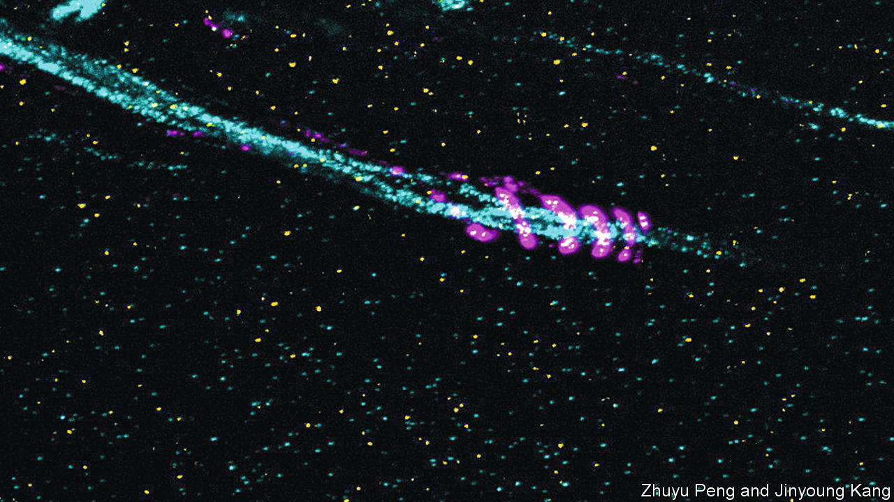

###### Zooming in

# Making the invisible visible 

##### A new imaging technique can reveal tiny protein structures like never before 

 

> Sep 7th 2022 

In 1665 robert hooke, a British polymath, published “Micrographia”, a book in which he described using what was then still a relatively new instrument—the microscope—to investigate the tiniest structures of everything from rocks to insects. Zooming in on a slice of cork, he saw a honeycomb-like structure and coined the term “cell” to describe the tiny pores he saw. 

Microscopes have come a long way since the 17th century and have helped scientists see smaller things in ever more detail. But they still have their limits—modern optical microscopes cannot image structures smaller in size than the wavelength of visible light, or a few hundred nanometres. Because light spreads out as it moves through small gaps, detail below a certain scale gets fuzzy.

In 2015 Edward Boyden, a neuroscientist at the Massachusetts Institute of Technology (mit), found a way past the physical limitations of the microscope by flipping the imaging problem on its head. Rather than inventing a better microscope, he found a way to make the object itself bigger. His technique, known as “expansion microscopy”, works by physically magnifying tissue. First, proteins of interest are tagged with fluorescent markers. An expandable gel is then inserted into the tissue and enzymes are poured in to chew up the rigid structural components of the cells. The gel expands, bringing the fluorescent markers along with it. This magnifies the initial protein structure by around four-and-a-half times, while preserving its proportions. An optical microscope, with a typical resolution of about 250 nanometres, can then produce images of individual elements within cells that are, in reality, only 60 nanometres in width.

Many proteins, however, have nooks and crannies that are too narrow for the fluorescent tags to squeeze into. Even with expansion microscopy, structures like Alzheimer’s disease-related amyloid-beta plaques look like blurry blobs. To this problem Dr Boyden has devised a new solution: adding the fluorescent markers after expansion of the sample, rather than before. And instead of using enzymes, his new method uses heat. This has enabled him to widen the nooks and crannies up to 20-fold, while still keeping the proteins intact. The new technique was described recently in .

Dr Boyden calls this method “expansion-revealing microscopy”. Since the method can be applied iteratively, he reckons it will eventually be able to create a 100-fold magnification of protein structures. Already his team at mit has used it to reveal detail in synapses, the nanometre-sized junctions between nerve cells, and also to shed light on the mechanisms at play in Alzheimer’s disease, revealing occasional spirals of amyloid-beta protein around axons (pictured, in pink), which are the threadlike parts of nerve cells that carry electrical impulses. The team plans to study crowded protein structures linked to Parkinson’s disease and molecules implicated in the ageing process in the brain.

Hooke’s “Micrographia” contained dozens of drawings of insects and plants. It was a bestseller and, by popularising microscopes, accelerated scientific progress. Three centuries on, expansion-revealing microscopy continues the quest to peer deeper into the world of the very small. ■


