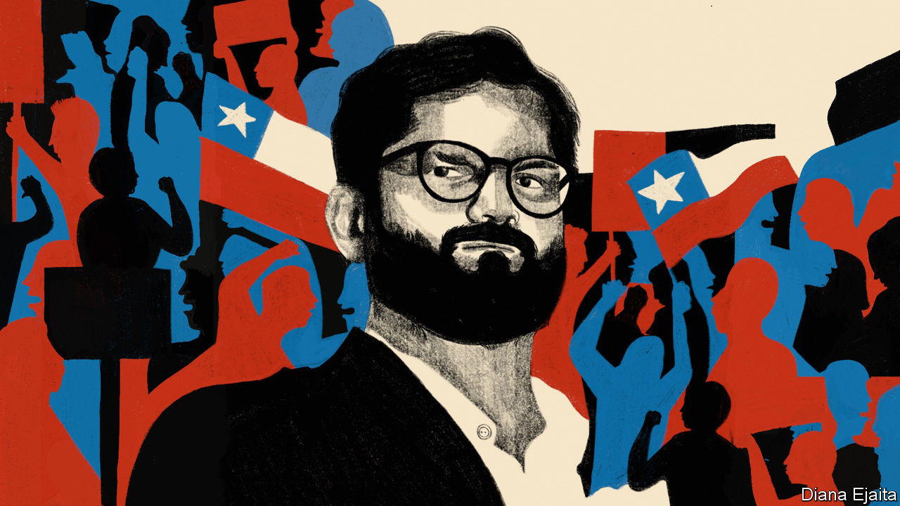

###### Second time’s a charm

# Common sense prevails as Chileans reject a new constitution 

##### The landslide result is a blow to the recently elected leftist government 

 

> Sep 5th 2022 

FOR THE past three years it seemed that the people of , one of Latin America’s most successful economies, were lurching to the left. In October 2019 huge protests against  shook the image of the country as a haven of stability. A year later Chileans voted in a referendum to have an elected convention rewrite the constitution, which was first adopted under a military dictatorship in 1980 but has since been amended almost 60 times. Then last December they plumped for , a bearded and tattooed 36-year-old leftist, to be president in a ruling coalition with the Communist Party.

Now they appear to have had enough. In a referendum on September 4th, 62% of voters  drawn up by the convention. Turnout was high, at 86%. Not one of Chile’s 16 regions approved it. Polls had for months shown that the charter would be spurned. But none predicted a 24-point margin. The sheer size of the defeat is a blow to Mr Boric, who supported the constitution-drafting process.

The result is indeed unusual. Of the 179 plebiscites on new constitutions that have taken place around the world between 1789 and 2016, 94% have been accepted, according to Zachary Elkins and Alexander Hudson, two constitutional scholars.

Much of the blame for the defeat lies with the convention itself. The elections to choose its 155 members were held in May last year. Many older voters abstained because of the pandemic. Turnout was only 43%. More than two-thirds of those elected were outside mainstream political parties. They included many political newbies and activists from the hard left.

They quickly alienated the average, centrist Chilean voter. One member crowed that the left was “going to make the big agreements, and everyone else will have to join us”. One far-left member dropped out after it emerged he had lied about having cancer. Another voted from the shower and was asked to turn his camera off. “People thought: if the artists are like this, the work will probably also have major flaws,” says Cristián Valdivieso of Criteria, a pollster. That view was reinforced when, at a recent event promoting a “yes” vote, a drag queen had the national flag pulled out of his rectum while his bandmates urged the audience to “abort Chile”.

The  put before voters was polemical. At 388 articles, it would have been one of the world’s . It enshrined over 100 rights, more than any other charter. Chileans would have enjoyed ones ranging from the odd—such as to “culturally appropriate” food and “digital disconnection”—to the ruinous, including an unfettered right for trade unions to strike. It would have weakened property laws, debilitated the upper house and created autonomous territories for indigenous people. Economists estimate that it would have increased government spending by between a third and a half—or by as much as 14% of GDP.

Now that the text has been buried, questions turn to the fate of the ruling coalition. The share of people who say they disapprove of Mr Boric has risen from 20% in March, when he took office, to 56% today. Though his government tried to distance itself from the work of the convention before the plebiscite, the two were still seen as tightly intertwined. Mr Boric’s approval ratings fell in line with a rapid drop in support for the body. On September 6th the government announced a cabinet reshuffle. Out went several of the younger faces who were close to the president. They were replaced by old hands from the centre-left parties that have governed Chile for much of the past three decades.

Even so, the government will continue to be weak. Mr Boric’s administration put off large reforms to Chile’s pension and health-care systems while it waited to see what the constitution would permit. Polls show that most Chileans still want a new charter, and they want another convention to have a go at writing a second draft. While the details of that convention are hammered out in Congress, Mr Boric will struggle to get his agenda off the ground.

A tax bill working its way through the legislature, which aims to increase the tax take by 4% of GDP by 2026 and push up mining royalties, will probably be toned down. A health-care bill the administration hoped to put forward in October will now probably be delayed. And the government will have to shift focus. Chileans are concerned about crime and inflation rather than pensions and health care, as they were when protests erupted in 2019. Such a change of strategy could lead to discontent among leftists who support the coalition, including those within Mr Boric’s own party. On the day the cabinet overhaul was announced, schoolchildren protested in Santiago against the constitution’s defeat.

If a new convention starts up, it will probably be more moderate than the first. Opposition parties will try to make it harder for independent candidates to run, and to have the process last six months instead of another year. “It was the convention’s impulse to refound the country that led to the failure of this process, and we need to avoid that,” says Javier Macaya, the head of one of Chile’s largest right-wing parties.

Meanwhile the economy will continue to deteriorate. Amid a difficult global context, weakening copper prices and the removal of pandemic-era stimulus, BCI, a bank, predicts a recession will start this year. It says GDP is due to shrink by 1.2% in 2023. Markets rallied after the draft charter was rejected. But Jay Truesdale of Veracity Worldwide, a political risk consultancy, thinks uncertainty over a new constitution will lead investors to take “a wait and see approach”. This bodes badly for Mr Boric, just six months into his administration. He will need his new centrist sidekicks to help him get out of this rut.■

