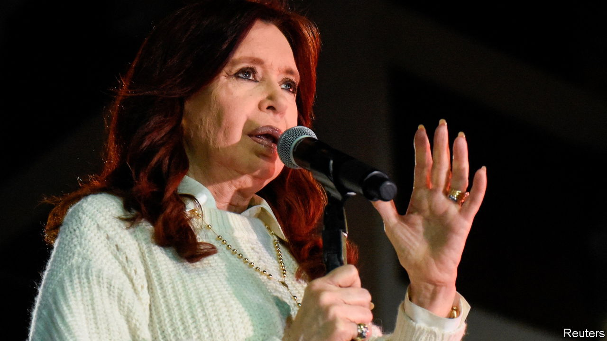

###### The Economist explains

# Who is Cristina Fernández de Kirchner? 

##### Argentina’s divisive vice-president is embroiled in a corruption trial and an assassination attempt 

 

> Sep 5th 2022 

LAST MONTH a prosecutor in Argentina sought a  for Cristina Fernández de Kirchner, the country’s vice-president, for her alleged involvement in funnelling padded public contracts to a crony at a cost of $1bn to the taxpayer. Ms Fernández, who denies all allegations as political persecution, called on her supporters to gather outside her apartment in Recoleta, a posh neighbourhood of Buenos Aires, the capital. As she was greeting some of them on September 1st, a man pointed a pistol close to her head and . No shot was fired, seemingly because the gun malfunctioned. Argentina’s president, Alberto Fernández (no relation), called it the “gravest” event since the country returned to democracy in 1983. He declared a public holiday to allow tens of thousands of Peronists—the movement to which both belong—to march in support of the vice-president. But who is Ms Fernández, Argentina’s most polarising politician?

Born in 1953 into a modest family, her father a bus driver and her mother a clerk, Ms Fernández studied law at the University of La Plata, near Buenos Aires. There she met Néstor Kirchner, who became her husband and political partner. In 1976, to escape the attention of the country’s military dictatorship, the couple moved to Néstor’s home province of Santa Cruz, in remote Patagonia, where they made their political careers. He became governor and she a senator, establishing themselves as leaders of the leftist-populist wing of Peronism. Their breakthrough came in 2003 when Néstor was elected as Argentina’s president. She followed him in the job; after he died of a heart attack she won a second term.

In office she combined progressive measures, such as the legalising of same-sex marriage, with a nationalist and statist economic policy. She renationalised YPF, an oil company, and returned private pension funds to state hands. Helped by a boom in the prices of the agricultural exports she ramped up subsidies and handouts for poorer Argentines. Her rule was marked by conflict: she tried and failed to control the judiciary and private media groups; when she imposed windfall taxes on farmers, they staged big protests. She could not prevent her chief opponent, Mauricio Macri, a conservative businessman, from succeeding her in 2015. Ms Fernández returned to the Senate.

There, she engineered her revenge against Mr Macri by uniting the disparate factions of Peronism. She expediently gave the top slot on the movement’s presidential slate to Mr Fernández, who appealed to more moderate voters. Mr Fernández won the presidency in 2019, with Ms Fernández as his deputy. But their relationship soon suffered strain: she opposed his agreement with the IMF to renegotiate Argentina’s debts and blocked his efforts to curb the fiscal deficit.

A resilient and cunning politician who instinctively knows when to talk and when to stay silent, Ms Fernández has exploited Argentina’s penchant for melodrama and political theatre. She has framed her trial for corruption as a conspiracy by the judiciary, the media and business to silence a champion of the poor. But her star is waning: though she may run again for the presidency next year, her core support is now only around 25% of the electorate. Many of her opponents have claimed that the thwarted attempt on her life was staged to divert attention from the corruption case, although there is no evidence to suggest this. Peronism has rallied round her for now, but sympathy over the alleged assassination attempt may soon wear off. ■

