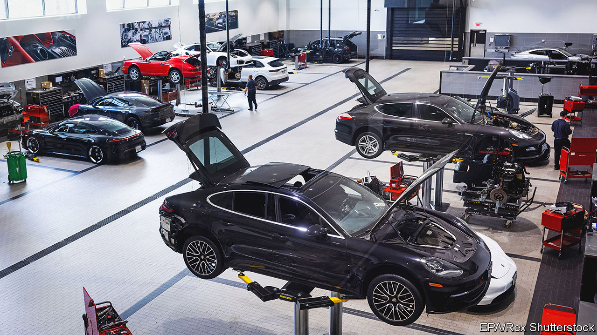

###### The world this week

# Business 

#####  

 

> Sep 8th 2022 

Volkswagen said it would list  in an ipo on the Frankfurt Stock Exchange that will take place in either late September or early October. The German carmaker is offloading only a portion of the stock, some of which will go to the Porsche-Piëch families, vw’s biggest shareholders. The rest will be sold to individual investors. vw will retain the remaining shares. The flotation could raise as much as €10.6bn ($10.5bn), which would make it the biggest stockmarket listing in Europe since Glencore in 2011. 

The  lifted its benchmark interest rate by three-quarters of a percentage point, to 0.75%. In July the rate was raised from a negative rate of -0.5% to zero, which was the first increase in a decade. As with other central banks around the world, the ecb is under intense pressure to tame inflation, which stood at an annual rate of 9.1% in the euro zone in August. The day before the ecb’s decision  central bank lifted its main interest rate and also by the same amount, taking it to 3.25%, the first time it has been over 3% since 2008. 

 decided to cut output by 100,000 barrels of oil a day, a slap in the face for Western governments that have urged the cartel to increase production in order to keep prices down. The cut is small (global demand is about 100m barrels a day), taking output back to where it was in August, and reverses a small increase in production that was agreed after Joe Biden visited Saudi Arabia to plead for more oil on the market. Amid talk of a recession in the West, the price of oil has in fact dropped, from almost $125 in early June for a barrel of Brent crude to under $90 this week for the first time since February. opec is signalling that it does not want the price to fall much further. 

 economy shrank by 0.7% in the second quarter (over the previous quarter), when the country had to contend with flooding that disrupted production at car factories and washed away infrastructure, and power cuts. Unions have been calling for a general strike to protest against high living costs, poverty and unemployment. 

 in China’s cities last month lay behind a drastic slowdown in the country’s , which rose by 7.1%, year on year, compared with 18% in July. 

The mighty greenback

China’s central bank moved to shore up the limp  by reducing the amount of foreign currency that banks need to hold. Meanwhile the  fell to ¥144 against the dollar, its weakest level since 1998. Officials hinted that they were ready to intervene to head off a further decline. The  sank to a new 20-year low amid the turmoil in European energy. And the  plunged to $1.14, its lowest level since 1985, amid dire forecasts about the British economy. 

The Biden administration gave more details about its plans for subsidising the production of  in America. Around $28bn will be provided for cutting-edge logic and memory chips, $10bn for current-generation chips, and $11bn for a new technology centre and other institutes. The government wants to boost domestic expertise in semiconductors, and reduce the reliance on chips from South Korea and Taiwan.

In a deal that further diversifies its health-care business,   agreed to buy , which provides virtual and at-home help to patients, for $8bn. Amazon was one of several companies said to have bid for Signify. cvs was known mostly for its retail pharmacy chain until 2007, when it expanded into the administration of prescription-drug programmes and then, in 2018, health insurance. 

 reached a settlement with 33 American states to resolve claims that it targeted its vaping products at under-age users. Under the agreement it will pay out $438.5m and will be banned from portraying users under the age of 35 in its marketing materials. The company, which denies wrongdoing, is appealing against a ruling from the Food and Drug Administration that would stop it from selling its e-cigarette merchandise in the United States. 

Apple launched the  at its annual product event. Like previous models, the latest iPhone includes pricier Pro versions, which have helped increase revenue for Apple. Smartphone sales have declined considerably this year, but the one “bright spot”, according to Counterpoint Research, is the market for phones priced above $900. 

Force majeure

The judge overseeing the forthcoming trial between  and  ruled that evidence will be allowed from a whistleblower that Mr Musk says backs his claim that Twitter misled him about fake user accounts, the reason why he wants to back out of his $44bn takeover. A text was revealed at the hearing in which Mr Musk said he wanted to “slow down” the deal just two weeks after it was announced, in case world war three breaks out in Ukraine. 

The chairman of Lukoil reportedly died after falling out of a hospital window in Moscow. The Russian oil giant said he had passed away following a severe illness. A number of senior , mostly connected to energy, have died in mysterious circumstances this year. In May Russian media reported the death of another senior executive at Lukoil, who was found in a room used for voodoo rituals at the house of a shaman. Reports at the time said he had been given venomous toad poison to cure a hangover.

