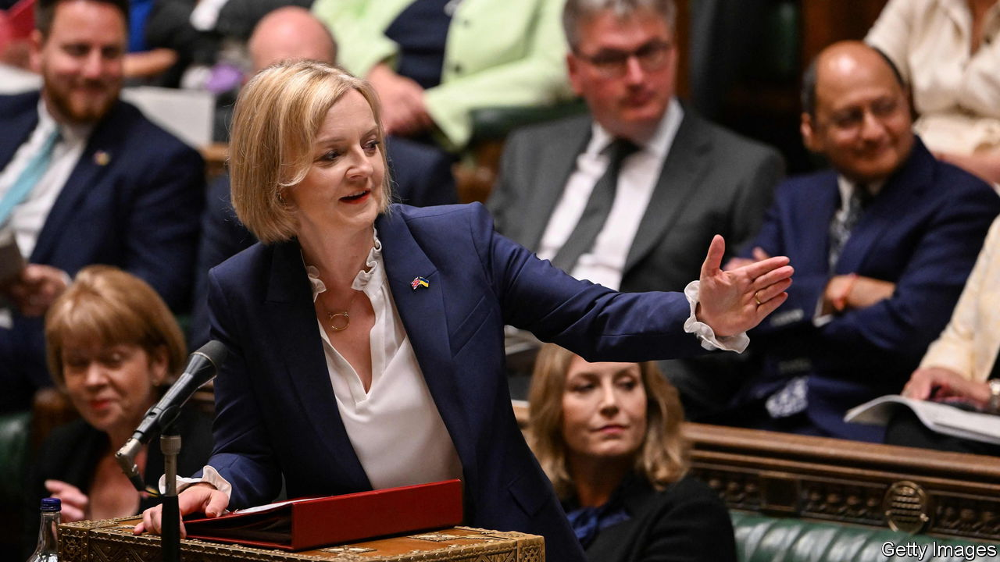
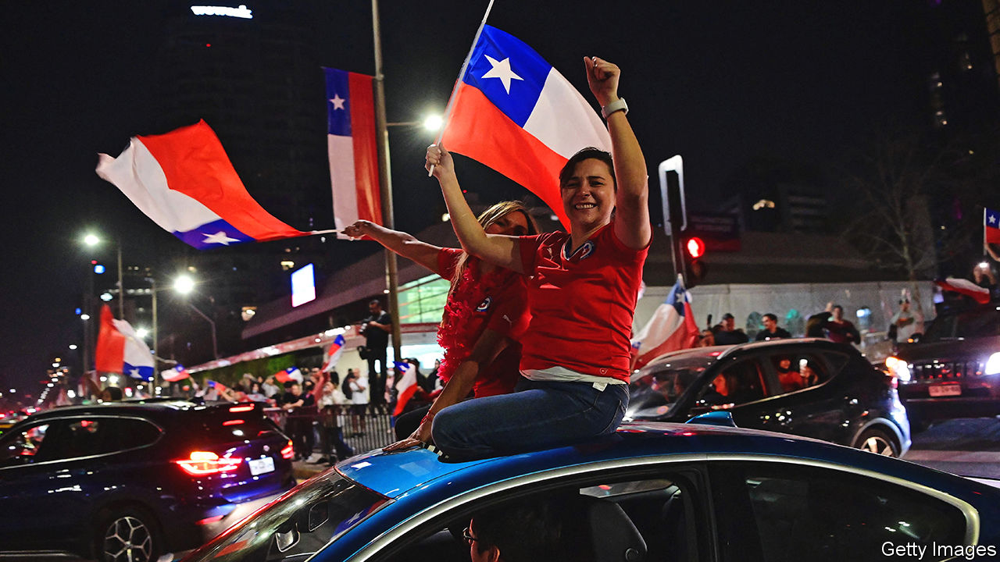

###### The world this week

# Politics 

#####  

 

> Sep 8th 2022 

 won the leadership contest of Britain’s Conservative Party, thus becoming prime minister. Ms Truss appointed loyalists to the top jobs in her cabinet. Kwasi Kwarteng was appointed chancellor of the exchequer, James Cleverly foreign secretary and Suella Braverman home secretary. There was no place at the table for Rishi Sunak, her opponent in the Tory race. Ms Truss’s most pressing task is helping Britons through the cost-of-living crisis. She unveiled plans to cap energy prices in order to protect households and firms from surging bills. 

Feeling the heat

Ursula von der Leyen, the European Commission’s president, proposed a set of measures to cushion the impact of rising on Europe’s economy. They include mandatory consumption cuts, taxing the windfall profits of energy firms to provide rebates to consumers and capping the price of Russian gas. European energy ministers will meet on September 9th to discuss the proposals. Russia has slashed gas deliveries to Europe to exert pressure on it to stop supporting Ukraine.

The International Atomic Energy Agency published its assessment of the situation at the  nuclear plant in Ukraine, following a visit by its inspectors. The report said that continued shelling in the area was causing damage, including to the building that houses “fresh nuclear fuel”. The iaea suggests it is urgent to establish a protection zone around the facility. 

Vladimir Putin approved a foreign-policy doctrine based on protecting the , which in essence means allowing the Kremlin to interfere in other countries with Russian-speaking populations. Meanwhile, a court in Moscow sentenced , a widely respected former journalist, to 22 years in prison after a closed-doors trial. Mr Safronov was arrested in 2020 on charges of treason, which he denies. He had written about Russia’s defence industry. 

Russia is reportedly buying millions of rockets from  to deploy in Ukraine. A Pentagon official said turning to North Korea for weapons was a sign the Russians were facing “challenges on the sustainment front”.

 Supreme Court dismissed an appeal by Raila Odinga against his narrow loss in a recent presidential election to William Ruto. Mr Ruto will be sworn in to office on September 13th.

The ruling People’s Movement for the Liberation of Angola, better known as the mpla, was officially deemed to have won an election on August 24th, defeating the National Union for the Total Independence of Angola (unita) by 51% to 44%, the closest result since the mpla came to power in 1975.  president, João Lourenço, will remain in office. But civil-society groups said the true result was a tie or a narrow victory for unita.

Jihadists were suspected of planting a bomb that killed at least 35 civilians travelling on a road in northern . The country&#39;s military ruler had recently met his counterparts from Mali and Ivory Coast to discuss ways of tackling the jihadist threat in the region. 

 army admitted that there was a “high probability” that one of its soldiers had killed a prominent Palestinian journalist, Shireen Abu Aqleh, in May by mistake. It said the soldier had not identified her as a journalist.

 


Almost 62% of voters in  rejected a new constitution. The referendum came after a year’s deliberation by a constitutional convention that was plagued by scandal and heavily influenced by the hard left. At 388 articles, the proposed charter would have been one of the world’s longest. Gabriel Boric, the new left-wing president, had backed the process. His disapproval rating has risen from 20% to 56%.

Bolsonaro emboldened

right-wing populist president, Jair Bolsonaro, whipped up big crowds at independence-day parades in Brasília and Rio de Janeiro. He said that an election on October 2nd would be a struggle of “good versus evil”, and that polls showing that Luiz Inácio Lula da Silva, a former left-wing president, is ahead in the race were “lying”. 

Ten people were fatally stabbed in Saskatchewan, a rural province of . It was one of the country’s deadliest mass killings. One of the two suspects was later found dead with knife wounds. The other died after being captured by police, reportedly from self-inflicted injuries. 

A judge agreed that an independent lawyer, or “special master”, should be appointed to review the papers that were taken from  home in Florida by the fbi. The decision will delay the Justice Department’s evaluation of the classified files that Mr Trump removed from the White House. Documents on the nuclear capabilities of an unnamed country were reportedly among the stash of papers confiscated by the fbi.

nasa’s  unmanned mission to the Moon may not be launched now until mid-October, after a second attempt was called off, this time because of a fuel leak. 

 were told to conserve power in order to avoid blackouts, as the state sweltered under record-breaking temperatures. Some cities reached the mid-40s Celsius (110°F).

A bomber attacked the Russian embassy in Kabul, killing six people, including two members of the diplomatic mission. Russia is one of the few countries to keep a diplomatic presence in  after the Taliban’s return to power. Scores of bombs this year have killed hundreds of people. 

Faced with a labour shortage,  raised the annual cap on permanent immigration to the country by a fifth, to 195,000 people. It was the first increase in a decade. 

The government of  suspended three appeals-court judges. The three had ruled against a decision to deport a high-court judge who is also the husband of the opposition leader. The country of 32 Pacific atolls now has no judges in the high court or appeals court. Observers worry that Kiribati could slide into authoritarianism, just as China gains influence. 

 extended a lockdown in Chengdu, home to 21m people. It is the biggest city to close since Shanghai locked down earlier this year. Dozens of Chinese cities have imposed restrictions to stem outbreaks. New cases have topped 1,000 per day for the past month. A 6.8 magnitude earthquake, felt in Chengdu, added to the suffering, killing scores of people.

