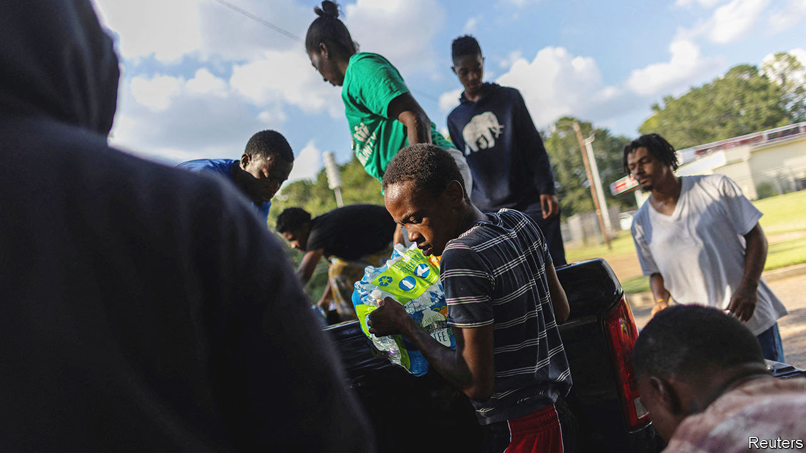

###### High and dry

# A water crisis in Mississippi’s capital is a harbinger of worse 

##### Jackson’s residents have been without drinking water since August 29th 

 

> Sep 6th 2022 

A line of cars snakes around the Metrocenter, an abandoned mall in Jackson, Mississippi’s capital and its largest city. The car park has weeds a foot high and potholes twice as wide. But it has recently come to life again, as one of seven temporary distribution sites handing out cases of bottled water to Jackson’s 150,000 residents. Clean tap water stopped flowing into their homes over a week ago.

On August 29th excessive rainfall caused the Pearl River, which runs through Jackson, to overflow. The storm took out the city’s main water-treatment plant, where pumps had already been failing. Because the floods reduced water pressure throughout the system, a back-up plant was not able to keep up with demand.

Local officials warned that Jackson would be without “reliable running water at scale” indefinitely. Mississippi declared a state of emergency the following day. It was swiftly approved by President Joe Biden, allowing the federal government to send funds to Jackson as well as hundreds of National Guard troops to support relief efforts. The stoppage has left many in the city unable to bathe, wash clothes or flush their toilets. (Non-potable water is also being distributed for such activities.)

Jackson’s system has been failing for years. Last year ice storms cut off water supplies for several weeks. And even when water flows, residents have been periodically advised to let it run for at least a minute to flush away lead; then to boil it before drinking in order to kill bacteria. Lead is not its only metal pollutant: since 2018 the city’s water has failed to meet treatment standards for copper, too.

The scale of this problem extends well beyond Jackson. Nearly 21m Americans drank water from communal systems (including schools, hospitals and other public places) that did not meet safety standards in 2015, the latest year for which data are available. From 2014 to 2016 tens of thousands in Flint, Michigan, were exposed to lead poisoning and possibly Legionnaires’ disease (a nasty kind of pneumonia) through their tap water. In August high levels of arsenic were found in the water system of a public-housing complex in Manhattan that serves some 4,000 people.

Mami Hara of the us Water Alliance, a non-profit group, says Jackson’s crisis stems in part from a broad failure to ensure equal access to water. Four in five of its residents are black, and many are poor. For others across the country, even a shower remains out of reach. Over 1m Americans do not have complete indoor plumbing (defined as having hot and cold water with an indoor bath or shower). Nearly half of those without indoor plumbing live in cities, and they are more likely to be non-white, poor and renters.

Since the Clean Water Act of 1972, which regulated quality standards for America’s waterways, federal investment in water infrastructure has decreased as a proportion of total infrastructure funding. Most water pipes were installed in the 1970s and 1980s, and few upgrades have been made to them since. As much as 18% of treated potable water is lost to leaks each day, estimates McKinsey, a consulting firm. Last year the governor of New Jersey signed a bill to remove all lead pipes in the state within a decade, at an estimated cost of $2.7bn. In August congressional representatives complained to the Environmental Protection Agency (epa) of an “absurd disparity” in its allocation of federal funds to New Jersey.

Without adequate funding, access to clean water will worsen. Extreme weather is pushing old systems to their limits. Last year a legislative delegation from Jackson failed to obtain $42m from Mississippi to cover water-infrastructure improvements. Jackson’s mayor, Chokwe Lumumba, says the city’s water crisis is “dehumanising” for its people. He reckons $1bn is needed to fix its water system.

Some federal help is on the way. In December the epa allocated $75m to improve Mississippi’s water and sewer systems. The Bipartisan Infrastructure Law, signed by Mr Biden in November, will shower $55bn on water-infrastructure projects and upgrades across the country (of which $429m will go to Mississippi over the next five years). Millions of Americans are thirsting for them. ■


