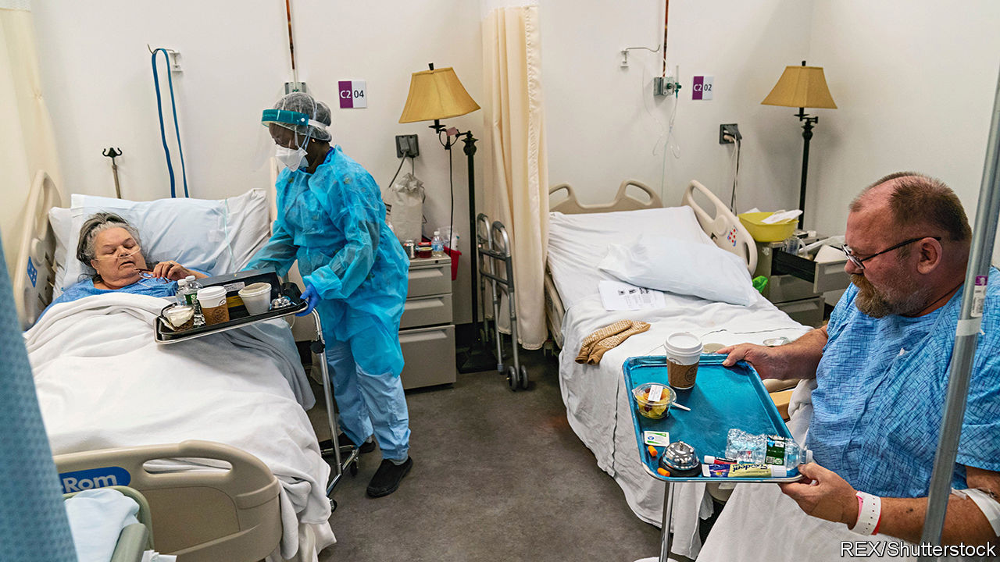

###### The best medicine

# American hospital food is fast improving 

##### More doctors are taking nutrition seriously 

 

> Sep 8th 2022 

Few sick people consider the quality of the food when choosing a hospital. That is perhaps just as well. Even in America, a country where private hospitals have long provided individual rooms with such comforts as personal cable television, patients are often still fed institutional food. “Mystery meat” and processed-cheese slices are common; everything gets cooked in a microwave. Many of the country’s biggest hospitals get their food from the likes of Aramark, a giant global caterer that also provides meals to schools and prisons.

More hospitals are starting to feed their patients better food. Intermountain, a non-profit group based in Utah that runs 32 hospitals across the Mountain West, has since 2019 served freshly made meals to patients. Chefs in proper kitchens now source local ingredients to serve in cafeterias. Doctors are consulted to meet patients’ dietary needs. Christopher Delissio, the head chef at Intermountain, describes creating a meal for a Mexican child who was being treated for cancer. “He would not eat,” Mr Delissio recalls, and that was making it harder for him to recover from chemotherapy. “I was able to go up on the floor and speak to this boy’s parents and him and kind of figure out what he wanted,” he says.

The link between eating well and good health has long been clear, says David Eisenberg, a nutrition specialist at the Harvard School of Public Health. Heart disease, which has a direct connection to diet, is America’s biggest killer. Roughly two-fifths of American adults are clinically obese, and over 14% suffer from diabetes. The right food can help patients avoid going back to hospital. Yet doctors themselves have often been slow to recognise the need to encourage healthy eating, says Dr Eisenberg. Most health care remains curative, rather than preventive. Medical schools still rarely teach much about nutrition. Long working hours mean that hospital employees eat poorly and are often “even more overweight and diabetic than the general public”, says Dr Eisenberg.

A decade ago Henry Ford Hospital in West Bloomfield, outside Detroit, opened a teaching kitchen where staff could help patients plan affordable, healthy meals and learn how to cook them. The idea is now spreading widely. In October a conference for health and food professionals in Los Angeles will encourage the adoption of such kitchens. Participants will tour a new one that has just opened at ucla’s hospital. In May the House of Representatives passed a resolution urging medical schools “to provide meaningful physician and health-professional education on nutrition and diet”.

Challenges remain. Doctors do not get paid more if, owing to healthier eating, patients no longer need treatment. But at least, says Dr Eisenberg, insurers are starting to balk at the expense associated with chronically sick patients. Some healthy food for thought.■


