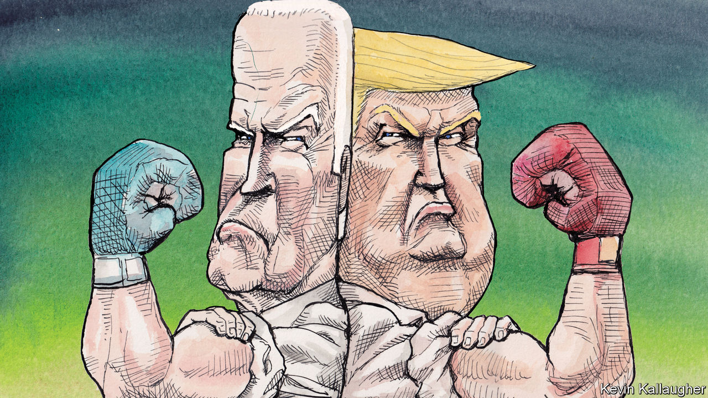

###### Biden’s gamble

# Joe Biden and Donald Trump agree on one thing 

##### They both want the midterms to be about the former president 

 

> Sep 8th 2022 

One thing upon which Joe Biden and Donald Trump agree is that the biggest issue confronting voters in the midterms this November is Donald Trump. The two men are locked in a dark contest, the likes of which no living American has witnessed between a sitting and former president. Mr Biden and Mr Trump are travelling to battleground states to warn of grievous threats from fellow Americans and to make the case, respectively, that Mr Trump is to blame, or that only he can save the country.

Apocalyptic warnings and divisive tactics are Mr Trump’s stock in trade. They are more surprising coming from Mr Biden. That he has felt it necessary to resort to them is yet another sick triumph for Mr Trump over what was once normal in American politics. 

What is also surprising is that Americans appear to agree with the two presidents—or, more precisely, to disagree with each other, in parallel to them. In the past, political campaigns that focused on the conduct of politics itself, such as on the influence of big financial contributions over legislation, have not captured the imagination of voters. But a recent poll by nbc News found that a plurality of voters (21%) cited “threats to democracy” as the most important issue facing the country, ahead of the cost of living, jobs and the economy or abortion.

Republicans seem even more persuaded of this than Democrats, maybe because many accept Mr Trump’s claims that the investigations into his doings are politically motivated or that he won the 2020 election. According to a poll at the end of August by cbs News/YouGov, 45% of people who voted for Mr Biden in 2020 believe that a generation from now America will be “less of a democracy”, compared with 71% of those who voted for Mr Trump. 

Taking office after the attack on the Capitol on January 6th 2021, Mr Biden did not ignore the threats of domestic extremism and terrorism. But he tried to calm Americans down by appealing to their better angels for “that most elusive of things in a democracy: unity”, as he put it in his inaugural address. He promised to fight as hard for those who had opposed him as for those who had supported him. For most of his term he tried to avoid even mentioning Mr Trump by name, and he succeeded in coaxing some bipartisan action from Congress. But unity did not materialise, and Mr Trump did not fade away.

Having amassed substantial legislative achievements, Mr Biden chose to go on the offensive as summer’s end heralded the intense phase of the midterm campaigns. Gone is the benevolent peacemaker; in his place is a feisty partisan. With speeches in Philadelphia and Pittsburgh, Pennsylvania, and in Milwaukee, Wisconsin, he has attacked Mr Trump and “maga Republicans”. “Name me a democracy in the world where a leader argues to engage in violence,” Mr Biden challenged his audience in Milwaukee, on September 5th. “To this day, maga Republicans in Congress defend the mob that stormed the Capitol.” Later that day, in Pittsburgh, he said: “We can choose to build a better America or we can continue down this sliding path of oblivion.”

Unlike Mr Trump, Mr Biden can be a happy warrior, and he is playing optimistic notes alongside his dire warnings. He is careful to distinguish “maga” from “mainstream” Republicans. He is trying to woo the latter (along with independents) by embracing patriotic symbols, talking up his record of creating jobs and envisioning how the Inflation Reduction Act, which he signed into law in August, will lower prescription-drug costs. But tens of millions of Americans consider themselves part of Mr Trump’s maga movement. In calling them a threat to “the very foundations of our republic”, as Mr Biden did in Philadelphia, he is signalling, unavoidably, that he is giving up on them, and on the legislators who represent them. He is supplying them with evidence for their belief that he and other Democrats are their enemies. And even “mainstream” Republicans may conclude that he is just playing games for partisan advantage.

Mr Biden appears to be gambling that us-or-them oratory will motivate Democrats to turn out to vote, defeating candidates backed by Mr Trump in states like Pennsylvania and showing Republicans the folly of embracing his politics (a lesson they failed to absorb from Mr Trump’s previous losses of the White House, House and Senate). Many Democrats and their champions in the press are delighted with the president’s harder edge, and Mr Biden seems revivified by being out on the road. Talk of the need for a new Democratic standard-bearer in 2024 has subsided.

So many enemies within

But Mr Trump is happy to match Mr Biden’s bet, and raise him. When Mr Trump held a rally in Wilkes-Barre, Pennsylvania, on September 3rd, he declared Mr Biden’s speech in Philadelphia “the most vicious, hateful and divisive speech ever delivered by an American president”—and then demonstrated that, when it comes to such speechifying, Mr Biden is not in his league. 

Mr Biden is “an enemy of the state”, Mr Trump said, and the justice department and fbi “have become vicious monsters, controlled by radical left scoundrels, lawyers and the media”. The federal investigation of Mr Trump was “a desperate attempt” to keep him from returning to the White House. “Despite great outside dangers, our greatest threat remains the sick, sinister and evil people from within our own country,” he said. He and his maga movement (“the greatest in the history of our country, and maybe in the history of the world”) have no choice but “to smash the grip of this vile and vindictive political class”.

Thus the perceived stakes of American politics continue to rise, and the real stakes with them. Small wonder the cbs News/YouGov poll found that identical proportions of Biden and Trump voters—70%—expect an increase in political violence in the next few years. And to think that the 2024 presidential campaign has not even begun yet. Or has it? ■


