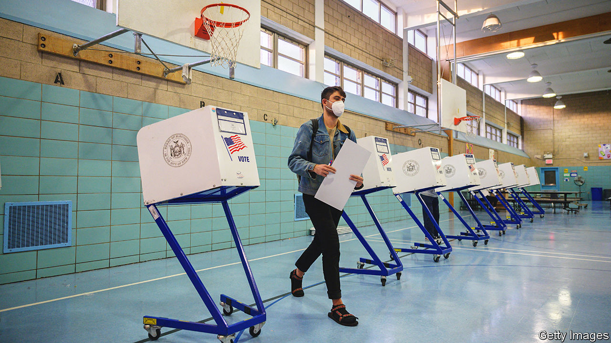
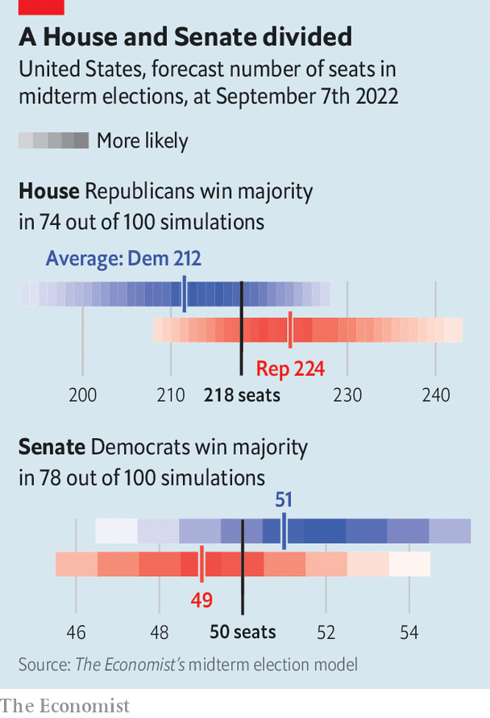

###### Split decision

# The Democrats are likely to lose the House but keep the Senate 

##### Meet our election-forecasting model for America’s 2022 midterms 

 

> Sep 7th 2022 

In the 40 midterm elections to have taken place since 1862, the president’s party has lost seats in the House of Representatives 36 times. America’s midterm elections, which take place on November 8th, are almost always a referendum on the occupant of the White House and his party. (All seats in the House are contested, as are 35 of the Senate’s 100 seats.) But unusually, a former president looms large in these elections. And Donald Trump appears to be a drag on Republicans’ prospects.

For Democrats, the historical pattern looks likely to hold in 2022, according to ’s new  to control Congress. In early September, our model expects Republicans to win 224 House seats, a gain of 11 seats from 2020. They achieve a majority of at least 218 seats in 74% of simulations. If Democrats lose control of Congress, Joe Biden will no longer be able to pass laws along party lines. Gridlock will mark the rest of his presidential term.

But Republicans’ strong chance of flipping the House is the only good news that our forecast offers them. The model assigns a 78% probability to the Democrats’ retaining control of the Senate. Only a few months ago, any Democrat would have been thrilled with a one-in-four chance of holding the House.

The political environment has markedly improved for the Democrats. Inflation and petrol prices are coming down. In August congressional Democrats passed a big spending bill, a cornerstone of Mr Biden’s agenda. The justice department’s investigation into Mr Trump’s  has focused attention on the alleged wrongdoing of a predecessor. 

In an unpopular decision in June, the Supreme Court rescinded a constitutional right to abortion. Since then Mr Biden’s net approval rating has risen by nine percentage points. The Democrats’  by two points in polls asking which party should control Congress.

Sceptics might note that in 2020 such surveys overestimated Democrats’ popular-vote margin in the House. But in recent elections to fill vacant seats, their candidates have fared much better than Democratic nominees did in the same districts in 2020. Such swings in special-election vote margins have accurately predicted the national popular vote. After accounting for uncontested races, our model expects the Democrats to win 49.8% of votes cast for major-party candidates in the House.

If the map of House districts were politically neutral, winning half of the vote would give Democrats a 50-50 chance at control. In fact, we find that the new maps (redrawn following the last decennial census in 2020, when adjustments are allowed for population changes) give the opposition a slight edge. Only in simulations in which the Democrats secure at least 50.7% of the major-party vote are they favoured to win a majority.

In theory this year’s Senate races should be daunting for Mr Biden’s party. Democrats need to defend vulnerable seats in Arizona, Georgia and Nevada, three states in which Mr Trump fared better in the 2020 election than the national average. Moreover, all of the potentially competitive Republican-held seats—in Florida, North Carolina, Ohio, Pennsylvania and Wisconsin—sit on redder-than-average turf.

 


Democrats are compensating with an edge of their own: candidate quality. All of the party’s incumbents in possibly vulnerable seats are seeking re-election. But Republican senators in North Carolina, Ohio and Pennsylvania are retiring.

Mr Trump’s endorsements appear to have hurt his party. In four of six competitive states, Republican primary voters opted for political novices backed by Mr Trump: , an author and venture capitalist, in Ohio; Mehmet Oz, a doctor and television star, in Pennsylvania; Herschel Walker, a former American football player, in Georgia; and Blake Masters, an investor, in Arizona. All are doing worse in polls than would be expected for a Republican in their states. Mr Oz trails behind John Fetterman, Pennsylvania’s lieutenant-governor, by eight points, as does Mr Masters behind Mark Kelly, the incumbent.

These Republicans have time to catch up. What is more, surveys of Senate races mostly overestimated Democrats’ vote shares in 2020. Because of the risk of such polling errors, our model also incorporates predictions based on “fundamental” factors like a state’s electoral record. At this stage of the campaign, it assigns about the same weight to such variables as to polls.

One predictor reinforces the findings from polls, however: fundraising. Historically, candidates who receive lots of contributions from individual donors living in their states have tended to outperform electoral expectations. The most likely explanation for this pattern is not that advertisements persuade many voters, but rather that strong candidates tend to raise more money than weak ones do.

In almost every close Senate race this year, Democrats are receiving more in-state donations than their opponents. Mr Vance has yet to hit $500,000 in contributions, even when including those from outside Ohio. His Democratic competitor, Tim Ryan, is nearing $20m, a third of which is from Ohio. Looking at in-state donors for which records are available, Mr Kelly has collected $5.2m to Mr Masters’s $500,000 in Arizona, and Mr Oz has $700,000 against Mr Fetterman’s $4.8m in Pennsylvania. With polls and fundamental factors favouring Mr Kelly and Mr Fetterman, the model puts their chances of victory at 88%. If both were to win, Republicans would probably need to sweep Nevada and Georgia to control the Senate.

Our model is bullish on Democrats’ odds in the Senate for a further reason. Colorado and Washington look solidly blue. But not all Republican favourites have locked in their races. Ron Johnson, the incumbent in Wisconsin, lags behind Mandela Barnes, the lieutenant-governor, by four points. In Florida, Marco Rubio, once a leading presidential contender, holds just a four-point lead over Val Demings, a congresswoman. In North Carolina, Cheri Beasley, a Democratic former chief justice of the state Supreme Court, is almost level with Ted Budd, her Republican opponent.

Winning any of these races would be a coup for Democrats. Our model gives them a 22% chance in Florida, 31% in Wisconsin, 32% in North Carolina and 36% in Ohio. But the Democrats do not necessarily need a blue wave to win such races, in which the party’s incumbents would all hold on, too. Local factors can be decisive in Senate races: two years ago, no one would have expected Democrats to flip two Senate seats in Georgia yet lose by nine points in Maine. 

In nearly half of simulations in which Democrats hold on to the Senate with the bare minimum of 50 seats, those 50 include one from Ohio, Florida, North Carolina or Wisconsin. If Democrats’ prospects in these states fade, the chances of retaining their majority will, too. 


