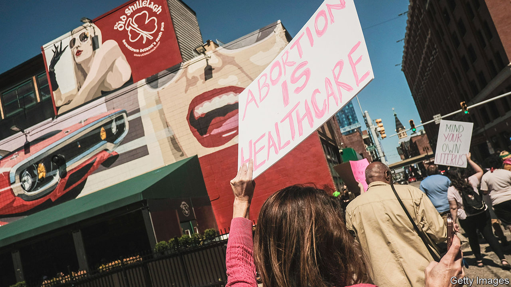

###### Abortion and the midterms

# The demise of Roe v Wade has fired up the Democrats 

##### Extreme views on abortion by Republican nominees are jeopardising their party’s chances across the country 

 

> Sep 8th 2022 

Backlash is the prevailing force in midterm years. Members of the president’s party hunker down, and the opposition charges forward. Visit Michigan, however, and you will see the reverse. Democrats there are raging against a decision taken by the Supreme Court in June to overturn , the ruling that declared abortion a constitutional right, which has left decisions on abortion to individual states. A dozen have already instituted near-total bans on the procedure.

In this final stretch before the midterm elections on November 8th, Republicans should be preparing to seize power amid deep discontent with President Joe Biden. Michigan, which went for Donald Trump in 2016, should be the least of their worries. Instead they are fretting that they could lose all three of the major statewide elections, as well as control of at least one state legislative chamber and some competitive congressional seats.

Democrats up and down the country have been energised by the demise of . But the issue could do more to decide the course of elections in Michigan than in any other state. One reason is that Michigan’s abortion policy rests on a knife-edge. Upon the court’s ruling, an obsolete law passed in 1931 was due to come into effect, which would have completely banned the procedure unless the life of the mother was at risk. Courts have temporarily suspended it, following months of legal wrangling. Hundreds of thousands in Michigan have signed on to a ballot initiative to protect abortion rights through an amendment to the state constitution.

Gretchen Whitmer, the Democratic governor, cannot pass a law to supersede that of 1931 without support from Republicans who control the state legislature—which they will not give. Tudor Dixon, her Republican challenger in the midterms, opposes abortion even in cases of rape and incest. “Today’s Republican Party in Michigan is incredibly extreme,” says Ms Whitmer, after a campaign event at a school’s sports ground in suburban Detroit. “They want to roll us back to 1931, making abortion a felony with no exceptions for rape and incest, putting doctors and nurses in jail. That is absolutely not even reflective of who the Republicans are in the state. But that’s what the leadership is.”

That force is jeopardising Republican chances across the country. Most Americans want neither a complete ban, nor a very permissive regime;  had guaranteed a right to abortion before fetal viability (about 24 weeks). But in the marginal seats that Republicans need to win, many of their candidates have not been playing for the middle.

Adam Laxalt, the party’s nominee for senator in Nevada, has praised the court’s decision—in a state where access to abortion is under no immediate risk—and been pummelled for doing so. The Republican candidate for senator in Arizona, Blake Masters, recently attracted national attention for removing some anti-abortion rhetoric from his campaign website, where he no longer refers to himself as “100% pro-life”. Doug Mastriano, the Republican nominee for governor of Pennsylvania, another swing state, is similarly struggling to explain his view that abortion should be banned from conception.

Abortion is an issue that Democrats are championing even in Trumpy terrain. “I don’t doubt the emotion and the sincerity of people who are pro-life. But this is also not a place that likes the government telling you what to do,” says Elissa Slotkin, a Democratic congresswoman, after a campaign event in Lansing, the capital of Michigan. Ms Slotkin is running for re-election in a district that went for Mr Trump in 2016 and 2020. Yet she is the one turning the issue of abortion to her advantage (even if through libertarian appeals to personal liberty and privacy), while her Republican opponent tones down his website.

Attacking extreme stances on abortion is a favoured Democratic strategy. “My opponent has doubted whether women can get pregnant as a result of rape,” says Abigail Spanberger, a Democratic congresswoman from Virginia who is running in one of the most hotly contested districts in the country. Mary Peltola, who recently won a special election for the Democrats to fill the lone seat for Alaska in the House of Representatives, devoted her first general-election campaign ad to arguing that “the federal government has no business taking away our freedoms”. In conservative Kansas, a referendum to scrap the right to abortion in the state’s constitution was resoundingly rejected in August.

More referendums are coming. Four other states have already decided to put abortion on the ballot in November. But unlike electorates in California, Kentucky, Montana and Vermont, that in Michigan is more evenly split. Minimal polling suggests for now that two-thirds of voters would support enshrining the right in Michigan’s constitution. So opponents are instead campaigning to stop the initiative from reaching voters. Republicans on the Board of Canvassers, an official state body, have blocked it based on a typographical objection over the spacing between words. The state Supreme Court, which is expected to consider the dispute, will probably allow the initiative.

Other opposition is more substantive. Some Republicans argue that the content of Michigan’s amendment—which would allow abortions after viability if they protected “life or physical or mental health”—is more extreme than voters realise. “They will allow abortions even in the third trimester and up to birth,” says Christen Pollo of Citizens to Support mi [Michigan] Women and Children, an organisation campaigning against the amendment. If the amendment passes, Ms Pollo says Michigan “will have put the most extreme abortion policy into our state constitution, forever repealing health and safety standards that protect women”.

If the Michigan referendum fails, and Republicans win the state’s race for governor in November while keeping control of the House and Senate, legal disputes will not end. Some county prosecutors have already pledged not to charge anyone with violating the 1931 law. Among them is Eli Savit, the elected prosecutor in Washtenaw County, which includes the college town of Ann Arbor. Mr Savit refers to “the horrific story of that ten-year-old girl in Ohio”, who was raped and had to travel out-of-state for an abortion. “I have no desire to prosecute that girl, her parents, or doctors. That just strikes me as tremendously unjust. I want to prosecute that rapist,” says Mr Savit. Other forms of resistance would crop up, as they might in other states with bans. The most common medication for early-term abortions is easily smuggled across state lines. Policing this would require state surveillance that would make even most Republicans balk.

Swinging back

Only months ago, Republicans were expected to secure a thumping victory in the midterms. They seem to have squandered much of that advantage. Most statistical forecasts, including ’s, do not favour them to retake control of the Senate, as of early September. Even Mitch McConnell, the Republican Senate leader, has griped about the “candidate quality” of the party’s nominees, most of whom were handpicked by Mr Trump. They have staked out unusually extreme positions on two issues: abortion, and Mr Trump’s Big Lie that the presidential election in 2020 was stolen. In Michigan the Republican nominees for governor, attorney-general and secretary of state all hold this view. So do the party’s nominees in Arizona and Wisconsin, both swing states.

All this has handed Democrats a second line of attack in the run-up to the general elections. “I’m not using hyperbole when I say the consequences will be deadly [if the 1931 law goes into effect]”, says Dana Nessel, the Democratic state attorney-general, who is running for another term. Her Republican opponent, Matt DePerno, is perhaps the most ardent “Stop the Steal” enthusiast running to be a state’s top law-enforcement officer anywhere in the country. “If you don’t have someone in this office that is incredibly aggressive about defending the will of the people,” says Ms Nessel, “you simply will not have a democracy in the state of Michigan anymore.” Come November 8th, that closing argument may prove to have been effective—and not just in the state of Michigan. ■


