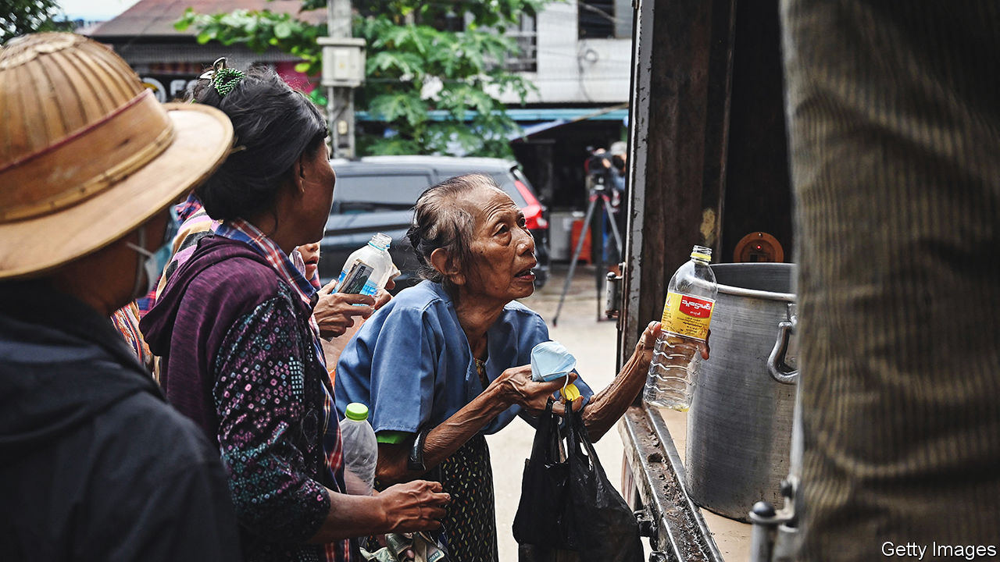

###### General chaos

# An economically illiterate junta is running Myanmar into the ground 

##### Last year’s coup has put the country’s economy in a tailspin 

 

> Sep 15th 2022 

Queues snake away from open-backed trucks that sell cooking oil on the streets of Yangon. Since July people in Myanmar’s commercial capital have stood for hours in the tropical heat and rain to buy discounted oil from wholesalers. At 3,000 kyats ($0.90) a kilo it costs about half what it would on the open market. That still makes oil almost 50% dearer than it was last year, before a military coup put Myanmar’s economy into a tailspin.

The Burmese kyat is trading at one third of its pre-coup value. This is a disaster for a population that depends on imported palm oil, petrol and medicine. The World Bank says 40% of Burmese now make less than $4 a day (in 2017 prices). The junta has erased a decade of economic improvement under semi-civilian rule.

Rather than take responsibility for the crisis, junta supremo General Min Aung Hlaing lectures the Burmese on the importance of a lean diet; he is troubled by the amount of oil used in curries. But his hectoring is just a smoke screen for his real worry: Myanmar’s current-account balance. The junta wants to reduce consumption, expand domestic oil-crop production and reopen junked state factories, all to increase Myanmar’s “internal strength” and shore up its balance of payments.

To read the generals’ policies as attempts to shield the economy against sanctions and isolation would ascribe too much method to their madness. Previous coups, in 1962 and 1988, were followed by periods of radical political and economic restructuring. The current lot’s first action was to announce that it would keep existing policies for a year-long emergency period—since extended to two years—to be followed by fresh elections. The regime was unprepared for the nationwide uprising that ensued, and had no plan to deal with the inevitable economic fallout.

The kyat’s initial slide prompted the central bank to sell some $600m of foreign reserves (an estimated 10% of its total) in an attempt to prop up its value. But by April reserves were dwindling, as foreign investment, aid and remittances all plummeted and commodity prices soared. The junta tried to claw back dollars by imposing capital controls and import restrictions. 

That created shortages of imported essentials, including diabetes and cancer medicines. Exporters were put off by the requirement to convert foreign-currency revenues into kyat at a confiscatory rate. Many chose to stop trading (or tried to keep their earnings offshore) rather than lose a chunk of their income to prop up the regime. The generals later acknowledged their own part in the chaos, albeit indirectly, by relaxing some controls. In mid-August the government said exporters could keep a third of their foreign earnings or buy kyat with them at market rates; traders say dollars are now easier to come by. 

But the certainty that business craves is unlikely to come from a junta bent on subjecting market forces to military mandates. In June it shoved six of its lieutenant colonels into senior roles at the central bank. Lieutenant-General Moe Myint Tun, a close ally of Min Aung Hlaing, is now the chair of the investment commission, and controls the committee that oversees trade and foreign currency.

Attempts to manage the economy will create space for patronage. Min Aung Hlaing may be hoping to recreate the pliant class of tycoons that propped up Myanmar’s previous junta. That will be harder this time, says Gerard McCarthy of the National University of Singapore. An ailing economy means there are fewer spoils to go around. Fat cats who have spent a decade diversifying their portfolios may resist hitching their wagons to yet another junta. Since it says that it plans to step down, and is facing unprecedented resistance from ethnic and pro-democracy guerrillas, it is not a tempting political bet. If the rebels are successful they might punish the regime’s collaborators.

“You can’t just create an entirely new business class that is indebted to one or two generals,” says Mr McCarthy. “The existing business elite seem to be biding their time till the junta tries to transition to a new, rigged electoral regime, or implodes along the way.” ■

