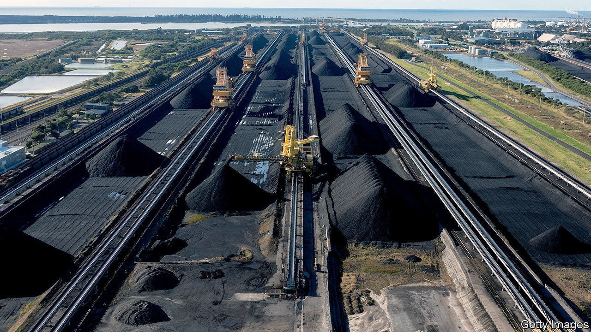

###### Changing climate

# Australia passes a law to reduce emissions, at last 

##### That will not stop it from opening new coal mines 

 

> Sep 15th 2022 

Carbon has long caused chaos in Canberra. Prime ministers who tried to limit emissions were deemed a threat to Australia’s coal-heavy economy and chucked out by their parties. Three lost their jobs in what the national press dubbed “the climate wars”.

Battle lines shifted on September 8th, when the Climate Change Bill passed through the lower house of Australia’s parliament and into law. It is the country’s first legislation addressing carbon emissions in 11 years. Some advocates hope that Australia—one of the world’s biggest fossil-fuel exporters, and a perpetual laggard on climate change—has turned a corner. 

The bill creates relatively deep, legally binding targets for emissions reductions. Future governments will either have to follow them or repeal the law. It commits Australia to slashing emissions by at least 43% by 2030, compared with 2005 levels, and then to net zero by 2050. The previous conservative coalition government promised cuts of only 26-28% by 2030, and eschewed any legal binding. 

The stage was set for change by the elections in May. The Liberal and National parties had spent nine years arguing that cutting emissions would lead to job losses. (Chris Bowen, now the new climate minister, calls their tenure “nine years of denial and delay”.) Centre-right voters looked around at a country racked by fire and flood, then booted Liberals from their wealthy suburban heartlands and ushered in a new set of climate-friendly independent mps. Their numbers gave Labor and the Greens the parliamentary heft to push the climate bill through. 

Backtracking is possible. When Australia brought in a carbon tax, in 2011, it was promptly repealed by the coalition. But the public mood has changed so much that the new law is likely to stick, says Frank Jotzo, a climate economist at the Australian National University. Australian businesses, which once thought Labor’s emissions targets would be “economy-wrecking”, now call for even bigger cuts. 

Labor’s bill has its limits. It does not shower money on renewable energy or electric vehicles—although the government says it will invest A$20bn ($14bn) to upgrade the electricity grid, so that more of the economy can abandon fossil fuels. Nor does it dictate the exact mechanisms by which emissions will be reduced.

It will happen in part by adjusting the “safeguard mechanism” introduced by the conservatives to curb the emissions of 200-odd of the largest industrial polluters. But caps have been set high so far, and no business has ever been punished for breaking them. Emissions have kept rising. 

Labor wants to tighten the scheme. It plans to set caps that would force big polluters to cut their emissions by 3.5-6% a year. Companies that emit less carbon could be awarded credits, creating a trading scheme for heavy industry. It wants the system up and running by next July. 

One big point of contention is new gasfields and coal mines. Green politicians argue that Labor is signing off on new fossil-fuel projects as eagerly as would the conservatives, despite its tough talk. There are more than 100 in the pipeline. Just one of the largest, a proposal for fracking in the huge Beetaloo gas basin in the Northern Territory, could increase Australia’s emissions by up to 13%, the Greens claim. “The question of new coal and gas has to be addressed,” says their leader, Adam Bandt. 

Most Australians agree. Some 60% say they support a ban on new coal mines, according to polling from the Lowy Institute, a think-tank. But such radical action is not on the table. A ban on new coal and gas would have a “devastating impact on the Australian economy”, says Anthony Albanese, the new prime minister. The country can both “reduce emissions in a predictable and orderly way” and remain “a trusted and stable supplier of energy”, he told mining lobbyists recently. Australia, in other words, is finally set to begin cutting emissions at home. Those generated overseas, by burning its fuel, are someone else’s problem. ■


