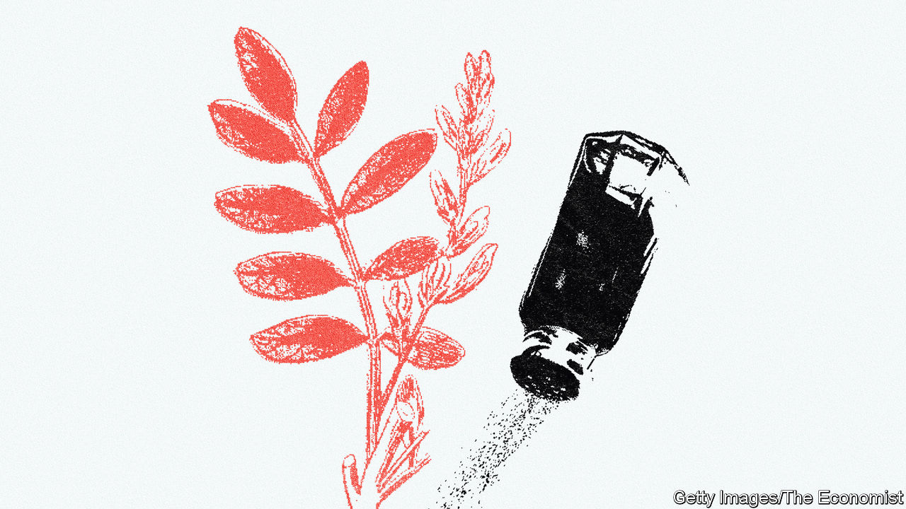

###### Sweet success

# Liquorice flourishes in salty soils of the dried-up Aral Sea 

##### Karakalpakstan is the sweet root’s new production hub 

 

> Sep 15th 2022 

They put liquorice in their vodka in Karakalpakstan. Its sweetness softens the local liquor, Qarataw (named for the nearby mountain range), making it a surprisingly palatable tipple.

Karakalpakstan itself offers no such respite. The vast autonomous republic in western Uzbekistan, spanning the Aral Sea, is an environmental disaster zone. Soviet-era central planners sucked the sea dry to irrigate cotton fields, turning the world’s fourth-largest lake into a puddle. The roads around Nukus, the region’s capital, are crusted with salt, a memory of the dried-up sea. 

Cotton is still the agricultural mainstay, but now liquorice fields are popping up all over. The root crop has been cultivated in Central Asia for millennia, but it is becoming a booming business for dried-out Karakalpakstan. Not only does it grow well in salted land, says Khabibjon Kushiev, a biologist at Gulistan State University, it regenerates the land in the process by sucking salt out of the soil. 

The value of Uzbekistan’s liquorice-extract exports rose by nearly a quarter between 2017 and 2021 to reach $30m, according to World Bank data. Last year, Uzbekistan was the world’s largest supplier of liquorice by volume. Karakalpakstan is at the heart of the sweetness. 

Harvest begins as the heat arrives in April. Workers pick through ploughed earth for the exposed, stalky roots, snapping off their stems and flinging them onto piles. Those are transported to the headquarters of Qaraqalpaq Boyan ( means liquorice in the Karakalpak language, which is distinct from Uzbek) in Nukus, where they are dried. Sometimes the roots are spread out to soak up the sun on the deck of an old barge that sits rusting on company land. 

Qaraqalpaq Boyan exports the majority of its liquorice root raw. But that is not where the money is. Sales of liquorice extract are soaring, says Murat Gaipov, chairman of the National Liquorice Producers Association. 

That aligns with a government push for exporters to make more value-added products: plastics instead of petroleum, cloth instead of cotton. Liquorice-processing plants have sprung up across Karakalpakstan, some with Chinese investment, lured in by tax breaks and customs-duties exemptions. 

In his office in Nukus, Mr Gaipov showed off a dazzling array of liquorice-based products: shampoos, medicines, teas. If more firms could make the leap from producing extract to manufacturing finished products, Uzbekistan could double the value of its liquorice exports, he says. Entrepreneurs can, of course, toast their successes in Qarataw vodka. Though it is healthier, Mr Gaipov points out, to stick to sweet tea.

