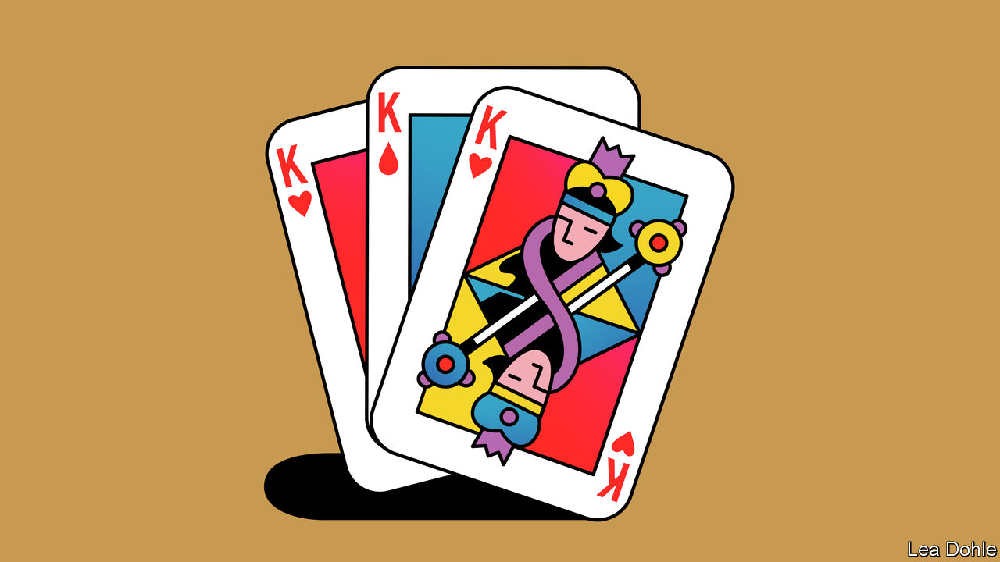

###### Banyan

# South-East Asia’s monarchies struggle with succession 

##### Bad heir days are more common than they would like 

 

> Sep 15th 2022 

With the death of Queen Elizabeth, the title of longest-serving, still-breathing monarch passes to Sultan Hassanal Bolkiah of Brunei. He has been on the throne for 55 years. Long reigns are not unusual in South-East Asia. It is home to a flush of potentates, from the kings of Cambodia and Thailand to the sultans of Malaysia, Brunei and Yogyakarta, a province of Indonesia. Most have sat on their thrones for decades. All are in their 60s and 70s. Some are whispered to be in ill health. 

The issue of hereditary succession looms over their realms. Unlike the British monarchy, which has survived by ceding power to democratic institutions, some kings in South-East Asia have preserved their prerogatives. Some have even amassed power that exceeds that of their forebears. The Thai king is notionally hemmed in by a constitution, but is actually the most powerful person in the country. Indonesia is a republic, but the sultan of Yogyakarta will rule for life, and pass his power to his heir. The sultan of Brunei, an absolute monarch, considers himself to be “the shadow of Allah on earth”, and expects his subjects to agree. 

Plenty of South-East Asians are happy with their monarchs. In times of change they provide a link with the past. If you believe they are divinely appointed, as they often claim, they make ideal defenders of religion and national identity. They remind the people of their sanctity through good works. King Bhumibol Adulyadej of Thailand, who reigned for seven decades (88 days fewer than Queen Elizabeth) until his death in 2016, spent half his time touring the poorest parts of Thailand. He presided over Buddhist ceremonies and dispensed university diplomas, handing out so many that doctors worried he might injure his arm. By tapping his kingdom’s oil wealth, Brunei’s sultan offers goodies such as free education and health care. Some style themselves as champions of democracy. Malaysia’s sultans have recently earned goodwill by chiding the country’s corrupt, self-serving politicians. 

Yet discontent often simmers at moments of transition. The mood in Thailand was sour in 2016, when King Maha Vajiralongkorn took the throne. His father, King Bhumibol, was, whisper it, no angel. (He would often throw his weight behind the army as it launched yet another coup.) But the public did revere him as the embodiment of a good Buddhist. His son spends much of his time in Germany, cycling through the forests of Bavaria in skimpy shorts, accompanied by members of his harem. He rules by fear, says Pavin Chachavalpongpun, a Thai dissident, and is trying to claw back the absolute power enjoyed by his ancestors. 

King Vajiralongkorn uses the courts to hound his critics. Hundreds of people have been charged with insulting the Thai royal family in recent years. The late Sultan Mahmood Iskandar of Johor, a Malaysian state, had a violent streak. In the 1970s, as crown prince, he was twice charged with manslaughter (and pardoned by his father both times). He was just as bad as sultan. In 1987 he allegedly clubbed a caddie to death for laughing at him when he missed a putt. 

Heredity is not an infallible way of picking a good ruler. Some monarchies have found ways to avoid crowning the worst candidates. Malaysian sultanates are not bound by primogeniture and so can select the best son for the job. There are usually a reasonable number of sons to choose from, since sultans typically have multiple wives. (Daughters are not yet eligible.) When the ex-wife of the apparent heir to the sultanate of Kelantan alleged that the heir had kept her as a sex slave, the sultan anointed a different son (the prince denied the charge, sued his ex-wife and won). In Cambodia, a council of politicians elects a king for life, plucking a favoured man from one of two royal households. 

Finding good heirs is essential if monarchies are to endure. The consequences of rotten royal behaviour can be deleterious. In the 1990s Sultan Iskandar’s misadventures prompted the Malaysian government to revoke sultans’ immunity from prosecution and remove their veto over legislation. 

Thailand’s monarchy faces similar risks. The king is protected by his supporters in the army and the courts, but public anger is building. Tens of thousands of young Thais took to the streets in 2020 to demand royal reform. Their movement was crushed, but the taboo against lèse-majesté was broken. If King Vajiralongkorn and his peers want to keep hold of the reins of power, they would do well to soften their grip. 


 (Sep 8th)


