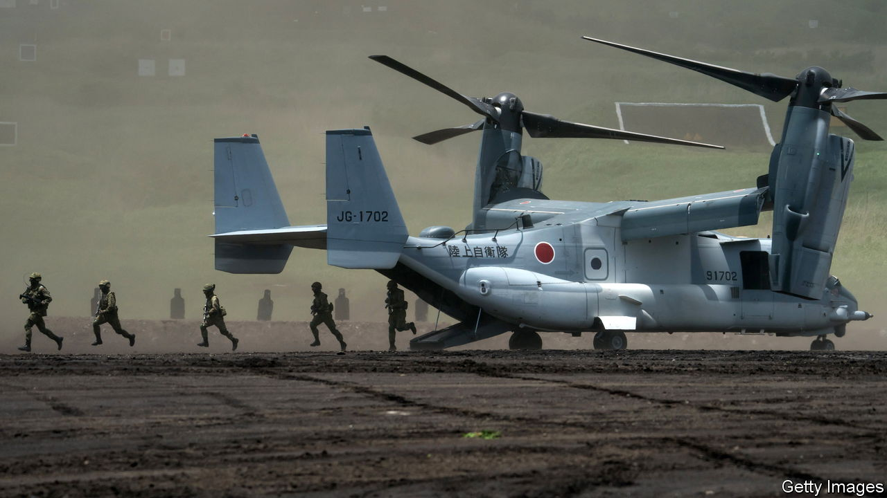
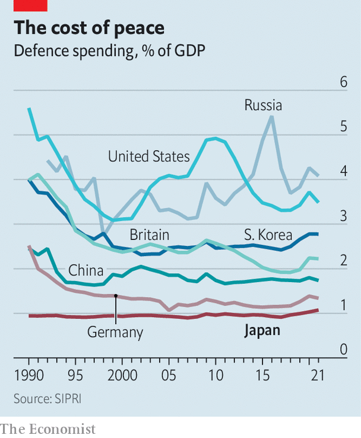

###### A wake-up call

# War in Ukraine has bolstered Japan’s support for a stronger army 

##### A nation with a deep streak of pacifism confronts a dangerous world 

 

> Sep 13th 2022 

In august Japan’s foreign minister, Hayashi Yoshimasa, gave a performance at a café in Tokyo. Sitting on stage at a keyboard, the Ukrainian flag emblazoned on the wall behind him, he played and sang “Imagine”, John Lennon’s peace anthem. Mr Hayashi’s appearance at an event called “Flowers of Peace” was one small sign of how deeply the war in Ukraine, 8,000km away, has rattled Japan. 

Lennon-esque ideas have shaped Japan’s security policy since the end of the second world war. Its constitution, drafted under American tutelage after Japan’s unconditional surrender, renounces “war as a sovereign right of the nation” and declares trust in the “justice and faith of the peace-loving peoples of the world”. Though Japan did build up its armed forces—which it calls the Self-Defence Forces (sdf)—in subsequent decades, pacifism remained a powerful political force.

Mr Putin has provided a wake-up call for many of Japan’s dreamers. His unprovoked invasion of a neighbour is a reminder that autocratic regimes can be extremely dangerous. China’s  around Taiwan has highlighted the possibility that something similar could happen in Japan’s part of the world. “Ukraine today may be East Asia tomorrow,” Kishida Fumio, Japan’s prime minister, has repeated. 

Politics is shifting as a result. Defence has jumped up the list of voters’ concerns, and permeated news agendas. Polling done earlier this year by the, a liberal daily, found that 64% of Japanese favour strengthening their islands’ defences, the first time the figure has topped 60% since the paper began conducting the surveys in 2003. The , its conservative rival, found 72% support for a stronger army; fewer than 10% felt that way in a similar survey carried out in 1988. Other polls show that a majority now favours acquiring long-range missiles which would let the sdf strike targets beyond Japan’s territory, another break from established norms. 

The question, says Tobias Harris of the Centre for American Progress, an American think-tank, is how this change in mood might lead to changes in policy. Japanese leaders have not come close to declaring anything as dramatic as the “Z”, or “”, that Olaf Scholz, the German chancellor, announced in February. There will be more clarity by the end of this year. The Japanese government is due to release updated versions of its key national security documents, including the National Security Strategy (nss) and the National Defence Programme Guidelines, which inform foreign and defence policy for years at a stretch. 

Those national security reviews were growing in importance even before Mr Putin’s latest invasion of Ukraine. The nss was first drafted in 2013. China under Xi Jinping has become more assertive and better armed since then. North Korea has advanced its nuclear programme. America has come to seem less reliable, especially during Donald Trump’s presidency. War in Ukraine has raised tension further still. “Our calculation has changed drastically,” says Otsuka Taku, who chairs the national security committee of Japan’s lower house. “We have to do more faster here.” 

That means spending more on defence. Japan has long limited spending to around 1% of gdp, an informal rule established in 1976 to appease pacifists at home, and somewhat assuage neighbours’ fears that rapid economic growth would lead to rearmament. Now the ruling Liberal Democratic Party (ldp) is eyeing an increase in spending over the next five years to meet the nato standard of 2% of gdp. One senior ldp politician worries that Japan’s current, meagre levels of military spending will make any requests for Western support in the event of a crisis over Taiwan “unconvincing”. At current spending levels, 2% of gdp would give Japan the world’s third-largest defence budget, after America and China (it is the ninth-largest at present). 

In public, Mr Kishida has been circumspect, promising only a “substantial increase” in spending. Nonetheless, the defence ministry’s budget request for the upcoming fiscal year reflects the new mood: it is expected to top ¥6trn ($42bn) when accounting for unspecified items, an increase of more than 10% from the previous year. 

What Japan buys matters more than how much it spends. Mr Putin’s aggression changed the shopping list, too. One former defence official speaks of a shift from “paper-tiger deterrence” to “actual deterrence”. Japanese security policymakers are taking a new interest in the nuts and bolts of fighting. “When we look at Ukraine, we see that we need to be able to sustain our capabilities in combat,” says a person with knowledge of the discussions. “We’re thinking in more practical terms.” Maintaining lines of supply is now a prime concern: ammunition stockpiles, spare parts, fuel depots. Measures to weather an attack, such as hardened bunkers at airbases and improved logistics, are another focus, particularly across the Nansei islands, an archipelago which stretches 1,100km across the Pacific, from near Taiwan’s eastern coast to southern Japan. 

 


Paper or not, chronic underinvestment in defence (see chart) has left Japan with a long list of needs. Managing competing priorities will be a challenge. “It’s like all of your assignments have piled up after a summer holiday,” Mr Otsuka says. Officials worry about China’s growing arsenal of missiles; Japan plans to develop long-range standoff missiles of its own. Japan has long lagged in the newer domains of war, such as space, cyber, and autonomous vehicles, all of which must compete for funds. 

And where Russia used to be treated as a nuisance, planners now worry about it joining forces with China. This complicates plans to shift resources away from northern parts of Japan. On a clear day, the Russian-controlled Kuriles (which Japan calls the Northern Territories) are visible across the water. “Now it is necessary to take care of both ends [of the country],” says Kishi Nobuo, who was the defence minister until August.

Japan may struggle to fund its ambitions. Unlike fiscally hawkish Germany, the country has racked up public debt equivalent to over 200% of gdp during an era of easy money. Some military insiders question the wisdom of splurging on security at a time when the cost of caring for the elderly is relentlessly rising. Many members of Komeito, the ldp’s pacifist coalition partner, agree. “Whenever we boost the sdf budget, the us defence industry boosts prices,” gripes a Komeito lawmaker. A weakening yen makes overseas procurement pricier still. 

A shopping spree alone will not make Japan much safer. The sdf needs deeper reform. Too often its army, navy and air force operate as separate branches, rather than an integrated fighting machine. A shrinking population and tight labour market make it hard to recruit. nimby opposition limits where the sdf can train and deploy troops. American officials want Japan to improve the way it handles sensitive information, so it can share intelligence more easily.

Sadly, big thinking is in shorter supply than enthusiasm for big spending. The policy changes under discussion now are an acceleration of pre-existing trends, not a fresh approach. Politicians have yet to convert increased public support for a stronger army into a broader conversation about what that would mean for Japan’s civilians. A meaningful transformation of Japan’s security policy will require more imagination. ■

