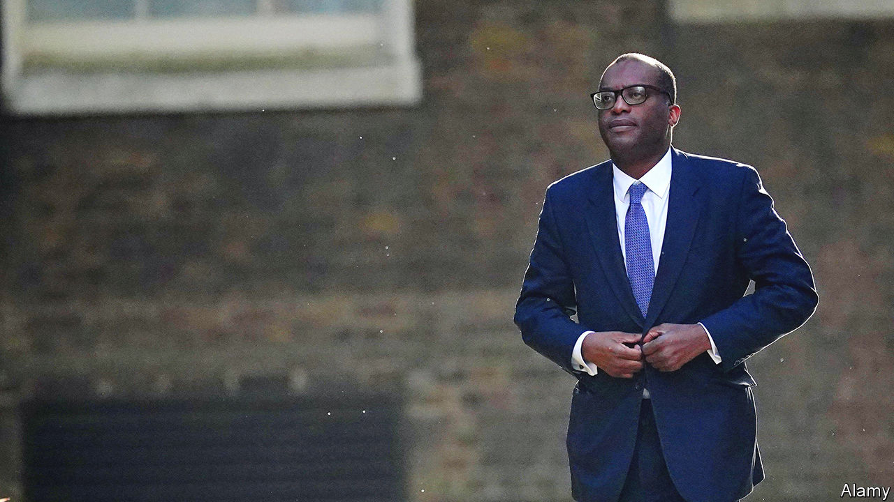

###### The new chancellor

# An official’s defenestration rattles the Treasury 

##### Kwasi Kwarteng, the chancellor, seeks new leadership 

 

> Sep 15th 2022 

For many Treasury officials, September 8th would be the strangest day of their careers. At 11.30am Liz Truss, the new prime minister, unveiled one of the largest fiscal interventions in recent British history: an open-ended commitment to subsidise energy bills for two years. Just after 5pm came word that Kwasi Kwarteng, the chancellor, had fired Sir Tom Scholar, the Treasury’s top civil servant. At 6.30pm, the queen’s death was announced. 

Mr Kwarteng had taken the decision on September 6th, the very day Ms Truss was appointed by the queen and in turn appointed him. The mood in the Treasury is sulphurous, but Mr Kwarteng has at least been candid about his reasons. He told Treasury staff on September 12th that the government’s change in economic direction required new leadership.

Ms Truss had spent the Conservative leadership campaign blaming “Treasury orthodoxy” and its “abacus economics” (ie, a preoccupation with deficit control) for Britain’s slow economic growth. She wants to pursue deficit-funded tax cuts and to lift the trend growth rate to 2.5%. (Sir Tom’s defenders point out that his job was to run the department, not to make policy.) 

Some think the root of Ms Truss’s grievance lies in her stint between 2017 and 2019 as chief secretary to the Treasury—the department’s second-ranked minister, who focuses on controlling departmental budgets. She wanted the Treasury to explore radical ideas; the then-chancellor, Philip Hammond, wanted to steady the ship after the Brexit vote. Sir Tom got the heat. 

Clashes between ministers and top civil servants are nothing new. Gordon Brown, chancellor from 1997 to 2007, swiftly squeezed out Sir Terry (now Lord) Burns, one of Sir Tom’s Thatcherite predecessors. Yet a succession of oustings under Boris Johnson, Ms Truss’s predecessor, is reshaping the relationship.

Under what Bernard Schaffer, a political scientist, called the “public service bargain”, since the 1850s officials have enjoyed permanent employment and merit-based promotion in exchange for remaining politically neutral and delivering the will of their elected bosses. This security of tenure allows them to give frank counsel to ministers. The compact is breaking down, argues Patrick Diamond of Queen Mary University of London. ”If officials fear the repercussions of giving candid but unwelcome advice, they will no longer do so—exposing the uk state to the growing risk of policy blunders,” he says. Former mandarins are disappointed that Simon Case, the head of the civil service, whose own job was thought to be under threat as part of a wider cull, failed to save his colleague. 

The Treasury needs good advice more than ever. Ms Truss’s intervention in energy markets could mean borrowing £120bn ($140bn) extra over the next couple of years. Interest rates were already rising, but the Resolution Foundation, a think-tank, reckons that the splurge could prompt the Bank of England to raise them by an additional 2.5 percentage points.

The enormous injection may not be enough to avoid a downturn. There are signs that labour demand may be weakening, including a decline of 7.3% in vacancies between April and August. According to the Lloyds Business Barometer, published by a leading bank, in August firms became gloomier for the third consecutive month. Consumer sentiment was even worse than in the depths of the global financial crisis.

None of this bodes well for the public finances. And yet Ms Truss’s government is expected to announce tax cuts at a fiscal event this month. The Office for Budget Responsibility, the government’s own fiscal watchdog, says it could produce a forecast in time if asked. But so far ministers seem set on ignoring the gloomsters, and proceeding without its counsel. ■

