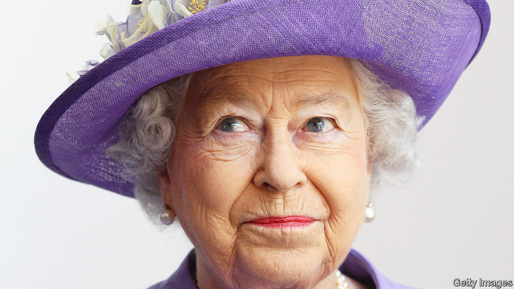
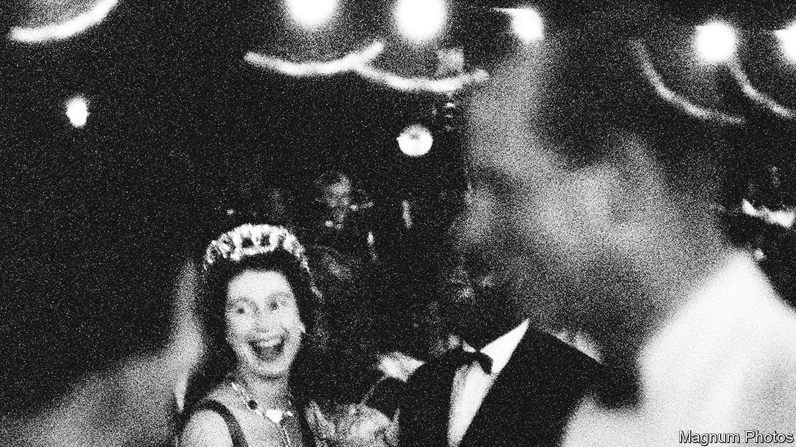

###### The queen

# Britain’s longest-serving ruler strengthened the monarchy 

##### Elizabeth II reigned in an era of social and political upheaval 

 

> Sep 8th 2022 

“I declare before you all that my whole life, whether it be long or short, shall be devoted to your service and the service of our great imperial family, to which we all belong.” The film is blurred, the soundtrack scratchy, the face obscured by bad lighting and the clipped vowels from another era. Even so the vow, made in a high, clear voice that seems too young for its solemnity, rings out in unmistakable tones. The woman looks straight at the camera for a while, and then her eyes slide sideways, uncertainly, for she is not much more than a girl.

It was Princess Elizabeth in 1947, speaking to the Empire on her 21st birthday in South Africa. The fervour with which she made her promise was born of her experience—of living through a war in which so many people had sacrificed so much, and of watching her uncle, who abandoned his duty to marry the woman he loved, and her father, who was thus thrust into a job he did not want and was not suited to. More than seven decades later, in a world dedicated to individualism, in which duty is an archaic notion and self-fulfilment is the greatest good, her promise sounds anachronistic and formulaic. But she meant it.


Keeping it was hardly easy. The royal role involves being constantly in the public eye while keeping personal views entirely private. Any sign of partiality would have undermined her ability to represent all her compatriots; instead she appeared always to be interested, without ever saying anything of interest. That unwavering professionalism helped ensure the survival of the British monarchy.

At the start of the 20th century, class tensions were so high that many predicted the crown’s demise, including those who had to wear it. Edward VII was so depressed by the national mood that on one occasion he introduced his son, the future George V, as “the last king of England”. When George VI, Elizabeth’s father, became king he feared that the crown would “crumble” under the strain of the abdication crisis.

The country she was born into, like the one she leaves, was turbulent and divided. The home secretary, who was required to be present at the birth of a royal, even a relatively minor one like her, was called to 17 Bruton Street on April 21st 1926, in the midst of negotiations to avert a general strike. There was plenty of interest when she was born, for the press was eager for good-news stories at a bad time. But since she was only the niece of the unmarried heir to the throne, her birth was not regarded as of great significance. Queen Victoria had decreed that those in direct line to the throne should be christened after her or Albert, but given the new baby’s low chances of acceding, “I hardly think it necessary,” wrote George V to his wife.

Elements of her childhood, which was quite normal for an upper-class girl then, would be regarded now as, at best, bizarre. When she was less than a year old, the king dispatched the Duke and Duchess of York to Australia for six months, and she was left behind. Elizabeth’s routine in her parents’ absence involved daily promenades in Hyde Park with her nanny during which, as a famous baby, she was constantly greeted by strangers, to whom she waved back enthusiastically. According to the duchess’s authorised biographer, Lady Cynthia Asquith, when her mother returned, the child was “almost as pleased” to see her as if she had been “quite a large crowd”.

Her younger sister Margaret soon arrived, and the royal foursome made a happy little family. Her parents were as domesticated as her glamorous uncle was social. “We four”, as they referred to themselves, were written up in magazines as the ideal version of the nuclear family to which modern Britons aspired. The girls did not go to school, but had lessons from their nanny, Marion Crawford; those were later supplemented by tutorials from a vice-provost of Eton who kept a pet raven that would peck at his ear. Even for the time, Elizabeth’s education was somewhat lacking. Until she was 11, the four seemed destined to be one of Britain’s many comfortable, privileged and fairly unremarkable upper-class families.

An unsought inheritance

Then in 1936 the thunderbolt struck. Elizabeth’s uncle, the heir to the throne, was determined to marry Wallis Simpson; the prime minister, Stanley Baldwin, concluded that because she was a divorcee, he could not do so and remain king. 

In earlier times, the crown was something that members of the royal family murdered and fought for. Not in the 20th century. Edward VIII gave it up willingly. The Duke of York recorded in his memoir that when he told his mother the outcome of his brother’s negotiations with the government, he “broke down and sobbed”. According to her grandmother, when Elizabeth heard that her father was to be king, she began “ardently praying for a brother”.

Yet she submitted willingly. The only matter on which she proved intractable was love. She met Philip of Greece when she was a teenager and became smitten. He was a penniless young royal who as a baby had slept in an orange crate when his itinerant family was evacuated from Corfu. The British aristocracy was not much impressed—it was noted at their engagement party that his naval uniform was shabby—but she had made her mind up to have him, and she did.

They had only five years of married life before the event she had dreaded came to pass. In 1951, after years of heavy smoking, her father was diagnosed with lung cancer. In February 1952 he died. The queen and Prince Philip were on a visit to Kenya at the time. After she was told the news, Lady Pamela Mountbatten, her cousin, came to console her. Her reaction was characteristic: “Oh, thank you. But I’m sorry it means we have to go back to England and it’s upsetting everybody’s plans.”

And so her job for the next 70 years began. Its formal core is the role of head of state, which requires the monarch to preside over the nation’s grand occasions: the opening of Parliament, the changing of the guard, visiting and being visited by other heads of state. As what  called the “dignified”, rather than the “efficient” arm of government, the monarch provides pageantry and diplomacy: the face that Britain shows to the world, and just occasionally a little more than that. She communicated clearly her attitude to Ian Smith’s racist government in Rhodesia: she made the governor-general who had tried to sack him as prime minister a Knight Grand Cross of the Royal Victorian Order, an honour more personal to her than the standard knighthood.


Her visit to Ireland in 2011, after the signing of the Good Friday Agreement that brought an end to the conflict in Northern Ireland, had huge political significance. The last time a reigning British monarch had set foot on the republic’s soil was in 1911, when it was still part of the United Kingdom. The visit marked the normalisation of relations between the two countries. Her few words in Irish at the start of her speech went down a treat.

But the queen’s principal focus was domestic. Her vision of the monarchy was that its purpose is to bolster the country’s sense of both unity and continuity. It represents the idea of a nation to which everybody, not just the glossy influential people in the capital, belongs and in which every citizen has as much value as any other. It represents the notion that while generations of people and politicians come and go, while governments rise and fall, while great social and economic change sweeps the country—it is still the same nation.

She did the job by going about, opening things and meeting people, as visibly as possible. The bright clothes in which she dressed were chosen so that the television cameras could pick her out in a crowd. “I must be seen to be believed,” was one of her favourite phrases.

The snipping of ribbons and shaking of hands is neither here nor there. What matters is getting across to people the message that they matter. “Why does she endlessly visit small towns, industrial estates, colleges and relatively minor firms?” asks Andrew Marr in his biography, “Diamond Queen”. “Because nobody else does.” For the same reason, receptions at Buckingham Palace were far more socially, racially and geographically diverse than those at Downing Street or other political venues.

Invested with importance

The mass investitures, at which councillors and cleaning ladies from all over the country turned up in their best frocks, met the queen, had a ribbon pinned on them and took tea at the palace, were an initiative of hers. She said that they were the most important part of the job. The weekend before investitures, she received a fat briefing paper with several paragraphs on each individual. She picked out a few key words about each person to be honoured, and learned them; an equerry whispered in her ear as the person approached. 

 


The queen’s identification with ordinary people came fairly easily to her. Although the country’s top aristocrat, she in many ways had more in common with the commoners than with the elite. Her family are not intellectuals. And her recreations were ordinary: her favourite leisure pursuits were walking her dogs and going to the races.

These were also old-fashioned pursuits, which raises a subtle aspect of the job. The monarchy must represent the country’s traditions, yet not seem stuck in the past. And although superficially the institution looks remarkably unchanged—pretty much everything the queen wore, for instance, would have been more fashionable in the 1950s than in the 2020s—it has changed a lot.

The big invisible changes were brought about by David Ogilvy, the 13th Earl of Airlie, a former banker who had known the queen since the five-year-old Elizabeth was brought to his fifth birthday party. In the mid-1980s, things were financially rocky. “We were simply running out of money,” according to a palace official. At the same time, the state’s control of the monarchy was increasing, through an annual agreement with the Treasury regarding how much money it should get, and growing public resentment of the fact that the queen did not pay tax.

Ogilvy employed consultants who went through the palace’s accounts and did a deal with the Treasury. The monarchy would cut its expenses and the queen would pay for most of her family members from her private wealth. In return the monarchy’s income would be agreed on for ten years on the basis of the expected inflation rate, and the royal household would reclaim control over the management of the palaces from the government. “To a degree that has never been fully understood,” notes Mr Marr, “they privatised the queen.” Henceforth, the queen would also pay income tax.

But the queen’s principal method of avoiding potential hostility was discretion. The public silence that she maintained over seven decades on all but the most anodyne subjects is central to the job of representing the country as a whole, for to express a view that endeared her to one lot of Britons would be to alienate another, and to express political views publicly would be to contradict the notion that the British monarch’s job is above politics. This self-effacement is anachronistic in the era of selfies, but it was central to her vision of her role. “Her authority derives from her respect and care for her own office,” says Robert Lacey, one of her biographers, “which she never forgets is greater than herself.”

That nobody knows what she thought about anything shows how discreet she was, even in private, for things do get out. David Cameron, a former prime minister, revealed in 2019 that he had asked whether the queen could do anything in response to the vote on independence in Scotland in 2014, like “a raising of the eyebrow...even a quarter of an inch”. During the campaign she said she hoped that people would “think very carefully about the future”, to which not even Scottish nationalists objected. But the palace made clear its fury with Mr Cameron, saying that “it serves no one’s interests” for private conversations with the queen to be made public.

Although the queen was mistress of the art of discretion, she did not pass this skill on to most of her children. Her offspring have, in one way, been pillars of the institution. They trek around the country carrying out official duties. Like her, they snip ribbons, shake hands and scatter monarchical fairy dust wherever they go. But although they did their bit for the Elizabethan monarchy, they also caused most of its problems.

The long, painful, public unravelling of her eldest son Charles’s marriage to Diana saw the monarchy sink to its lowest ebb since the abdication crisis. In 1997 a nation hysterical with unBritish grief turned against the queen for her apparent indifference towards her former daughter-in-law’s death. Charles’s robustly expressed views on architecture, medicine, climate change, conservation and genetically modified foods—all issues with political ramifications—have riled his opponents, as well as those who believe that the monarchy should be apolitical.

Her youngest son, Edward, briefly a television producer, led the family to perform in a toe-curling television game show known as “It’s a Royal Knockout”. Only the daughter, Anne, has done the job almost as impeccably as her mother, working assiduously at her charities, avoiding bad company and keeping her counsel. 

The most profound problems have come from the child often said to have been the queen’s favourite: Andrew. At first, her middle son seemed set to provide merely standard offspring embarrassments: namely, divorce and indiscretions.

Things took a more serious turn when his friendship with Jeffrey Epstein, an American financier convicted of procuring for prostitution a girl aged under 18, became the subject of international interest. In 2021 Virginia Giuffre, an Australian-American woman, filed a civil lawsuit against Andrew, alleging that she had been made to have sex with him when she was 17. As a result, Andrew, who has repeatedly denied the allegations, was, in effect, sacked: he was stripped of his royal patronages and military titles, and lost the right to style himself “hrh” (His Royal Highness). He and Ms Giuffre settled out of court for an undisclosed sum.

Yet support for the monarchy has stayed remarkably stable, varying between 60% and 80% over the past 30 years. Nobody knows whether that support is for the institution, or for the woman who came to embody it. Very few Britons have any idea what the monarchy, and the country, will feel like with a different incumbent.

The importance of luck is often underestimated, and Britain lucked out in 1952. It got a monarch who was wise enough to understand that she had to put her duty before herself, and selfless enough to do so. The skill with which she did her job propped up the reputation of a declining country with elected politicians who have often let it down. Her small, solid, brilliantly coloured frame topped with an unlikely hat, her metronomic wave and her anachronistic outbursts of delight at the racecourse were central to her nation’s sense of self. Elizabeth II will be an extraordinarily hard act to follow.■

